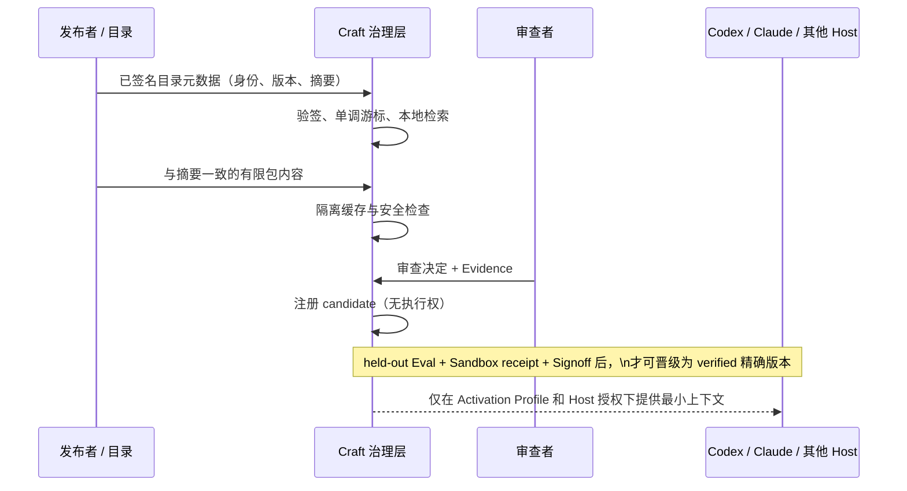

# 受治理能力接入：一个可验证的跨宿主示例

> 状态：v0.11.34 已实现的本地闭环。它接收**已提供**的签名目录页与精确包内容；不会替你抓取网页、安装市场条目、启动 MCP Server 或把候选交给宿主执行。

这个示例说明短期“跨宿主治理插件层”真正交付的东西：同一个 Skill、MCP Server 描述或以后 A2A Agent 描述，无论从哪个来源发现，先进入相同的来源、摘要、审查、证据与评测链。Craft 不替代 Codex、Claude Code 或其他 Host；它让这些 Host 在采用能力前共享同一份可检查的事实。

## 实际调用顺序

1. `craft_hub_source_register` 固定一个 HTTPS 目录端点、发布方和 Ed25519 公钥。它不发网络请求，也不接受带凭据的 URL。
2. `craft_hub_catalog_ingest` 接收该公钥可验证的目录页。页必须严格递增、链接前一摘要；目录搜索只查本地已验证快照。
3. `craft_hub_catalog_search` 只显示元数据候选。搜索结果、下载量、标签或模型推荐都不是信任凭据。
4. `craft_capability_materialize_stage` 只接收与目录 `content_digest` 严格相符的有限文件，写入隔离缓存并生成扫描结果。
5. `craft_capability_materialize_review` 要求人工决定与至少一条 Evidence；高风险包还要独立安全批准。
6. `craft_capability_materialize_activate` 最多登记 `candidate` Asset，且固定为 `execution_authority: false`。
7. 只有 `craft_capability_certification_assess` 收齐 held-out Eval、逐 Trial Sandbox receipt、程序 Grade 与独立 Signoff，随后 `craft_capability_certification_promote` 才能将**同一摘要**晋级为 `verified`。晋级也不会自行启动服务或执行工具。

仓库的 [端到端测试](../tests/governed-capability-intake.test.ts) 覆盖前六步：它生成 Ed25519 签名目录，检索本地快照，按摘要隔离 `SKILL.md`，以 Evidence 审核后注册候选，并断言候选绝无执行权。认证晋级的独立证据组合由 [Capability Certification 测试](../tests/certification.test.ts) 覆盖。

## 为什么它能跨宿主

Host Adapter 只解决“如何把已授权的最小上下文或调用交给某个宿主”；治理对象不含 Host 私有 Prompt、会话格式或供应商排名。因此同一已认证 Capability 可以由 Codex、Claude Code、DeepSeek Harness 或通用 MCP Host 采用，而来源撤回、摘要漂移或新的安全公告也能从同一个来源记录失效传播。

当前不是跨设备 Registry 同步服务，也尚未实现 MCP Registry、Skill 市场、专家服务和 A2A 的远程抓取适配器。接这些来源时，应只新增 [Discovery Adapter](technical/modules/pluggable-capability-sources.md#接入契约)，而不是绕过上述七步。
