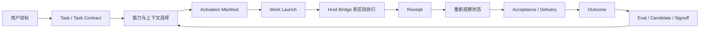

# Craft：受控 Agent 工作运行时

> 本文是 Craft 的总览入口。它解释产品解决的问题、关键概念如何连接、当前实现做到哪里，以及在面试或架构评审中应如何准确回答。实现基线为 v0.11.57。

## 一句话

**Craft 不是另一个聊天 Agent，也不替代模型或 Host；它是把“模型的提议”变成“可控、可观察、可验证、可复用工作”的运行时与治理层。**

模型负责理解、检索、规划和生成；Craft 负责固定目标、能力、权限、状态、事实、验收、评测和演进。实际模型与工具调用仍由 Codex、Claude 或其他 Host 完成。



这条链的关键不是“每一步都让 AI 更聪明”，而是任何一步都能回答：谁在什么范围内做了什么、依据是什么、结果是否被重新观察、何时可以复用。

## Craft 解决什么问题

大模型能产生方案，却天然缺少四类稳定事实：

1. **状态事实**：文件、交付物、输入、环境和人工修改是否已经变化。
2. **执行边界**：当前任务究竟能读什么、写什么、调用什么，谁批准过。
3. **交付判断**：Host 或模型说“完成”不等于业务或技术验收通过。
4. **可复用证据**：一次成功不等于方法可靠；候选流程必须在可比较评测中证明收益。

Craft 把这些问题放到同一个持久化控制面。它保存摘要、引用、版本、审批和观察结果，而不是把整个业务世界或全部对话复制进数据库。

## 正确的心智模型：五个平面

| 平面 | 核心问题 | 核心对象 | 不负责什么 |
| --- | --- | --- | --- |
| 任务与状态 | 要完成什么，世界现在是什么样？ | Task、Task Contract、Workspace、State Snapshot | 代替业务系统成为事实源 |
| 能力与上下文 | 该看什么、可用什么？ | Source、Logical Capability、Connector、Asset、Profile | 自动相信或加载所有 Skill/Tool |
| 执行与控制 | 谁来执行，能造成什么影响？ | Work Launch、Task Run、Host、Adapter、Effect | 越过 Host 权限直接执行 |
| 验证与交付 | 结果真的达标了吗？ | Receipt、Artifact、Evidence、Acceptance、Delivery、Outcome | 把模型自述当完成 |
| 评测与演进 | 哪个方法更好，何时可以复用？ | Trial、Trace、Evaluation、Signoff、Candidate、Canary | 自动改写默认 Prompt/Skill |

这五个平面是逻辑职责，不是要求每个功能都拆成单独进程。它们共享同一个本地事实存储，但接口和生命周期不同。

## 主链：Verified Work Loop

对于会修改工作区、需要交付或需要跨会话恢复的任务，推荐走 `Verified Work Loop`：

```text
Task + Task Contract + 初始 State Snapshot
        ↓
Execution Fabric + Host Activation Manifest
        ↓
Managed Host Bridge 启动 Host / Task Run 并回传 Receipt
        ↓
重新观察 State Snapshot
        ↓
Acceptance 与 Work Delivery
        ↓
Outcome，或 needs_replan / handoff
```

对于本地写入，Fabric 在启动前增加范围内基线 Checkpoint，终态后形成提交 Checkpoint 或待人工恢复状态；这只覆盖声明的文件路径。v0.11.56 将跨会话接力收敛为 `Managed Run`；v0.11.57 再由 `Work Coordinator` 将 Fabric、Managed Run、Host Run、Receipt 与再观察串成一个事实链。`Workspace Observer` 只保存声明范围的摘要差异，无法证明归属的修改直接标记为外部漂移。真实 Delivery 可进入 `Eval Campaign`，`Agent Eval Lab` 只接受同环境、同预算且经过终态再观察的 Host Attempt；候选仍必须经过 held-out、可靠性/校准 Judge Gate（若使用 Judge）、Signoff、带 Evidence 的 Canary 和人工结论后，才会被 `Adaptive Harness Recommendation` 推荐。无合格证据时系统返回最小 baseline，不靠“多 Agent 看起来更强”扩大 Harness。

三个规则最重要：

- Host 完成只说明 Host 已返回；仍要重新观察状态并执行 Acceptance。
- 文件、输入、权限、能力版本、环境或预算发生漂移时，旧路径进入 `needs_replan`，不会借用旧 Receipt。
- 人工修改是 `HumanStateEvent`，是新的事实，不要求模型“记住”人刚才改了什么。

这条主链是对外应优先理解的 **Module**；`Task Control`、`Task Run`、Execution Fabric、Host Bridge、State Workspace、Acceptance、Delivery Loop 是它内部协作的 Module。Fabric 创建的 Launch 不会走旧入口直接启动；Bridge 必须重验 Manifest、Prompt 摘要和调用回执。这样调用方只需理解少量动作：`prepare`、`advance`、`decide`、`resume`、`get`。

## 能力链：发现不等于可用，更不等于调用

Craft 有三类容易混淆的“能力”：


- **Capability Source** 是用户挂载的本地目录；它保留来源和镜像关系。
- **Logical Capability** 是可检索的去重身份；相同内容镜像合并，内容冲突不静默覆盖。
- **Capability Connector** 是用户明确批准的外部元数据接入点，例如 MCP、GitHub Skill 或 Serena。它不保存凭据，不替用户安装、启停或调用外部服务。
- **Capability Asset** 才是带 trust、health、effect 和精确版本的受治理能力。
- **Activation Profile** 为一个 Task 选出最小、可用且权限匹配的 Asset 集合。
- **Connector ticket** 同时固定 Profile、Asset、来源摘要和有效期；Connector Asset 不能绕过 ticket 走旧的通用调用入口。

`Logical Activation Plan` 与 `Activation Profile` 不相同：前者固定“哪些本地 Skill 正文可以作为只读上下文”，后者固定“哪些治理过的能力可被当前任务使用”。两者可同时存在，但不能互相代替。

### Serena 在哪里

Serena 是项目理解与记忆能力，不是 Craft 的替代品。Craft 可按需把 Serena 项目记忆作为 Project Knowledge 引入 Context Profile；通过 Connector 接入时，Serena MCP 在当前版本只允许 `read_only` Asset。Craft 不自动修改 Serena 的记忆文件，最多基于 Evidence 提出更新建议。

## 上下文不是记忆堆栈

Craft 把不同目的的“上下文”拆开：

| 名称 | 回答的问题 | 是否带执行权 |
| --- | --- | --- |
| Context Profile | 当前 Task 应带哪些材料、多少预算 | 否 |
| Logical Activation Plan | 哪些本地能力正文可作为只读参考 | 否 |
| Activation Profile | 当前 Task 可使用哪些受治理 Asset | 受 effect 约束，不等于已调用 |
| Context Capsule | 某次子操作最小需要哪些引用 | 否 |
| Project Knowledge | 项目已有的说明与经验 | 否 |

因此，向量检索、知识图谱、行业标签树都只是未来的检索或视图手段；它们不能成为权限、真实状态或业务验收的唯一事实源。

## 执行、安全与恢复

Craft 用 `effect` 说清影响范围：`read_only`、`local_write`、`external_write`、`destructive`。effect 是要经过策略、审批和环境验证的输入，而不是“已经安全”的标签。

- 读任务可跨平台运行，但仍有 Workspace 范围和 Receipt。
- 本地写入要绑定明确 Workspace 与批准；有可验证隔离后才可使用相应运行能力。
- 外部写入还需要 Host 授权、可观察结果及补偿或人工处置路径。
- 无法证明边界时，Craft 应失败关闭或转人工，而不是裸执行。

“事务”“Sandbox”“补偿”也不是同义词：文件 Workspace Transaction 能处理已声明的本地状态；外部 API/数据库是否可逆，要由外部系统的补偿语义和实际 Receipt 决定。

## 验证、评测与自进化

Craft 的证据链分为三个层次：

```text
Host Receipt：动作是否发生、协议是否完成？
        ↓
Acceptance / Delivery：交付是否满足明确条件？
        ↓
Trial / Evaluation / Signoff：某个方法在可比较样本上是否值得复用？
```

- **Artifact** 是引用的产物；**Evidence** 是支持或反驳 Claim 的依据；两者都不等于 Outcome。
- **Trial** 固定 Subject、Harness、环境和预算；**Trace** 只追加关键过程事实；**Outcome** 是终态判断。
- **Evaluation Case** 需要脱敏和分区。`development` 用于设计，`held_out` 用于晋级证据。
- **Evaluation Run** 聚合多次可比较尝试；同环境、等预算、重复配对是判断 Candidate 的前提。
- **Signoff** 允许候选进入下一验证阶段；**Canary** 在有限范围观察回归；二者都不自动发布或改默认路由。
- **Trajectory Script Proposal** 可以把已有通过证据的受限步骤固化为候选，但必须绑定版本、Workspace Transaction 和既有 Gate；Craft 不把模型临时生成的任意代码直接当作可执行资产。

所谓“自进化”在 Craft 中是：从证据生成受限 Candidate，经过 shadow / held-out / Signoff / Canary，才可能变成可复用版本；不是模型直接修改 Prompt、Skill、Workflow 或拓扑。

## 多 Agent 与 Expert

Craft 不默认多 Agent。只有当子目标可独立验证、上下文可以切分、额外成本能在评测中抵消时，才应该增加 Expert 或子操作。

当前 `diagnostic_research` Expert 是受限的只读诊断角色；子操作必须给出假设、反例、Evidence 引用、置信边界与下一步，父任务负责裁决。历史文档中“Sub-agent Run”统一理解为 **Sub-agent Operation**：代码中它是父 Runtime Operation 下的子 Operation，而非一个新的根 Task Run。

## 运行形态与 MCP

| 形态 | Craft 做什么 | Host 做什么 |
| --- | --- | --- |
| Codex / Claude Plugin | 提供核心控制面、能力检索、Work Loop、事实记录 | 推理、工具调用、用户审批与实际执行 |
| `craft-mcp` | 暴露精简 Core：路由、Work Loop、状态、已签发 ticket | 不加载大量配置工具，降低工具选择负担 |
| `craft-mcp-full` | 额外暴露 Connector 注册、发现、批准等管理动作 | 由用户或受信任管理流程显式使用 |
| CLI / Workbench | 展示任务、证据、待决策项和本地工作状态 | 不取代业务系统或远程 Host |

启用 Craft 插件不意味着每一句对话都必须调用 Craft。短问题、一次性解释、无持久价值的读取可以直接回答；涉及多步工作、能力选择、写入、验证、恢复或可复用结果时，Craft 应作为默认控制面。

## 面试与架构评审常问问题

### Craft 和普通 Agent 框架有什么区别？

普通 Agent 框架重点在“让模型选择工具并循环执行”。Craft 的重点是“让模型的提议进入可验证控制链”：固定任务和版本、限制 effect、记录 Receipt、再观察状态、独立验收，并用评测决定是否复用。它可以接入 Agent 框架，但不依赖某一家模型或 Agent SDK。

### Craft 是 Workflow 引擎吗？

不是纯 Workflow 引擎。Workflow 是一种可复用、可验证的能力；Craft 同时管理未命中 Workflow 时的安全路径、真实执行状态、事实与评测。Workflow 不能绕过 Task Contract、Host 审批和 Outcome。

### 为什么不直接把所有 Skill/MCP 给模型？

工具过多、重叠或不可信会降低选择质量、增加上下文和风险。Craft 先发现和检索，再只启用最小 Activation Profile；外接 Connector 还需要来源、审批、版本和短期调用 ticket。

### 为什么模型说完成还不够？

模型只知道它生成了什么，不必然知道文件是否写入、命令是否成功、外部系统是否接受、人工是否修改，或业务条件是否满足。Craft 用 Receipt、State Snapshot、Acceptance 和 Delivery 把“说完成”变成“可观察地完成”。

### 为什么不先做全局知识图谱、行业树或通用世界模型？

它们对检索、展示或特定领域模拟可能有价值，却不能替代最基础的任务状态、权限、执行回执和交付验收。Craft 先把事实控制链做稳；行业分类以后应是可演化视图，不是强制事实模型或路由前提。

### 为什么不默认多 Agent？

多 Agent 增加上下文传播、预算、协调和失败面。Craft 只在并行边界清晰、独立结果可验收且评测证明收益大于成本时启用 Expert/Sub-agent。

### Craft 如何实现“自进化”而不失控？

它不直接改生产提示词或 Skill。它生成带适用条件与证据的 Candidate，在 shadow / held-out 中与基线比较，经 Signoff 后再 Canary；回归则停止并回到精确版本。

### Craft 是否就是 Sandbox？

不是。Sandbox 解决执行环境隔离；Craft 还解决事实、版本、权限、验收、恢复和评测。反过来，Craft 的 Policy 也不能替代真实 OS/容器隔离器。

### 为什么不让模型生成脚本后直接执行？

生成代码是提议，执行仍是 effect。Craft 只允许已有证据、精确版本、工作区边界和 Gate 的 `Trajectory Script Proposal` 进入 `Verified Script Run`；没有这些前提时，脚本必须经 Host 的正常审批与运行边界，而不能以“模型刚写出来”为由获得执行权。

## 架构优化结论

当前实现已经有多个深 Module：`VerifiedWorkLoopKernel`、`CapabilityAccessKernel`、`CapabilityConnectorKernel`、`TaskControlKernel`、`EvalCampaignKernel` 等。它们的共同价值是把大量校验、幂等、版本和状态转移隐藏在小的 Interface 后。

下一步优化应优先收敛 Interface，而不是继续增加同级名词：

1. **把 `CraftService` 继续收缩为兼容 Facade。** 它目前仍是巨型入口；新增领域行为应进入专用 Kernel，再由 Facade 做稳定转发。不要让 MCP handler 直接拼跨领域状态。
2. **以 Verified Work Loop 作为唯一用户级主入口。** `Task Control`、`Task Run`、`Delivery Loop` 保留为内部 Module 和兼容 Interface，避免用户在多个“主流程”之间选择。
3. **统一 Receipt 分类。** 文档和 UI 应标明它是 Host、Adapter、State、Acceptance 还是 Connector Receipt；避免把 Receipt、Evidence、Outcome 互称“结果”。
4. **完成术语迁移。** 新文档使用 `Sub-agent Operation`；旧的 “Sub-agent Run” 保留历史兼容说明。`Activation Profile` 与 `Logical Activation Plan` 必须连写全名，不简称 “Activation”。
5. **按真实变化建立 Adapter Seam。** 只有已有两个真实实现（例如生产 Host 与测试替身）时才公开 Adapter Interface；只有一个实现时保留内部 seam，防止配置表和 MCP 工具继续膨胀。

这些是架构收敛建议，不宣称本次已经改变了运行时行为。

## 延伸阅读

- [快速入门](quickstart.md)
- [产品概览](product/overview.zh-CN.md)
- [产品架构](product/architecture.zh-CN.md)
- [技术总览](technical/overview.zh-CN.md)
- [Verified Work Loop](technical/modules/verified-work-loop.md)
- [Capability Connector](technical/modules/capability-connectors.md)
- [Capability Access](technical/modules/capability-access.md)
- [领域词汇](../CONTEXT.md)
