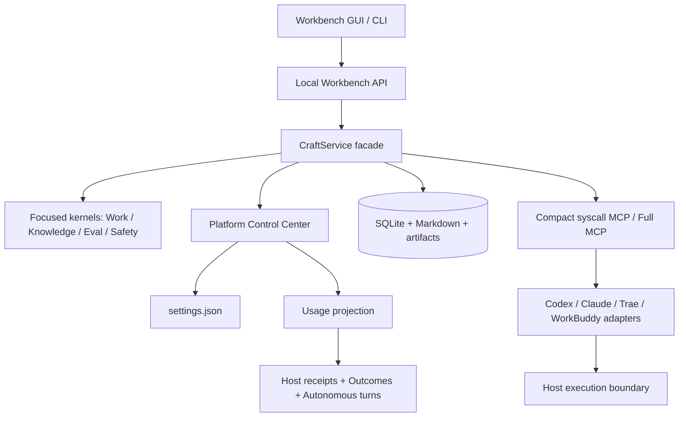

# v0.12.13 Platform Control Center

v0.12.13 把 Craft 从“可被宿主调用的治理内核”推进成带有界动作、独立验收、可恢复本地 Worker 和 Provider fallback 的本地工作台与 Runtime Truth 运行时。GUI 仍是本机 Workbench 应用，由 `craft gui`/`craft serve` 启动；执行权限仍由 Codex、Claude、Trae Work、WorkBuddy 或独立 Host Driver 承担。

## 设置与数据目录

默认设置文件为 `~/.craft_data/settings.json`。`dataRoot` 可以改到绝对路径；重启 Craft 后，新的数据库、索引、日志、缓存、运行时和成果目录都会从该根目录创建。`CRAFT_DATA_DIR` 环境变量优先级最高，适合 CI、便携包和多项目隔离。设置文件只存 UI/运行预算偏好，不存 API Key、Cookie 或授权令牌。

## Token 用量

Workbench 和 `craft usage` 读取已落盘的 Host receipt、Outcome、Autonomous Turn，按日、ISO 周、月、年及 Host 汇总 input/output/total tokens。缺失或不可信的 usage 不会被猜测；结果为空时显示零，而不是制造“节省”结论。该报表是本地可重建投影，不会保存 Prompt 正文。

## 数据兼容承诺

Craft 的版本升级遵循单向可迁移原则：旧数据库按有序 migration 升级，业务记录不被删除或重写；检测到旧 schema 时，打开前会在 `backups/` 保留一份原始数据库副本。已知的部分迁移状态（例如旧版本提前写入 schema 版本但遗漏 `meta.applied_at`）会在启动时幂等修复。检测到高于当前版本的数据库时则失败关闭，不会降级覆盖。跨多个大版本升级前仍建议保留整个 `~/.craft_data` 目录备份。

## 桌面分发边界

Windows 原生 runner 会生成含 Node runtime、真正的 `craft.exe` 和应用资源的绿色 ZIP；双击 `craft.exe` 会隐藏命令窗口并打开浏览器 Workbench，`.cmd`/`.ps1` 仅保留给高级用户。若默认 `~/.craft_data` 在 Windows 上暂时不可写，便携启动器会回退到 `%LOCALAPPDATA%\Craft\data`；显式设置 `CRAFT_DATA_DIR` 时不做回退并弹出可读错误。macOS 原生 runner 会把 Node runtime 放进 `.app`，再使用 `hdiutil` 生成真正的 `.dmg`。Windows 当前开发机无法合法生成 macOS DMG，因此 `.github/workflows/desktop-release.yml` 在 macOS runner 上产出它；不生成伪文件冒充 DMG。

## 当前架构图（v0.12.13）

## 仍然明确未声称完成的理想态

真实跨厂商模型循环、多人协作/远程同步、标准 OTel 导出、生产级 OS 沙箱和签名安装器仍属于部署或后续产品层。v0.12.13 提供的是可观察、可配置、可移植且能独立验收的本地基座，不把本地契约包装成云端服务。
