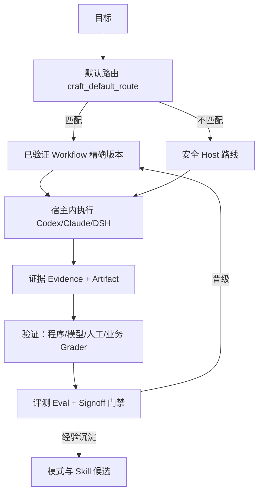

# Craft 快速入门（5 分钟）

本页面向第一次接触 Craft 的人：装好、连上宿主、跑通一次"能力发现 → 执行 → 证据"的最小闭环。完整概念见 [产品概览](product/overview.zh-CN.md)，全部术语见 [CONTEXT.md](../CONTEXT.md)。

## Craft 现在是什么

当前形态是**跨宿主治理插件层**：它装进 Codex CLI、Claude Code、DeepSeek Harness 或任意 MCP Host，统一管理能力（Skill）目录、授权、证据与评测门禁；实际执行仍发生在宿主里。长期目标是自主 Agent 平台，见 [产品路线](product/roadmap.zh-CN.md)。

## 安装与初始化

要求 Node.js 23+。

```bash
npm install -g github:wdx9413/craft
craft init --mode provider          # 当前主线形态；交互式可直接运行 craft init
```

数据全部写在 `~/.craft_data`（可用 `CRAFT_DATA_DIR` 改位置），不碰你的业务目录。`craft paths` 可查看布局。

## 挂载一个能力目录并检索

任何包含 `SKILL.md` 的目录都可以作为能力来源（Source Mount）：

```bash
craft source add ~/my-skills        # 登记并扫描；重复登记幂等，支持软链接
craft source list
craft capability search "需求澄清"   # 只返回候选摘要，不把全文塞进上下文
```

相同内容的多个镜像归并为一个逻辑能力；同名不同内容会显式报冲突，绝不静默覆盖。

## 接入宿主（三选一）

- **Codex CLI 插件**：把本仓库加为插件市场来源（固定 Tag），插件读根目录 `.codex-plugin/plugin.json`。
- **Claude Code 插件**：同上，读 `.claude-plugin/plugin.json`。
- **任意 MCP Host**：

```json
{ "mcpServers": { "craft": { "command": "craft-mcp", "args": [] } } }
```

接入后，宿主里的 Craft Skill 会对复杂目标自动走 `craft_default_route`：优先选中已验证 Workflow，否则建立可续接的安全路线；短问答不建路线。

## 跑通一次最小闭环

1. 宿主里提出一个多步目标 → Craft 建 Task 并路由；
2. 执行中产生 Artifact/Evidence（`craft_artifact_register` / `craft_evidence_record`）；
3. 跨会话说"继续上次的 X" → `craft_default_route_find` 恢复唯一活动路线；
4. 成功路径经两条以上独立通过路线后可提炼为 `draft` Workflow，再经评测门禁晋级。

## 本地工作台（可选）

```bash
craft serve --port 4173   # 只监听本机的 Workbench Web
craft home                # 任务、成果、预算、运行与健康的统一投影
craft inbox list          # 审批、恢复、后台异常等待处理卡片
craft worker tick         # 一次安全维护循环（回收过期 Lease 等）
```

## 概念地图



记住一条主线：**目标 → 路由 → 宿主执行 → 证据 → 评测 → 经验回流**。其余概念都挂在这条线上。

## 最小术语表（先认这 6 个）

| 术语 | 一句话 |
| --- | --- |
| Capability / Source | 可被发现和授权的能力单元（如 Skill）；Source 是挂载它的目录 |
| Task | 持久任务：目标、进度、决策、产物的载体，跨会话可恢复 |
| Workflow | 版本化的成功路径，只在精确版本执行 |
| Evidence | 一次执行的可审计证据，程序证明与模型自述严格区分 |
| Trial / Evaluation | 不可变的运行记录与评测；晋级和回滚都靠它 |
| Signoff | 判定某个精确版本是否达到复用标准的策略 |

其余术语（Activation Profile、Context Capsule、Execution Decision 等）在需要时查 [CONTEXT.md](../CONTEXT.md)。
