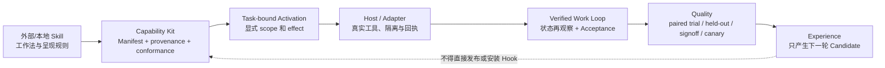

# Agent Skills 调研：mattpocock、i-have-adhd 与 Ponytail 对 Craft 的启示

> 检索日期：2026-09-21（Asia/Shanghai）  
> 范围：只核验一手资料（项目仓库 README、`SKILL.md`、同仓脚本/测试/适配器，以及 Craft 当前工作树）。未安装、未运行外部 Skill，也未改动 Craft 代码或配置。  
> 结论先行：三者最值得迁入 Craft 的不是更多 Markdown 规则，而是三个可治理机制：**可组合的工作流编排、对 Skill 自身的隔离/盲评门禁、以及把“少做”变成可验证的最小变更策略**。它们都不应绕开 Craft 的 `Task / State / Policy / Receipt / Evidence / Outcome / Eval Gate` 内核。

## 1. 研究问题、身份与证据边界

本报告回答：这些公开 Skills 分别解决什么问题；其触发、工作流、约束、验证和真实执行边界是什么；哪些可迁移到 Craft 的 Knowledge、Memory、Experience、Quality、Capability Kit 与 Procedure Automation；哪些不应迁移。

### 1.1 项目身份

| 名称 | 本报告采用的项目 | 身份核验与范围 |
| --- | --- | --- |
| Matt Pocock Skills | [`mattpocock/skills`](https://github.com/mattpocock/skills) | 官方 README 将其定位为可组合、可修改、面向真实工程的 Skills；当前 `main` 目录共有 **38 个** `SKILL.md`，其中 18 个 engineering、9 个 `in-progress`、4 个 misc、7 个 productivity。插件清单只正式发布 engineering + productivity 的 25 个；另外 13 个是 `in-progress` / misc。目录枚举依据 [GitHub tree API](https://api.github.com/repos/mattpocock/skills/git/trees/main?recursive=1) 与 [plugin manifest](https://raw.githubusercontent.com/mattpocock/skills/main/.claude-plugin/plugin.json)。 |
| i-have-adhd | [`ayghri/i-have-adhd`](https://github.com/ayghri/i-have-adhd) | 同名仓库不止一个，例如 `iizcm/i-have-adhd-skill`、`hackersatyamrastogi/i-have-adhd`；它们不是同一实现。本报告只讨论维护者仓 `ayghri/i-have-adhd` 的 [`skills/i-have-adhd/SKILL.md`](https://raw.githubusercontent.com/ayghri/i-have-adhd/main/skills/i-have-adhd/SKILL.md)。 |
| Ponytail | 本机已安装的 [`SKILL.md`](/Users/didi/.agents/skills/ponytail/SKILL.md)，并以 [`meo9805/ponytail`](https://github.com/meo9805/ponytail) 上游的 [portability 文档](https://github.com/meo9805/ponytail/blob/main/docs/agent-portability.md) 交叉核验 | 当前本机安装内容是单个 `ponytail` Skill；上游另有 `ponytail-review`、`ponytail-audit`、`ponytail-debt`、`ponytail-gain`、`ponytail-help`。本报告将本机文件作为本轮实际可见行为的权威，不推定本机与上游版本完全一致。 |

### 1.2 Craft 对照基线

以下不是设计愿景，而是本工作树可定位的实现边界：

- [Capability Kit Runtime](../technical/modules/capability-kit-runtime.md) 已把 Manifest、精确版本、依赖、Conformance、Task Activation、阶段性 digest-only Contribution 与撤销分开；Kit 不能直接写核心事实、读取凭据、安装时执行第三方代码，或把 Hook 声明当执行授权。
- [Experience Skill](../../skills/craft-experience/SKILL.md) 要求两条独立的、脱敏的真实结果才产生 Candidate；`shadow → held_out → signoff → canary` 后才可 routeable。它不因一次成功或写出 `SKILL.md` 而自我发布。
- [Quality Skill](../../skills/craft-quality/SKILL.md) 规定冻结 Subject、Case、环境、预算与 Grader；使用重复等预算 Trial，结论只能是 `eligible`、`rejected`、`inconclusive`。
- [`ProcedureAutomationKernel`](../../capability/craft-experience/procedure-automation.ts) 已有 interval `tick`、配额、可重试、checkpoint、receipt、验收 verifier、无进展 handoff；但只自动化已 routeable 的 **linear Workflow**，effect 仅限 `read_only` / `local_write`。Graph、Prompt Procedure、Host/远程副作用必须由独立 Adapter 承担。
- [Durable Action Loop](../technical/modules/durable-action-experience.md) 和 [Verified Work Loop](../technical/modules/verified-work-loop.md) 明确：Host 自述完成、命令退出成功、无正文 action report 都不等于交付；必须有状态再观察和 passed Acceptance。

因此，本报告不把“Skill 被加载”当作“能力已执行”，也不把“Skill 的单元测试通过”当作“Craft 或宿主在真实工程任务中变好”。

## 2. Matt Pocock：一个以用户编排为主的工程工作流库

### 2.1 核心模型和执行边界

官方 README 的关键选择是：Skill 应当小、可改、可组合，而不由一个巨型过程框架接管全部开发；`/setup-matt-pocock-skills` 在每个仓库先把 issue tracker、triage label 和领域文档位置写成已提交的 Markdown 配置，再让后续 Skill 读取这些 project-local 指针。[README](https://github.com/mattpocock/skills/blob/main/README.md) · [setup 源码](https://github.com/mattpocock/skills/blob/main/skills/engineering/setup-matt-pocock-skills/SKILL.md)

它将 Skill 分成两类：

- `disable-model-invocation: true` 的**用户调用编排器**，只能由用户明确触发；它们可以调用 model-invoked 基础纪律，但不应互相偷偷触发。
- 未禁用的**模型可调用纪律**，由任务语义触发，也可被上层编排器复用。

这是可取的责任分割：何时启动一条较长的流程是人的决策；如何诊断、写测试、评审、查询一手资料是可复用的局部纪律。它的边界也很清楚：绝大多数 Skill 只是对 Agent 的自然语言过程约束；真正写 issue、提交、跑命令或调用 tracker 仍由宿主工具、凭据与项目配置决定。

### 2.2 全量清单（当前 `main`）

下表是逐一枚举，不等同于建议全部启用。链接均指向一手 `SKILL.md`；`in-progress` 是仓库显式的未稳定区域，应更严格地看待。

| 分类 | Skill | 主要工作流 / 约束 | 对 Craft 的初步判断 |
| --- | --- | --- | --- |
| engineering | [`ask-matt`](https://github.com/mattpocock/skills/blob/main/skills/engineering/ask-matt/SKILL.md) | 人工调用的路由表：推荐下一个 Skill/流程并停止，不自行执行。 | 可借鉴为 Capability discovery 的解释层；不替代 Craft 的策略决策。 |
| engineering | [`setup-matt-pocock-skills`](https://github.com/mattpocock/skills/blob/main/skills/engineering/setup-matt-pocock-skills/SKILL.md) | 一次性发现并经用户确认后写 project-local tracker/label/domain 配置。 | 借鉴“配置是已提交项目资产”；应生成 Kit/Adapter Candidate，而非让模型猜 tracker。 |
| engineering | [`grill-with-docs`](https://github.com/mattpocock/skills/blob/main/skills/engineering/grill-with-docs/SKILL.md) | 调用 grilling + domain-modeling，在访谈中沉淀 glossary/ADR。 | 可成为 Knowledge Candidate 的输入，不应直接提升为 reviewed Knowledge。 |
| engineering | [`triage`](https://github.com/mattpocock/skills/blob/main/skills/engineering/triage/SKILL.md) | issue/外部 PR 的小状态机，分类、核验、澄清与 agent-ready brief；对外评论附 AI 声明。 | 很适合作为未来只读/草稿 tracker Adapter 的场景，但发评论是外部 effect。 |
| engineering | [`to-spec`](https://github.com/mattpocock/skills/blob/main/skills/engineering/to-spec/SKILL.md) | 从既有对话综合 Spec；先看代码、领域词汇和 ADR，设计测试 seam。 | 可做有 provenance 的 Spec Candidate，需独立验收而不是直接发布。 |
| engineering | [`to-tickets`](https://github.com/mattpocock/skills/blob/main/skills/engineering/to-tickets/SKILL.md) | 按 blocking edge 拆成 tracer-bullet tickets。 | 可迁移为 Craft `TaskGraph` 的导入/投影，不应把文本依赖关系当可执行授权。 |
| engineering | [`implement`](https://github.com/mattpocock/skills/blob/main/skills/engineering/implement/SKILL.md) | 基于 spec/ticket 实施；在预先约定 seam 用 TDD，定期 typecheck/单测，末尾全测与 code review，再提交。 | 其“先有 acceptance，再推进”可投影为 Procedure；提交仍需 Craft 写入策略与审批。 |
| engineering | [`wayfinder`](https://github.com/mattpocock/skills/blob/main/skills/engineering/wayfinder/SKILL.md) | 大任务先生成 decision-ticket map，逐项消除未知；默认只计划，不直接交付。 | 对长任务的决策图很有价值；适合 Experience 的 diagnostic 资产，不能替代 Task/State。 |
| engineering | [`prototype`](https://github.com/mattpocock/skills/blob/main/skills/engineering/prototype/SKILL.md) | throwaway 原型回答一个明确设计问题；逻辑分支输出可操作 HTML，UI 分支给多种可切换变体。 | 可作为 Sandbox/Fixture 的实验 Subject；原型结果不能自动成为生产方案。 |
| engineering | [`diagnosing-bugs`](https://github.com/mattpocock/skills/blob/main/skills/engineering/diagnosing-bugs/SKILL.md) | 红化反馈环→最小化→假设→埋点→修复→回归；要求先脱敏命令/输出/工件。 | 直接强化 Craft 的证据与 redaction 契约；“模型判断根因”仍只能是候选。 |
| engineering | [`tdd`](https://github.com/mattpocock/skills/blob/main/skills/engineering/tdd/SKILL.md) | red-green-refactor，行为经公共接口验证，读领域文档和 ADR。 | 可作为 coding Procedure 的一条 routeable 候选；应按变化风险而非每个任务强制。 |
| engineering | [`code-review`](https://github.com/mattpocock/skills/blob/main/skills/engineering/code-review/SKILL.md) | 固定基线 diff，从 Standards 与 Spec 两轴并行独立评审，最后聚合。 | 很值得迁移：双轴、独立上下文、基线固定；发现仍须以可复现证据与独立 outcome 结算。 |
| engineering | [`codebase-design`](https://github.com/mattpocock/skills/blob/main/skills/engineering/codebase-design/SKILL.md) | deep-module 词汇与原则：小 interface 包住大量行为、clean seam、可测。 | 可作为版本化 Knowledge/Skill 资产；术语不可绕过项目实际领域语言。 |
| engineering | [`domain-modeling`](https://github.com/mattpocock/skills/blob/main/skills/engineering/domain-modeling/SKILL.md) | 主动挑战术语和边界案例，并把 glossary/ADR 写下。 | 符合 Knowledge 的 source→candidate→review 路径；非证据化对话不能直接入库。 |
| engineering | [`improve-codebase-architecture`](https://github.com/mattpocock/skills/blob/main/skills/engineering/improve-codebase-architecture/SKILL.md) | 扫描 shallow/deep module 机会，出可视化 HTML，再访谈选择。 | 适合作为只读分析 + artifact；报告不是重构授权。 |
| engineering | [`research`](https://github.com/mattpocock/skills/blob/main/skills/engineering/research/SKILL.md) | 后台 Agent 只读一手资料，产出带引用 Markdown。 | 本次即采用；与 Craft Knowledge 的 provenance/evidence 直接契合。 |
| engineering | [`resolving-merge-conflicts`](https://github.com/mattpocock/skills/blob/main/skills/engineering/resolving-merge-conflicts/SKILL.md) | 先追两边 primary intent，再逐 hunk 解决，自动检查后完成 merge/rebase，明确禁止 abort。 | “intent provenance + test”可借鉴；“永不 abort”不应成为 Craft 全局规则。 |
| engineering | [`wizard`](https://github.com/mattpocock/skills/blob/main/skills/engineering/wizard/SKILL.md) | 人类执行的分步 Bash 向导；模板有确认门、敏感输入、幂等更新。 | 可借鉴人工步骤/Receipt 建模；写 `.env`、secret、迁移是高风险 effect，必须独立授权。 |
| in-progress | [`claude-handoff`](https://github.com/mattpocock/skills/blob/main/skills/in-progress/claude-handoff/SKILL.md) | 将摘要交给后台 Agent 并立即启动。 | Craft 已有 handoff/long-task 账本；不照搬特定 CLI 启动方式。 |
| in-progress | [`implement-spec`](https://github.com/mattpocock/skills/blob/main/skills/in-progress/implement-spec/SKILL.md) | 把 tickets 看作 task graph，在 ready frontier 并发分派。 | 可作为 Ticket Autopilot 的产品需求来源；不能直接获得 worktree、PR、merge 权限。 |
| in-progress | [`loop-me`](https://github.com/mattpocock/skills/blob/main/skills/in-progress/loop-me/SKILL.md) | 将生活/工作中的重复模式写为 workflow spec。 | 与 Craft Experience 名词相近，但这里是用户设计，不是从 Outcome 学习；两者不可混账。 |
| in-progress | [`pr`](https://github.com/mattpocock/skills/blob/main/skills/in-progress/pr/SKILL.md) | PR 正文模板。 | 仅是展示层；不能替代 diff、CI、review 或 merge gate。 |
| in-progress | [`retro`](https://github.com/mattpocock/skills/blob/main/skills/in-progress/retro/SKILL.md) | 从 session primary source 找环境改进候选。 | 可作为 Experience Observation→Candidate 输入；不能让复盘直接改 Agent 环境。 |
| in-progress | [`setup-ts-deep-modules`](https://github.com/mattpocock/skills/blob/main/skills/in-progress/setup-ts-deep-modules/SKILL.md) | 安装 dependency-cruiser 并证明 deep-module 规则确实生效。 | “规则必须 bite”值得借鉴；项目特定依赖/写配置不宜泛化。 |
| in-progress | [`writing-beats`](https://github.com/mattpocock/skills/blob/main/skills/in-progress/writing-beats/SKILL.md) | 从既定材料按 beat 组织文章。 | 非 Craft 核心；可作为通用内容 Kit 的可选样本。 |
| in-progress | [`writing-fragments`](https://github.com/mattpocock/skills/blob/main/skills/in-progress/writing-fragments/SKILL.md) | 先发散收集 fragments，不预先固化结构。 | 非核心；可启发候选与正式资产分层。 |
| in-progress | [`writing-shape`](https://github.com/mattpocock/skills/blob/main/skills/in-progress/writing-shape/SKILL.md) | 只读原料、另产文章，逐段成形。 | 非核心；可启发“原始材料不可被候选写回”。 |
| misc | [`git-guardrails-claude-code`](https://github.com/mattpocock/skills/blob/main/skills/misc/git-guardrails-claude-code/SKILL.md) | 用 PreToolUse hook 阻止 push、hard reset、clean、删分支等危险 Git。 | 可借鉴 hook 声明/测试；Craft 应继续以 effect policy/approval 为权威，不只靠字符串拦截。 |
| misc | [`migrate-to-shoehorn`](https://github.com/mattpocock/skills/blob/main/skills/misc/migrate-to-shoehorn/SKILL.md) | 测试中将 `as` 迁到类型安全的 shoehorn。 | 高度库特定，不进入通用 Craft。 |
| misc | [`scaffold-exercises`](https://github.com/mattpocock/skills/blob/main/skills/misc/scaffold-exercises/SKILL.md) | 课程练习目录与 lint 约束。 | 高度仓库特定，不迁移。 |
| misc | [`setup-pre-commit`](https://github.com/mattpocock/skills/blob/main/skills/misc/setup-pre-commit/SKILL.md) | 配 Husky/lint-staged/typecheck/test。 | 可作为项目 Kit 的受控安装模板，不做平台默认。 |
| productivity | [`grill-me`](https://github.com/mattpocock/skills/blob/main/skills/productivity/grill-me/SKILL.md) | 调用 grilling 作深入访谈。 | 人类澄清是重要 gate；不应为避免提问而绕过歧义。 |
| productivity | [`grilling`](https://github.com/mattpocock/skills/blob/main/skills/productivity/grilling/SKILL.md) | 以设计树 frontier 分轮提问，每题附建议答案，等回答再前进。 | 可借鉴为高风险 plan 的澄清 UX；不应作为每次自动执行前的阻塞。 |
| productivity | [`handoff`](https://github.com/mattpocock/skills/blob/main/skills/productivity/handoff/SKILL.md) | 生成脱敏、指针化的临时交接文件。 | 与 Craft durable handoff 对齐；Craft 应保留版本/receipt/过期边界。 |
| productivity | [`teach`](https://github.com/mattpocock/skills/blob/main/skills/productivity/teach/SKILL.md) | 以 workspace 保存学习任务、参考材料和资源。 | 不是当前优先级；不能混入项目 Knowledge/Memory。 |
| productivity | [`to-questionnaire`](https://github.com/mattpocock/skills/blob/main/skills/productivity/to-questionnaire/SKILL.md) | 对“发送对象与所需答案”访谈，产出给领域专家填写的问卷。 | 可作为人类补证据的低风险 workflow；答案仍要经 Knowledge review。 |
| productivity | [`wait-what`](https://github.com/mattpocock/skills/blob/main/skills/productivity/wait-what/SKILL.md) | 将没讲清的上一轮用 plain language 和项目词汇重讲。 | 可借鉴 presentation profile；绝不可压缩掉高风险证据。 |
| productivity | [`writing-for-agents`](https://github.com/mattpocock/skills/blob/main/skills/productivity/writing-for-agents/SKILL.md) | 把 Skill/AGENTS 文档看作带触发条件的 context pointer，强调明确分支与渐进加载。 | 对 Craft Kit/Skill 投影最直接：manifest/摘要要声明触发与边界，避免常驻长提示。 |

### 2.3 其中真正值得采用的四件事

1. **项目局部、已提交的 Adapter 配置。** `setup-matt-pocock-skills` 不把 GitHub/Linear/本地 tracker 细节硬编码进 Skill，而写进 `docs/agents/`。Craft 可将这种文件登记为受信任项目 Source，并由 Kit Manifest 引用其 digest；内容漂移必须让 Activation `needs_replan`。
2. **编排器与基础纪律分层。** `implement`、`to-spec`、`triage` 是人显式启动的流程；`tdd`、diagnosing、review、领域建模是可组合的局部纪律。Craft 可以把前者实现为 Capability/Procedure Candidate，把后者实现为小而可测的 Skill asset；二者都不能直接拿到 effect。
3. **代码评审的双轴独立性。** Standards 与 Spec review 并行，避免同一 Agent 先形成“实现正确”的结论后污染另一轴。迁入时要固定 diff baseline、spec digest、reviewer identity、证据指针与结论；最终 Acceptance 仍取决于独立状态观察。
4. **Task graph 的 ready frontier。** `to-tickets` / `implement-spec` 的 blocking edge 和 ready frontier 是 Ticket Autopilot 所需的领域模型。但它只说明“哪些工作理论上可开始”，不解决并发隔离、幂等、worktree、CI、PR 或 merge 的外部执行与回滚。
5. **诊断先有可反证证据。** `diagnosing-bugs` 要求在假设前先得到针对该症状、可无人运行、确定且能变红的反馈命令；随后才最小复现、提出可证伪假设、插桩、回归并清理调试物。Craft 应将它固化为 diagnose Candidate 的 blocking precondition，避免“解释得通”替代“已复现”。

### 2.4 不应照搬的部分

- 不把 38 个 Skill 一次性安装/激活；这会增加选择噪声，并把项目特定假设误当通用规则。
- 不以 Markdown 中的“最后提交”取代 Craft 的 Git effect policy、受控 Workspace、状态再观察和 Acceptance。
- 不把 `in-progress` 中的并发 Agent / CLI 指令直接变为系统调度器；它们缺少 Craft 要求的预算、隔离、receipt、reconcile 和授权契约。
- 不把 `CONTEXT.md`、ADR 或 Agent 的访谈记录直接当成 confirmed Knowledge；它们只能是 digest-pinned Source / Evidence Candidate。

## 3. ayghri/i-have-adhd：呈现体验 Skill，及其比内容更有价值的评测方式

### 3.1 实际能力，而非名字所暗示的能力

此仓的核心不是 ADHD 诊断、研发流程、CI 或项目自治，而是防止 coding agent 把可行动的答案埋在长篇前言中。[README](https://raw.githubusercontent.com/ayghri/i-have-adhd/main/README.md) 与 [SKILL.md](https://raw.githubusercontent.com/ayghri/i-have-adhd/main/skills/i-have-adhd/SKILL.md) 规定的输出习惯包括：

- 首行给答案或下一动作；多步骤以编号呈现，每一步有界；结尾只给一个两分钟内能做的下一步；可见清单最多五项。
- 每轮说明当前进度和预计时间；变更后说明现在什么可用；错误以“位置—原因—修复”表达；减少岔题、前言、复盘和收尾。
- 用户要求完整解释时可突破简洁规则；破坏性操作仍要确认；真实歧义只问一个短问题；连续三次修复失败时停止猜测并指出可疑假设。

它是显式调用而非语义自动路由：`SKILL.md` 中有 `disable-model-invocation: true`，其 Codex adapter 也声明 `allow_implicit_invocation: false`。[OpenAI adapter](https://raw.githubusercontent.com/ayghri/i-have-adhd/main/skills/i-have-adhd/agents/openai.yaml) 启用后持续到用户说 `stop adhd mode`/`normal mode`。可选 always-on hook 只在用户自行建立标记文件后才从本地读取文本并注入；找不到标记、文件或发生异常均 `exit 0`，不阻塞 session start。[hook manifest](https://raw.githubusercontent.com/ayghri/i-have-adhd/main/hooks/hooks.json) · [hook 实现](https://raw.githubusercontent.com/ayghri/i-have-adhd/main/hooks/always-on.mjs)

故其执行边界很窄：没有 code executor、CI、PR、tracker 或 merge 调用；文本注入不是质量证据，更不是 effect authorization。

### 3.2 最有价值的是其 Skill Evals，而不是十条文案

仓内把自身当作 candidate，使用 cases/rubric/runner：同 prompt 的 baseline/candidate/comparator、多 trial、固定模型/预算；中性临时 cwd、禁用用户设置以隔离本机记忆和插件污染；可恢复、有限重试并记录 token/cost。[runner](https://raw.githubusercontent.com/ayghri/i-have-adhd/main/scripts/run_evals.py)

裁判只看到隐藏条件名的 rubric，按每 case/trial 生成可复现 A/B/C 标签；不完整配对不计分。这是结构性盲评，不是让被评对象自己解释为什么更好。[judge](https://raw.githubusercontent.com/ayghri/i-have-adhd/main/scripts/judge.py) Release 条件是：没有 blocker、correctness/safety 相比 baseline 不低于 0.1、加权总分要更高。[rubric](https://raw.githubusercontent.com/ayghri/i-have-adhd/main/evals/rubric.md)

该项目的公开失败结果反而是最强的工程证据：即使 14 Case × 3 Trial 的 candidate 加权分提高 0.427，仍有三个 blocker，因而 Release 为 `FAILED`；其中一个回归是“cause→fix”格式诱导模型在证据不足时断言确定根因。[RESULTS](https://raw.githubusercontent.com/ayghri/i-have-adhd/main/evals/RESULTS.md)

### 3.3 对 Craft 的迁移方式

**可迁移：**

1. 将“行动优先、进度可见、失败时给证据和下一步”做成一个显式、可撤销、按用户/会话 scope 激活的 *Presentation / Collaboration Profile*。它应是 Capability Kit 的受控参数或 Host Adapter 提议，不是 Experience 自动发现后写入全局人格。
2. 优先迁移其**评测隔离机制**：固定 model/environment/budget、baseline-vs-candidate paired trials、隐藏 condition、blocker 绝对门槛、不可配对不计分、可恢复 receipt。Craft 的 Quality 已有 Subject/Case/Trial/Outcome 骨架；缺的是一个真实 Host 中的“输出呈现风格”测试 Subject，而非再写十条提示词。
3. 将“三次失败后停止并指出假设”实现为可审计 retry policy：记录尝试、failure signature、Evidence、上限和 handoff，进入 `needs_replan` / `requires_handoff`，而不是仅要求模型改一句话。当前 Procedure Automation 已有 `max_attempts`、`max_no_progress` 与 handoff，可作为最接近的内核位置。

**不迁移：**

- 不把 ADHD 作为默认人设、用户画像或诊断；用户需显式 opt-in，并可随时撤销。
- 不让“最多五项/只有一个 next step”裁剪对安全、验收、冲突、证据和风险必需的信息；它只约束呈现层。
- 不采用无条件“原因→修复”格式。应改为 `位置 → 已观察证据 → 假设/置信度 → 下一项验证`，直接规避该项目公开评测暴露的无证据定因问题。
- 不把 always-on hook 当作静默全局化许可；Craft 不应读 home 下任意标记、写宿主配置或让 Experience 自行安装 Hook。

## 4. Ponytail：最小充分实现，而不是“少做少测”

### 4.1 本机实际规则

本轮本机文件 [`/Users/didi/.agents/skills/ponytail/SKILL.md`](/Users/didi/.agents/skills/ponytail/SKILL.md) 是唯一的本机行为证据。它默认 `full`，另有 `lite` / `ultra`，以“惰性是高效而非草率”为前提，给出一条由高到低的决策梯：

```text
需求真的存在？
→ 代码库是否已有可复用实现？
→ 标准库？
→ 平台原生能力？
→ 已安装依赖？
→ 一行能否解决？
→ 才写最少代码
```

但它同时要求先理解问题、完整追真实调用链；修 bug 时搜索所有 caller，在共享根因处修，而不是只贴 ticket 症状。它禁止未请求抽象、预留脚手架和不必要依赖；优先删除、少文件、短 diff。对于有 branch/loop/parser/money/security 的非平凡逻辑，仍必须留下一个最小可运行检查；输入校验、数据防丢、安全、可访问性与用户明确要求不能因“懒”被简化。

上游 [agent portability 文档](https://github.com/meo9805/ponytail/blob/main/docs/agent-portability.md) 把核心规则放在 `skills/`，再以 Claude/Codex/OpenCode/Pi 等薄适配器注入模式；并列出 review、audit、debt、gain 等辅助 Skill。这对 Craft 的启示是“核心行为资产与宿主接入分离”，而不是复制某一个 Host 的 Hook。

### 4.2 可迁移机制

1. **最小变更作为可测策略，而不是语气。** 在 Task Contract/Acceptance Plan 中加入可选 `change_budget`：复用候选是否搜索过、引入依赖数、受影响文件/模块数、公开 API 数、是否产生可执行验证。它只用于解释/评测，不可成为“行数越少越好”的盲目优化函数。
2. **根因覆盖检查。** 对 bug-fix Subject 建立评测 Case：已知 sibling caller、异常/边界输入和回归 test。Candidate 仅修 ticket path 而不修共享路径，应在 held-out Case 失败。这把 Ponytail 的“grep every caller”从文本建议变成 Quality 的可验证 outcome。
3. **将选择记录成可复现证据。** 记录选择的 ladder rung、拒绝的复用/stdlib 候选及原因、验证命令引用；不要记录完整思维链。它可作为 Capability Kit contribution / Acceptance Evidence 的脱敏摘要。
4. **保留“理解在前、最小在后”。** Craft 的 `Verified Work Loop` 要求观察、plan、执行、再观察；Ponytail 只应影响 plan 的候选集与 acceptance，不应绕过 Context Gate 或降低安全边界。

### 4.3 不迁移项

- 不以 diff 行数、文件数或依赖数单独作为 Quality gate；正确性、安全、可维护性和用户的完整需求优先。
- 不把 `ultra` 模式用于安全、迁移、并发、金额或不确定 effect；此类任务应提高验证强度，不能提高“省事”强度。
- 不以 Ponytail 的“一个最小检查”降低 Craft 对公共基础能力、跨模块变更或增量覆盖率的既有门槛。

## 5. 统一判断：Skill 是行为候选，Craft 是其治理与证明平面

三者互补但所在层次不同：



其中：

- Matt 的价值主要落在 `S`：清晰的流程分层、项目局部配置、独立 review 和 ready frontier。
- i-have-adhd 的价值主要是 `Q`：将提示/呈现规则作为 candidate 做隔离的成对盲评，并以 blocker 否决发布。
- Ponytail 的价值主要是 `S → V`：先搞懂真实路径，再以最小充分变更和最小有效验证交付。
- Craft 已拥有 `K/A/V/Q/E` 的大量内核。短板不是再把这些文本复制进去，而是用一个真实 Host Adapter 证明：激活某个小 Skill/Kit 是否让同一 Case、同一模型、同一预算下的终态变好。

## 6. 最小、分阶段的落地建议

以下是建议，不是本轮变更计划；每阶段失败都应停在候选/草稿状态，不能自动扩大 effect。

### Phase 0：建立基线（无产品代码变更）

选择一个单一、低风险编码场景，例如 `coding:bug-fix-shared-caller`。准备 12–20 个脱敏 fixture，明确：输入、允许 workspace、固定 acceptance command、预期终态与两个 sibling-caller 回归 case。固定 Host、模型、预算和环境指纹。

**验收指标：**

- 100% Case 有可运行 deterministic verifier；
- baseline 至少 3–5 次完整 Trial，记录 first-pass、终态通过、无效 retry、耗时、成本；
- 不因该阶段产生 routeable Procedure、默认 Skill 或外部 effect。

### Phase 1：只读的 Engineering Skill Profile Candidate

把三个小规则资产作为 versioned Candidate（不安装第三方包）：

1. `root-cause-minimal-change`：Ponytail 的调用链/复用/最小检查纪律；
2. `tdd-or-direct-verification`：借鉴 Matt，但依据 change class 选择测试而非机械 TDD；
3. `two-axis-diff-review`：固定 baseline 的 Standards + Spec 独立 review。

它们通过 Capability Kit Manifest 声明 `read_only` 或 `local_write`、适用 scope、输入输出 digest、禁止的 effect 和 verifier。Skill 正文可以是受管 asset 或 adapter descriptor；不允许其直接创建 commit/PR、调用 tracker 或写 Host hook。

**验收指标：**

- Conformance 拒绝未固定 digest、越权 effect、依赖漂移和 disabled/revoked Kit；
- Case 中 100% 记录被选/未选 profile 及理由摘要；
- 只有 acceptance 自身通过才记录 delivery，Host “done”不计成功。

### Phase 2：把 i-have-adhd 的评测方法迁入 Craft Quality

建立 `EngineeringProfileSubject` 的 baseline/candidate paired runner：同 Case、同 Host/模型/预算、同 trial 序号；judge 只读取隐藏 condition 与 rubric；不完整 pair 不聚合。定义 hard blocker：安全/事实/验收回退、跨 scope 泄漏、无证据根因断言、错误 effect 尝试。

**建议晋级门槛（先作为试验阈值，需校准）：**

| 指标 | 候选必须满足 |
| --- | --- |
| deterministic acceptance pass rate | 不低于 baseline，且无 hard blocker |
| sibling-caller 回归 | 0 漏检 |
| 共享根因修复率 | 高于或等于 baseline |
| 无效 retry / 成本 / 时延 | 在固定质量下不恶化；净改善才算收益 |
| Review 发现有效率 | 只计能由 diff/spec/测试证据复现的发现 |
| 试验数量 | 每个 candidate 至少 3–5 对完整 Trial；不以单次成功晋级 |

只有 `eligible` 的 Candidate 才能请求既有 Signoff / Canary；仍不能自动 publish/activate。

### Phase 3：受控 Automation（只在 Phase 2 有收益后）

将已经 routeable 的线性 Workflow 接入现有 `ProcedureAutomationKernel`，由外部 cron/CI/Host 显式调用 `tick`。初始只允许 read-only validation、local workspace write、冻结 verifier、配额与已实现的 `requires_handoff`。不要让 Experience 负责调度，也不要在本阶段做 issue/PR/merge。

**验收指标：**

- 每次运行都有 `job → run → checkpoint → receipt → outcome`；
- verifier 不通过、无进展、retry budget 耗尽均停止并生成 handoff；
- 自动化 Job 不能执行 Graph/Prompt Procedure、网络或外部写入；相关拒绝路径有回归测试。

### Phase 4：另立 Ticket/Forge Adapter 项目（不属于本次三个 Skill 的直接能力）

若仍要实现 overnight ticket loop，应作为独立 Capability/Adapter：只读 tracker 发现 → dispatch ledger → 隔离 worktree / Draft PR → CI/独立 review receipt → 受项目 policy 约束的 merge。先做只读和 Draft PR，再考虑合并；每个 effect 都需显式 grant、幂等键、reconciliation 与回滚/人工接管策略。

**关键否决条件：** 任何“subagent 说 DONE”、PR 正文完成、或 Skill 自述遵守流程，都不能通过 merge gate。只有接收端 Forge receipt、保护分支状态、固定 CI/Acceptance 和独立观察共同构成证据。

## 7. 明确的非目标与未验证项

- 本报告没有安装、运行、审计或背书任何外部 Skill；也没有评估其供应链安全、维护响应、许可证以外的法律适配或跨 Host 一致性。
- Matt 目录里的 `in-progress` 已逐项列出，但不应按稳定 API 或生产 SLA 使用；其特定 CLI/issue-tracker 命令不是 Craft Adapter 实现证明。
- i-have-adhd 的公开 eval 证明该仓的 runner/rubric 有上述逻辑，并不证明其对 Craft、中文输出、当前 Codex Host 或任意任务集的净收益。
- Ponytail 本轮精确核验的是本机 `SKILL.md`；上游辅助 Skills 只由其官方 portability 文档确认，未在本机安装或运行。
- Craft 当前许多边界有本地实现与测试，但本报告未宣称真实生产 sandbox、真实 GitHub/GitLab 自动化、远端 scheduler 或业务 Outcome 已部署/证明。

## 8. 来源索引

### 外部一手来源

- [mattpocock/skills README](https://github.com/mattpocock/skills/blob/main/README.md)、[完整目录 tree](https://api.github.com/repos/mattpocock/skills/git/trees/main?recursive=1)、[engineering README](https://github.com/mattpocock/skills/tree/main/skills/engineering)、[in-progress README](https://github.com/mattpocock/skills/tree/main/skills/in-progress)。
- 表 2.2 中每项 Skill 的直接 `SKILL.md` 链接；其余支撑资料包括 [setup 文档](https://github.com/mattpocock/skills/blob/main/docs/engineering/setup-matt-pocock-skills.md) 和 [ask-matt 文档](https://github.com/mattpocock/skills/blob/main/docs/engineering/ask-matt.md)。
- [ayghri/i-have-adhd README](https://raw.githubusercontent.com/ayghri/i-have-adhd/main/README.md)、[Skill](https://raw.githubusercontent.com/ayghri/i-have-adhd/main/skills/i-have-adhd/SKILL.md)、[Codex adapter](https://raw.githubusercontent.com/ayghri/i-have-adhd/main/skills/i-have-adhd/agents/openai.yaml)、[hooks](https://raw.githubusercontent.com/ayghri/i-have-adhd/main/hooks/hooks.json)、[always-on 实现](https://raw.githubusercontent.com/ayghri/i-have-adhd/main/hooks/always-on.mjs)、[eval runner](https://raw.githubusercontent.com/ayghri/i-have-adhd/main/scripts/run_evals.py)、[judge](https://raw.githubusercontent.com/ayghri/i-have-adhd/main/scripts/judge.py)、[rubric](https://raw.githubusercontent.com/ayghri/i-have-adhd/main/evals/rubric.md)、[结果](https://raw.githubusercontent.com/ayghri/i-have-adhd/main/evals/RESULTS.md)。
- [Ponytail 上游 portability 文档](https://github.com/meo9805/ponytail/blob/main/docs/agent-portability.md)。

### 本地一手来源

- [本机 Ponytail Skill](/Users/didi/.agents/skills/ponytail/SKILL.md)
- [Craft Capability Kit Runtime](../technical/modules/capability-kit-runtime.md)
- [Craft Experience Skill](../../skills/craft-experience/SKILL.md) · [Quality Skill](../../skills/craft-quality/SKILL.md)
- [Procedure Automation 实现](../../capability/craft-experience/procedure-automation.ts) · [对应测试](../../tests/procedure-automation.test.ts)
- [Workflow / Verification / Signoff](../technical/modules/workflow-signoff.md) · [Durable Action Loop](../technical/modules/durable-action-experience.md) · [执行策略](../technical/modules/execution-policy.md)
