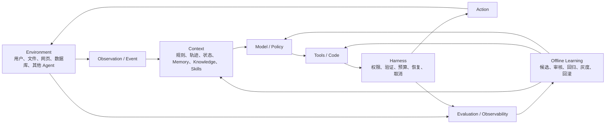
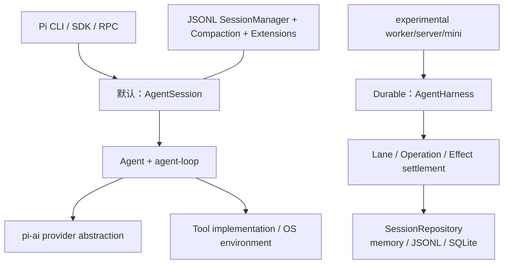
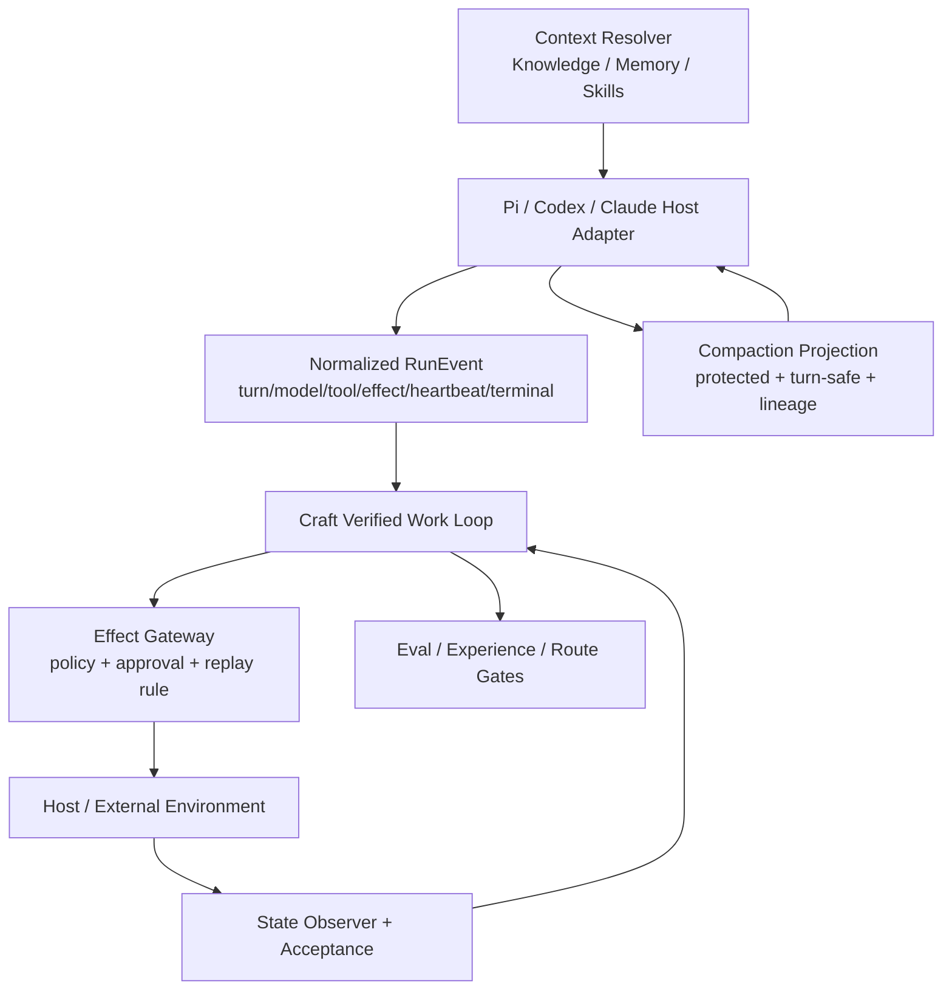

# 《AI Agent 构建指南》、Pi Agent 与 Craft 差距研究

> 日期：2026-09-20
>
> 结论口径：源码与文档静态核验；不代表生产部署验证
>
> Craft 基线：`43db8106c57c679625af6bcd140d19a1c48a6bea`，`package.json` 为 `0.12.34`

## 1. 范围、假设与方法

### 1.1 假设

- “书下面所有文章”指 `book/` 下全部 Markdown；构建脚本、LaTeX 和图片只做目录完整性检查。
- “PI Agent”指 Mario Zechner 发起、原位于 `badlogic/pi-mono`、现迁移到 `earendil-works/pi` 的 **Pi Agent Harness**，不是同名的个人助理、强化学习或加密项目。
- 本文研究的是 Agent/Harness 架构及其对 Craft 的帮助，不评价具体模型智力，也不把 GitHub 热度当成工程正确性的证据。
- Craft 的目标不是再造一个 Coding Agent，而是成为可接入 Pi、Codex、Claude Code 等 Host 的受管控制面：提供上下文、权限、状态、验证、恢复、评估和演进治理。

### 1.2 一手证据与固定版本

| 对象 | 固定版本 | 检查内容 |
|---|---|---|
| 《AI Agent 构建指南》 | [`1be5fd4`](https://github.com/bojieli/ai-agent-book/commit/1be5fd4f235b4af382a4403617f2d1657b719d94) | `book/` 完整目录、13 篇 Markdown 正文及参考答案 |
| Pi | [`d1230ea`](https://github.com/earendil-works/pi/commit/d1230ea2000d876b479a69b8b061f9d670f262f5) | monorepo、Agent loop、上下文、工具、会话、压缩、安全、扩展、durable harness、eval |
| Craft | 本地 commit `43db810` | ADR、能力矩阵、Host Session、Verified Work Loop、Long Task、Compaction、Memory/Knowledge 文档与测试 |

Pi 原地址 `https://github.com/badlogic/pi-mono` 当前重定向到 [`earendil-works/pi`](https://github.com/earendil-works/pi)。固定 commit 下的包名已是 `@earendil-works/pi-agent-core`、`@earendil-works/pi-coding-agent`，作者仍标为 Mario Zechner。这是本文认定项目身份的依据；旧文章里出现的 `@mariozechner/*` 是历史包名，不应据此误认成另一个项目。

GitHub 仓库首页在 2026-09-20 显示约 10.7 万 star、1.36 万 fork；这是“当前较火”的动态旁证，不参与架构优劣判断。本文固定链接用于可复核性，动态热度以[仓库首页](https://github.com/earendil-works/pi)为准。

### 1.3 方法与限制

- 逐篇读取书的 Markdown，而不是只看 README 或目录。
- 对 Pi 以代码为准，文档用于解释意图；特别区分默认 Coding Agent 路径和实验性 durable 路径。
- 对 Craft 以当前代码、测试和 ADR 为准；“已有协议/本地测试”不等于“已接入真实 Host/已部署有效”。
- 没有独立复核书中引用的每一篇第三方论文；本文只分析作者如何讲 Agent。
- Craft Memory 与 Craft Knowledge 子能力本轮均返回 `not available to the model`，因此没有伪造其检索结果；Craft 现状来自本地仓库证据。

## 2. 先给结论

1. 这本书和 Pi 对 Agent 的共同判断是：**模型不是系统，Harness 才把模型变成可运行 Agent**。上下文、工具、状态、权限、验证、恢复和评估共同决定真实能力。
2. Pi 最值得 Craft 学的不是终端 UI，而是几处可落地机制：转录记录优先、工具意图与结果分离、会话树、保持原始历史的压缩投影、溢出恢复、可插拔但明确的生命周期，以及 durable harness 对“意图—不确定外部效果—结算”的建模。
3. Craft 已有比 Pi 更强的治理骨架：Contract/Receipt、Host-neutral Session、Verified Work Loop、上下文决策门、长期任务重验证、候选—审核—灰度—撤销。但很多能力仍停留在控制面协议与本地测试，尚未形成一个 Pi Host 真实运行时适配器。
4. Craft 当前最重要的不是增加更多抽象，而是打通一条纵向链路：**Pi 事件 → Craft 标准 RunEvent → Effect Gate → State Observer → Acceptance → Compaction/Resume → Eval**。
5. 不应照搬 Pi 的默认本机权限、任意 TypeScript 扩展、把项目上下文文件无条件放进提示词、JSONL 作为跨系统权威状态，以及“无工具调用即自然结束”的低层停止语义。
6. 长任务“不跑偏、不摆烂、不阻塞、不误停”不能靠一个 Prompt 解决。Craft 已有无进展计数和 wait/wake 协议，但还缺真实 Host 心跳、工具指纹、错误预算、未知副作用结算、调度租约与端到端故障注入证据。

## 3. `book/` 完整目录与全部文章

固定目录见 [`book/`](https://github.com/bojieli/ai-agent-book/tree/1be5fd4f235b4af382a4403617f2d1657b719d94/book)。顶层共 21 个普通文件：13 篇 Markdown、8 个构建/排版文件；只有一个 `images/` 子目录，共 135 个图片资源，没有遗漏的文章。

8 个非正文文件是 `.gitignore`、`build_pdf.sh`、`cover.tex`、`crossref.lua`、`experiment_box.lua`、`gen_cover.py`、`preamble.tex`、`strip_titles.py`。

### 3.1 13 篇 Markdown 逐篇主题

| 文章 | 如何讲 Agent | 对 Craft 的直接启示 |
|---|---|---|
| [引言](https://github.com/bojieli/ai-agent-book/blob/1be5fd4f235b4af382a4403617f2d1657b719d94/book/introduction.md) | 用 `Agent = LLM + 上下文 + 工具` 建立全书主线，对应 Policy、Observation Space、Action Space。 | 能力问题先查“看不到什么、做不了什么”，不要默认换模型。 |
| [第 1 章：AI Agent 入门](https://github.com/bojieli/ai-agent-book/blob/1be5fd4f235b4af382a4403617f2d1657b719d94/book/chapter1.md) | Environment 在 Agent 外部；Agent 内部是 Model + Harness。Harness 构造上下文、暴露工具、维持循环和状态，并负责约束、验证、纠错。 | Craft 的边界应是 Harness 治理/控制面，不应吞掉模型循环和环境真相。 |
| [第 2 章：上下文工程](https://github.com/bojieli/ai-agent-book/blob/1be5fd4f235b4af382a4403617f2d1657b719d94/book/chapter2.md) | 上下文是一次决策的全部可见状态；稳定前缀、动态轨迹、Skills、状态栏分层；长任务要压缩、外置原文和隔离子任务。 | Context Receipt 要能证明来源、时点、裁剪和注入；压缩是可追溯投影，不是删除证据。 |
| [第 3 章：用户记忆和知识库](https://github.com/bojieli/ai-agent-book/blob/1be5fd4f235b4af382a4403617f2d1657b719d94/book/chapter3.md) | 区分个人记忆与共享知识；推荐“读取 → 后台提取候选 → 来源/策略核验 → 审核更新”。冲突按当前状态、历史事实和适用条件分类处理。 | 候选重复出现只提高价值，不应自动转正；要有 Evidence、时效、冲突、审核和撤销。 |
| [第 4 章：工具](https://github.com/bojieli/ai-agent-book/blob/1be5fd4f235b4af382a4403617f2d1657b719d94/book/chapter4.md) | 工具定义动作空间；通用执行器、专用工具、MCP、Skill Hub 分层；副作用必须事前授权、事后验证。 | Capability Route 和 Effect Gate 必须在确定性层执行，工具描述不是权限边界。 |
| [第 5 章：Coding Agent 与通用 Agent](https://github.com/bojieli/ai-agent-book/blob/1be5fd4f235b4af382a4403617f2d1657b719d94/book/chapter5.md) | 代码是元能力；Coding Agent 的优势来自测试、类型、版本控制等成熟 Harness。可靠性是每类故障都有检测、恢复、接管、终止路径。 | 为 API、工具、上下文、控制流分别定义错误分类、预算、恢复和人工升级。 |
| [第 6 章：交互](https://github.com/bojieli/ai-agent-book/blob/1be5fd4f235b4af382a4403617f2d1657b719d94/book/chapter6.md) | 把观察/动作扩展到异步事件、语音、GUI、机器人；共享骨架是感知—判断—行动—反馈—继续/纠正/重试/停止。 | 长任务要有唤醒、安全点、取消、抢占和快慢路径，而不是占住一个 Host 进程等待。 |
| [第 7 章：Agent 的评估](https://github.com/bojieli/ai-agent-book/blob/1be5fd4f235b4af382a4403617f2d1657b719d94/book/chapter7.md) | 成功定义、环境、数据集、验证器、Rubric、统计与失败归因共同构成评估；端到端回归之外还要做轨迹前缀边界测试。 | 把 Context/Permission/Stop 等关键边界做成可重放前缀用例，不能只测最终答案。 |
| [第 8 章：模型后训练](https://github.com/bojieli/ai-agent-book/blob/1be5fd4f235b4af382a4403617f2d1657b719d94/book/chapter8.md) | Mid-training、SFT、RL 分别解决底座、协议和策略问题；先判断失败属于哪一层，数据与环境常比算法更关键。 | Craft 当前优先完善 Harness 和评估证据，不急于把失败归因为模型训练不足。 |
| [第 9 章：Agent 的持续进化](https://github.com/bojieli/ai-agent-book/blob/1be5fd4f235b4af382a4403617f2d1657b719d94/book/chapter9.md) | 保存经验不等于学习；在线只收集证据，离线生成候选、独立验证、灰度、回滚，再更新知识、指令、程序或模型。 | 与 Craft 的 candidate/review/signoff/canary 方向一致；需要补的是可操作入口和真实数据闭环。 |
| [第 10 章：多 Agent 协作](https://github.com/bojieli/ai-agent-book/blob/1be5fd4f235b4af382a4403617f2d1657b719d94/book/chapter10.md) | 只有引入新信息、真实并行或上下文/权限隔离时，多 Agent 才抵得过协调成本；讨论拓扑、IPC、取消、预算与失败级联。 | 单 Agent 默认正确；子 Agent 必须有隔离上下文、预算、结构化交接、级联取消和独立验收。 |
| [后记](https://github.com/bojieli/ai-agent-book/blob/1be5fd4f235b4af382a4403617f2d1657b719d94/book/afterword.md) | 回到三元公式，并提出实时环境交互、从成败中持续学习两项长期难题；模型会吸收通用 Harness，但 Harness 会迁到新前沿。 | Craft 要沉淀可验证业务约束和运行证据，而不是依赖某一 Host 的短期产品形态。 |
| [思考题参考答案](https://github.com/bojieli/ai-agent-book/blob/1be5fd4f235b4af382a4403617f2d1657b719d94/book/reference-answers.md) | 十章开放题的答案提纲，不是独立理论；文件注明“AI 生成、人工略审”。补充了循环上限、调用指纹、熔断、ADD/UPDATE/DELETE/NOOP、Reviewer 独立证据等实践。 | 可作设计检查单，不能当未经复核的规范来源。 |

### 3.2 全书统一的 Agent 系统观

全书反复出现的工程模式是：提议者—审核者、渐进式披露、只增不改、边界集 + 保留集、最小 diff + 可回滚。它给长任务的答案也是组合机制，而非“更强的系统提示词”：显式目标和预算、追加轨迹、分层压缩、最大迭代、重复调用指纹、熔断、超时、安全点、外部验证器、人工接管，以及离线演进门禁。

## 4. Pi Agent：身份、分层与两条运行路径

### 4.1 Monorepo 分层

Pi 根 README 列出的主要包见[固定版本](https://github.com/earendil-works/pi/blob/d1230ea2000d876b479a69b8b061f9d670f262f5/README.md)：

| 包 | 作用 |
|---|---|
| `packages/ai` | 多供应商模型目录、统一消息/流式接口与模型调用。 |
| `packages/agent` | 简单 `Agent` loop，以及新的 durable `AgentHarness`。 |
| `packages/coding-agent` | 终端 Coding Agent：提示词、工具、会话、压缩、资源加载、扩展和 UI。 |
| `packages/chord` | service/facet 组合基础。 |
| `packages/telemetry` | 遥测契约。 |
| `packages/durable` | durable conversation/task/document 相关契约与参考实现。 |
| `packages/evals` | 行为评估，当前重点是文档增益实验。 |

### 4.2 必须区分的两条路径

**默认 Coding Agent 主路径**仍是 [`AgentSession`](https://github.com/earendil-works/pi/blob/d1230ea2000d876b479a69b8b061f9d670f262f5/packages/coding-agent/README.md) + `Agent` + 自己的 JSONL `SessionManager`。新的 [`AgentHarness`](https://github.com/earendil-works/pi/blob/d1230ea2000d876b479a69b8b061f9d670f262f5/packages/agent/docs/harness.md) 虽已成为 `pi-agent-core` 的重要能力，但在 Coding Agent 中主要用于 `experimental` worker/server/mini 路径。不能把 durable harness 的全部语义说成当前 CLI 默认能力。

## 5. Pi 架构逐项核验

### 5.1 Agent loop 与停止语义

核心代码是 [`packages/agent/src/agent-loop.ts`](https://github.com/earendil-works/pi/blob/d1230ea2000d876b479a69b8b061f9d670f262f5/packages/agent/src/agent-loop.ts) 和 [`agent.ts`](https://github.com/earendil-works/pi/blob/d1230ea2000d876b479a69b8b061f9d670f262f5/packages/agent/src/agent.ts)：

- 转录层始终使用 `AgentMessage[]`；每轮先 `transformContext`，再 `convertToLlm`，最后交给供应商。
- 内层循环处理 tool call 和 steering，外层循环还能消费 follow-up 消息。
- 工具参数先校验；被截断的工具调用不会执行。
- 工具调用先顺序 preflight，默认可并行执行，但结果按原始调用顺序写回转录；单个工具可以要求顺序执行。
- `beforeToolCall` 可以阻断，`afterToolCall` 可以改写结果；工具结果还能请求终止。
- assistant error/abort 会结束当前运行；`Agent` 在活跃状态禁止 reset，并暴露 abort/waitForIdle。

低层 loop 的自然结束条件仍主要是“没有 tool call、没有 steering/follow-up”或显式 hook。它没有默认的任务验收、最大总迭代、重复工具指纹、同错熔断和目标未达成强制 replan。Pi 把这些留给上层 Harness/扩展，灵活但也意味着直接使用低层库时可能“合理地过早结束”。

### 5.2 Context

Pi 把 transcript 当作可重放事实，把给模型的 context 当作投影：

- `AgentMessage[] → transformContext → convertToLlm → provider` 允许裁剪、注入和供应商适配。
- Coding Agent 的[系统提示构造](https://github.com/earendil-works/pi/blob/d1230ea2000d876b479a69b8b061f9d670f262f5/packages/coding-agent/src/core/system-prompt.ts)分出工具、规则、项目上下文、Skills、cwd 等段落。
- 动态工具集合变化作为 system message 进入 transcript，而不只是在内存里悄悄变化。
- `AGENTS.md`/`CLAUDE.md`、Skills 和当前目录信息共同形成项目上下文。

优点是模型视图与原始轨迹分离，利于缓存、重放和压缩；不足是“为什么选中这些上下文、它们是否仍有效”主要由 Host 自己负责，不具备 Craft 式 Evidence/Scope/Review 收据。

### 5.3 Tools

Pi Coding Agent 默认强调少量基础工具：`read`、`bash`、`edit`、`write`，另有可选只读查找工具。工具 schema 做参数校验；扩展可注册工具，hook 可在调用前阻断、结果后改写。动态 loadout 会进入 transcript。默认并行执行、按源顺序归档结果，是兼顾吞吐与可重放性的好设计。

对 Craft 最有价值的是把以下三件事分开：

1. 模型提出 `tool_intent`；
2. 确定性层做参数、权限、并发和副作用策略；
3. 真实 `tool_result` 按稳定 invocation ID 结算。

### 5.4 Permissions 与 Environment

Pi 的[安全文档](https://github.com/earendil-works/pi/blob/d1230ea2000d876b479a69b8b061f9d670f262f5/packages/coding-agent/docs/security.md)明确：**没有内置 sandbox**，进程以当前 OS 用户权限运行，扩展也拥有完整权限。项目 trust 只决定是否加载项目设置、扩展和包，并不限制模型后续工具行为；项目上下文文件仍可能进入提示词。官方建议依赖 Docker、micro-VM 等外部隔离并减少挂载、凭据和网络。

因此，Pi 的 permission-gate、protected-path、project-trust 示例应理解为可插策略接缝，不是强安全边界。Craft 不应照搬默认权限模型。

### 5.5 Session 与 State

普通 Coding Agent 会话见 [`sessions.md`](https://github.com/earendil-works/pi/blob/d1230ea2000d876b479a69b8b061f9d670f262f5/packages/coding-agent/docs/sessions.md)、[`session-format.md`](https://github.com/earendil-works/pi/blob/d1230ea2000d876b479a69b8b061f9d670f262f5/packages/coding-agent/docs/session-format.md) 和 [`session-manager.ts`](https://github.com/earendil-works/pi/blob/d1230ea2000d876b479a69b8b061f9d670f262f5/packages/coding-agent/src/core/session-manager.ts)：

- JSONL 追加存储，entry 有 `id`/`parentId`，天然形成树。
- `/tree`、`/fork`、`/clone` 可保留分支与替代历史。
- entry 类型覆盖 message、模型/思考级别变化、usage、compaction、branch summary 和 extension custom data。
- JSONL 适合本机透明调试，但同步、事务、并发写和跨主机权威性有限。

Durable `AgentHarness` 则进一步把 session 建模为不可变 entry tree、可变 typed values/lists、branch/lane 和 usage ledger；operation 采用原子事务，并区分：

`intent → effect may have happened → settlement`

稳定 operation/tool invocation ID 让恢复过程能判断“安全重放读取”“禁止重放写入”或“合成 interrupted result”。它明确不承诺外部副作用 exactly-once，也不内置任务租约、告警、废弃 session 扫描和分布式复制。这种诚实边界比宣称“断点续跑”更有价值。

### 5.6 Compaction

Pi 的[压缩文档](https://github.com/earendil-works/pi/blob/d1230ea2000d876b479a69b8b061f9d670f262f5/packages/coding-agent/docs/compaction.md)和实现有几项成熟机制：

- 阈值约为 `contextWindow - reserveTokens`，默认 reserve 16,384，保留最近约 20,000 token。
- 通常按用户轮次边界切，不从 tool result 中间截断。
- 单轮过长时可拆成两段分别总结再合并。
- 前次 summary、已读/已改文件跟踪会向后延续。
- 原始 JSONL 不删除；新的 compaction entry 记录 summary、`firstKeptEntryId`、压缩前 token、工具 checkpoint 等。
- `/tree` 离开分支时可以写 branch summary。
- overflow 会移除失败/截断 assistant，压缩后重试一次；普通 threshold 压缩不盲目重试。
- hook 可取消或自定义压缩，失败有事件可观察。

Craft 的单一压缩策略更强调 protected governance segment、预算和确定性 fallback；Pi 更完整地处理 Host 会话生命周期、轮次边界、分支和 overflow。正确做法是合并两者：**Craft 决定不可丢内容和证据规则，Host 负责模型窗口与轮次安全，双方用压缩 lineage/digest 对账。** Summary 永远不能升级为 Evidence。

### 5.7 Skills、Extensions、Packages、Subagents

- [Skills](https://github.com/earendil-works/pi/blob/d1230ea2000d876b479a69b8b061f9d670f262f5/packages/coding-agent/docs/skills.md)：遵循 Agent Skills 约定，先把名称/描述放入上下文，需要时再读取完整 `SKILL.md`，是典型渐进式披露。`allowed-tools` 是实验提示，不是安全边界。
- [Extensions](https://github.com/earendil-works/pi/blob/d1230ea2000d876b479a69b8b061f9d670f262f5/packages/coding-agent/docs/extensions.md)：TypeScript 扩展可订阅生命周期、注册工具/命令/UI、改上下文和压缩、增加 session entry 或 provider；能力强，但等同可信本机代码。
- [Packages](https://github.com/earendil-works/pi/blob/d1230ea2000d876b479a69b8b061f9d670f262f5/packages/coding-agent/docs/packages.md)：可从 npm/git 分发扩展、Skill、Prompt、Theme并固定 ref；安装代码带来供应链风险。
- Subagent 不是默认内核特性。README 明确把它留给扩展；[示例扩展](https://github.com/earendil-works/pi/tree/d1230ea2000d876b479a69b8b061f9d670f262f5/packages/coding-agent/examples/extensions/subagent)通过独立 Pi 进程隔离上下文，支持单个、并行、链式，限制任务数/并发并传播 abort。它是示例，不是内核保证。

这说明 Pi 的取舍是“小内核 + 极强本地可扩展性”。Craft 可以借其开发体验，但不能让扩展绕开 Capability、Policy、Evidence 和 Effect Gate。

### 5.8 Eval

[`packages/evals/README.md`](https://github.com/earendil-works/pi/blob/d1230ea2000d876b479a69b8b061f9d670f262f5/packages/evals/README.md)展示了有价值的实验纪律：

- `without_docs`/`with_docs` 成对实验；相同模型、环境和本地包。
- 隔离容器、预先固定 pair、交替 arm 顺序、支持重复运行。
- 产出 protocol digest、cohort、observation、native session 和 report。
- 缺失或报错的任一 arm 会阻断 pair 和 headline lift，不把失败样本静默排除。
- 鼓励确定性 grading，并要求显式指定模型。

但当前范围主要是文档增益和 smoke；它不是完整的 route/signoff/canary 治理系统。Craft 应借用实验执行与 artifact 纪律，并保留自己的发布门禁。

## 6. Craft 当前支持度：有协议，不等于有效果

Craft 的目标边界来自 [ADR-0021](../adr/0021-agent-harness-runtime-context-boundaries.md)：Model、Harness、Runtime、Context、State、Hook 分离；状态真相和执行权限不能藏在 Hook 里。压缩遵循 [ADR-0020](../adr/0020-one-compaction-policy.md)。当前能力口径参考[能力矩阵](../technical/current-capability-matrix.md)。

| 能力 | Craft 当前证据 | 判断 | 与 Pi/书相比的主要差距 |
|---|---|---|---|
| Agent loop | [Agent-native runtime](../technical/modules/agent-native-runtime.md)明确 Host 执行、Craft 治理 | 边界正确 | 缺标准化的 turn/model/tool/effect 细粒度适配；尚不能从真实 Host 事件判断“还在思考、卡工具、已自然停”。 |
| Host session | [`src/host-session-events.ts`](../../core/host-session-events.ts)实现连续序号、幂等事件、摘要/引用、不存原始聊天 | 已实现控制面骨架 | 事件种类较粗，缺 turn/lane/tool invocation/pending effect/settlement/heartbeat。 |
| 防跑偏/验收 | [`src/verified-work-loop.ts`](../../core/verified-work-loop.ts)绑定 Task/Contract/Run/Snapshot；workspace drift 和连续无进展会 `needs_replan` | 已实现并有测试 | “进展”主要看 snapshot/state，未消费 Host 工具指纹、重复错误、上下文退化和里程碑语义。 |
| 长任务 | [`src/long-task-worker.ts`](../../core/long-task-worker.ts)支持 suspend、wake、revalidate、fresh host dispatch、expiry tick | 协议存在 | 没有证明实际 scheduler、lease、heartbeat、worker crash recovery 与外部唤醒已部署运行。 |
| Compaction | [`src/compaction.ts`](../../core/compaction.ts)统一预算、protected segments、加权选择、fallback、promotion | 策略较强 | 缺 Host 轮次完整性、branch summary、overflow retry、summary lineage 与真实 provider token 使用联动。 |
| Memory/Knowledge | [Context & Memory](../technical/modules/context-memory.md)区分工作/情景/偏好/程序记忆并设候选治理 | 模型比 Pi 完整 | 数据是否落地、候选审核入口、冲突合并、检索注入和回执仍需端到端操作性验证。 |
| Tools/Permissions | Capability/Policy/Contract/Receipt 的治理意图强于 Pi 默认 | 方向正确 | 真实 Host 是否能在每个副作用前停住、未知结果如何 reconcile，尚缺参考适配器和故障注入证据。 |
| Skills/Extensions | 有 Capability 搜索、门禁和可路由 Workflow | 治理强、开发便利性较弱 | 缺 Pi 式低摩擦包生态和动态 loadout 转录；但不能以牺牲权限边界换便利。 |
| Subagents | 单 Agent 默认，支持受限协作的设计方向 | 与书一致 | 真实收益、隔离、级联取消、预算和结果验收尚未形成跨 Host 基准。 |
| Eval/Evolution | candidate → review → signoff → canary → route/rollback 设计完整 | 治理目标强 | 缺像 Pi eval 那样默认产出 paired trial、protocol digest、blocked-arm 的可重复实际运行。 |

这里最容易误判的是：Craft 已经有 `HostSessionEventKernel`，所以“Host-neutral 事件完全没有”已不是事实；但只有 session started/dispatched/receipt/state observed/paused/resumed/terminal 等粗事件，还不足以可靠控制一次模型—工具循环。相反，Pi durable harness 有细粒度 effect recovery，却不提供 Craft 式知识、权限与演进治理。二者是互补，不是谁替代谁。

## 7. 对 Craft 可借鉴与不应照搬

### 7.1 应借鉴

1. **Transcript 是事实，Context 是投影**：Craft 保存内容引用和 digest；Host 保存原始转录。每次投影记录选择器、来源版本、cut point、summary lineage 和 provider token 使用。
2. **显式 Tool Intent/Settlement**：稳定 invocation ID；状态至少有 `proposed → authorized → effect_pending → settled | interrupted | unknown`。写工具默认不可自动重放，读工具按策略可重放。
3. **源顺序归档、执行策略独立**：并行工具仍按原调用顺序形成逻辑 transcript；每个工具声明 read/write、并发组、幂等性和 replay policy。
4. **Session tree 与 lane**：保留分支而不是覆盖历史；Craft 只存治理和引用事实，不复制整份聊天正文。
5. **会话感知压缩**：用户轮次/tool batch 完整性、超长单轮分段、branch summary、overflow 一次恢复、失败可观察。
6. **Progressive disclosure**：Skill 先暴露简短索引，按需加载正文；所有资源带 source digest、scope、trust 和撤销状态。
7. **成对评估工件**：固定协议和模型、交替顺序、独立环境、缺臂阻断结论、保留 native session；再接 Craft 的 signoff/canary。
8. **明确非目标**：像 Pi durable harness 一样坦白不承诺 exactly-once、调度和复制；这些由对应层负责，避免“durable”一词掩盖边界。

### 7.2 不应照搬

1. **无内置 sandbox 和当前 OS 用户全权限**。
2. **任意 TypeScript 扩展拥有完整进程权限**；Craft 扩展必须经过 capability/policy/effect 边界。
3. **Project trust 不约束模型工具行为**，或无条件加载可能含 prompt injection 的项目上下文。
4. **把 JSONL 当分布式权威状态**；它适合 Host 本地转录，不适合 Craft 控制面并发与同步真相。
5. **“没有 tool call 就结束”作为任务完成**；完成必须由 Acceptance/Environment 状态决定。
6. **Summary 替代 Evidence**；summary 只能导航，正式判断要回到原始引用或受管事实。
7. **默认引入多 Agent**；没有可证明的信息增益、并行收益或隔离收益时，复杂度不值得。
8. **把实验性 durable 路径宣传成默认 CLI 已全面使用**；集成必须按实际调用链验收。

## 8. 建议目标架构：Pi 作为第一个参考 Host

建议新增的是 **Host Adapter 和事件语义**，不是另一套模型 loop。现有 `HostSessionEventKernel` 可向下兼容扩展：

| 事件 | 最小字段 |
|---|---|
| `turn.started` | session/lane/operation/turn ID、context receipt、model fingerprint |
| `model.completed` | finish reason、usage、message digest、是否 truncated |
| `tool.intent` | invocation ID、tool/version、args digest、effect class、idempotency key |
| `tool.authorized` | policy/approval ref、约束、有效期 |
| `tool.settled` | result digest、state before/after ref、outcome=`success|failed|unknown|interrupted` |
| `progress.observed` | milestone、state delta、重复调用 fingerprint、error class |
| `heartbeat` | host run ID、lease epoch、last safe point |
| `compaction.applied` | source range、summary digest、protected refs、first kept entry、provider usage |
| `operation.terminal` | `accepted|needs_replan|blocked|cancelled|failed`，附 Acceptance ref |

原始 prompt、聊天、工具大结果仍不进入 Craft canonical store，只进入受控 artifact store，事件保存 digest 和引用，延续当前的脱敏边界。

## 9. 长任务专项：怎么不跑偏、不摆烂、不阻塞、不误停

| 风险 | 判定信号 | 自动动作 | 最终边界 |
|---|---|---|---|
| 跑偏 | 当前动作与 Task/Plan/Acceptance 无映射；Context scope 漂移；workspace 被非预期改变 | 进入 safe point，刷新 Context Receipt，要求 replan | 连续漂移或高风险变更转人工 |
| 摆烂/假完成 | Host 自报完成但 Acceptance/Environment 未变；反复输出解释而无 state delta | 拒绝 terminal，回送缺失验收项 | 预算耗尽后 `needs_replan`，不能伪装 completed |
| 活锁 | 同一 tool + args digest 重复；同一 error class 重复；无 state delta | 分级重试、换策略、熔断 | 每类错误独立 budget，超过即接管 |
| 阻塞/静默 | 无 token、无 tool、无 heartbeat 超过窗口 | cancel 当前 operation；从最近 safe checkpoint 新 Host dispatch | 不尝试附着死进程；未知副作用先 reconcile |
| 误停 | finish reason 正常但里程碑未完成；无 tool call 却仍有未满足条件 | 由 Acceptance 决定继续/replan，不信模型结束叙述 | 只有外部验收或人工决定可 completed |
| 无限运行 | iteration/time/token/cost/tool budgets 任一超限 | 先压缩/降级，再停止和出具收据 | 不因“终止条件不明”永久占用 worker |

Craft 已有 `no_progress_limit` 和 fresh host resume，应继续补：

- Host 心跳与 lease epoch；
- tool invocation fingerprint 与 error-class 预算；
- `effect_pending/unknown` 对账；
- 里程碑级 progress predicate，而不只比较 workspace digest；
- watchdog、取消确认和孤儿 run 扫描；
- 对进程崩溃、网络断开、返回截断、写成功但回执丢失做故障注入。

## 10. 分阶段最小实现与验收

### P0-1：Pi 只读回放适配器

输入 Pi JSONL session 和 durable snapshot，映射到现有 Host Session/Trace，不执行工具。

验收：

- 同一输入重复导入幂等；entry/lane/operation/invocation ID 稳定。
- 分支、compaction、usage、tool intent/result 不丢顺序。
- Craft 不存原始聊天正文，只存 digest/ref。

### P0-2：实时事件桥

把 Pi simple loop 的 turn/tool/abort 事件接入扩展后的标准 RunEvent。

验收：

- 并行 tool call 执行完成顺序不同，逻辑 transcript 仍保持源顺序。
- abort、truncated args、blocked tool、assistant error 都形成终态或可恢复收据。
- Host 断开后 Craft 能区分 `interrupted` 与 `unknown effect`。

### P0-3：Effect Gate 与恢复

实现 invocation 稳定身份、读写分类、approval ref、replay policy 和 settlement。

验收：

- 故障注入下写操作零重复副作用。
- “外部已成功、回执丢失”不会盲重试，进入 reconcile。
- 未授权工具不会到达执行层，且留下拒绝收据。

### P0-4：联合 Compaction

把 Craft protected segment 与 Pi 的 turn-safe/branch/overflow 机制结合。

验收：

- Task、Acceptance、未结算 effect、关键失败、Evidence refs 不丢。
- 任意 summary 可追溯 source range/digest；原文仍可恢复。
- provider overflow 最多自动恢复一次，之后明确失败，不无限压缩重试。

### P0-5：真实长任务与成对评估

选 3 类任务：多文件修改、异步等待、一次有副作用的外部操作。每类至少 5 次成对运行（无 Craft 治理/有 Craft 治理），固定模型和环境并交替顺序。

验收指标：

- Acceptance 通过率、误完成率、重复副作用数；
- stall 发现时延、恢复成功率、人工接管率；
- protected context 召回率、压缩后回归率；
- token/时间/费用及 95% 区间；
- 任一 arm 缺失或失败时，不发布“提升”结论。

### P1：Skills 与可选 Subagents

仅在 P0 证明纵向链路后，再做 source-digest Skill 包和受限子 Agent adapter。

验收：子 Agent 默认只读、独立 Context Receipt、显式 budget、级联取消、结构化交接；只有相对单 Agent 的稳定收益通过评估后才能成为可路由能力。

## 11. 最终判断

Pi 证明了一个强 Agent 可以保持小核心：清晰 transcript、少量通用工具、可插生命周期和优秀交互。但它也把安全、知识治理、任务验收和分布式运行的大量责任留给使用者。Craft 的机会不是复制 Pi UI 或扩展生态，而是成为这些 Host 之上的可信 Harness 控制面。

Craft 目前“设计大体齐、纵向实证不足”。下一步最有价值的交付不是再写一组抽象接口，而是用 Pi 做参考 Host，完成一次从真实 turn/tool/effect 到 Receipt、Acceptance、Compaction、Resume、Eval 的端到端闭环。只有这条链路通过故障注入和成对实验，才能回答“支持吗、效果怎么样”；在此之前，只能准确地说：**控制协议已有，本地测试已有，真实 Host 和部署效果仍待证明。**

## 12. 主要一手来源索引

### 书

- [固定目录与全部文章](https://github.com/bojieli/ai-agent-book/tree/1be5fd4f235b4af382a4403617f2d1657b719d94/book)
- [仓库固定 commit](https://github.com/bojieli/ai-agent-book/commit/1be5fd4f235b4af382a4403617f2d1657b719d94)

### Pi

- [仓库 README](https://github.com/earendil-works/pi/blob/d1230ea2000d876b479a69b8b061f9d670f262f5/README.md)
- [Agent loop](https://github.com/earendil-works/pi/blob/d1230ea2000d876b479a69b8b061f9d670f262f5/packages/agent/src/agent-loop.ts)
- [Durable AgentHarness](https://github.com/earendil-works/pi/blob/d1230ea2000d876b479a69b8b061f9d670f262f5/packages/agent/docs/harness.md)
- [Coding Agent README](https://github.com/earendil-works/pi/blob/d1230ea2000d876b479a69b8b061f9d670f262f5/packages/coding-agent/README.md)
- [Session format](https://github.com/earendil-works/pi/blob/d1230ea2000d876b479a69b8b061f9d670f262f5/packages/coding-agent/docs/session-format.md)
- [Compaction](https://github.com/earendil-works/pi/blob/d1230ea2000d876b479a69b8b061f9d670f262f5/packages/coding-agent/docs/compaction.md)
- [Security](https://github.com/earendil-works/pi/blob/d1230ea2000d876b479a69b8b061f9d670f262f5/packages/coding-agent/docs/security.md)
- [Skills](https://github.com/earendil-works/pi/blob/d1230ea2000d876b479a69b8b061f9d670f262f5/packages/coding-agent/docs/skills.md)
- [Extensions](https://github.com/earendil-works/pi/blob/d1230ea2000d876b479a69b8b061f9d670f262f5/packages/coding-agent/docs/extensions.md)
- [Packages](https://github.com/earendil-works/pi/blob/d1230ea2000d876b479a69b8b061f9d670f262f5/packages/coding-agent/docs/packages.md)
- [Evals](https://github.com/earendil-works/pi/blob/d1230ea2000d876b479a69b8b061f9d670f262f5/packages/evals/README.md)

### Craft

- [Agent/Harness/Runtime/Context 边界](../adr/0021-agent-harness-runtime-context-boundaries.md)
- [统一压缩策略](../adr/0020-one-compaction-policy.md)
- [当前能力矩阵](../technical/current-capability-matrix.md)
- [Agent-native runtime](../technical/modules/agent-native-runtime.md)
- [Long Task Worker](../technical/modules/long-task-worker.zh-CN.md)
- [Context & Memory](../technical/modules/context-memory.md)
- [`HostSessionEventKernel`](../../core/host-session-events.ts)
- [`VerifiedWorkLoopKernel`](../../core/verified-work-loop.ts)
- [`LongTaskWorkerKernel`](../../core/long-task-worker.ts)
- [Compaction implementation](../../core/compaction.ts)
