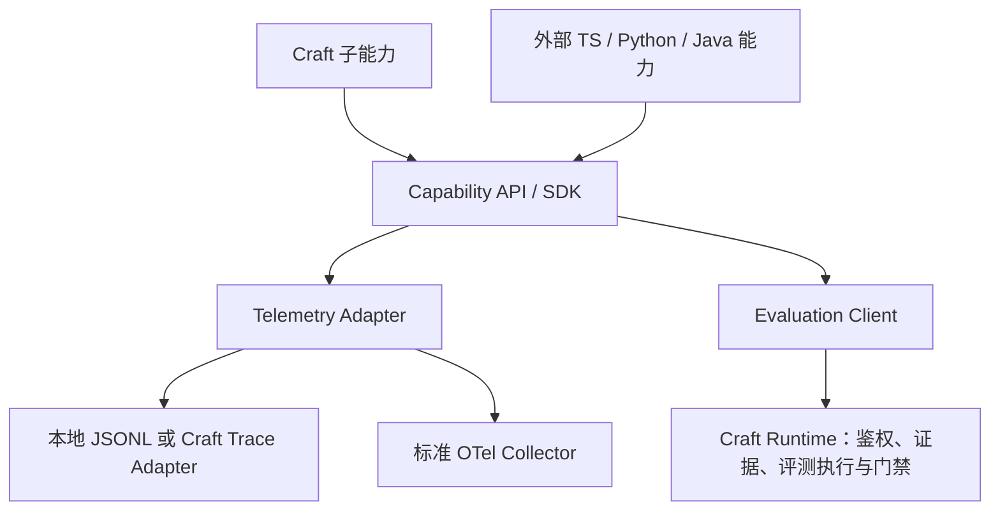

# 子能力的评测、日志、Trace 与外部 SDK

日期：2026-10-04。检查当前工作树；本轮是代码审查、隔离复现与设计建议，没有修改运行时、发布 SDK 或上线 Collector。

## 结论

子能力已经复用一部分 Trace 和评测实现，但尚未形成外部开发者可独立接入的公共基础层。建议沿现有实现提取 `@craft/capability-api` 与 `@craft/capability-sdk`，并通过 Runtime Adapter 连接原有存储、证据和门禁。公共层负责关联、记录和评测基础设施；能力自己的正确性标准仍由能力定义，是否可信及能否启用由服务端治理。

不要把所有现有内核搬进一个 `common` 包。外部能力不应为了记录一次调用而依赖完整 CraftService、SQLite 或知识/记忆内核。

## 现有链路

| 维度 | 已实现 | 尚未形成的公共能力 |
| --- | --- | --- |
| Trace | MCP 默认包装大多数业务调用；记录 started/completed/failed、摘要和 correlation；支持查询、回放投影、归档及保留策略 | 跨进程父子 Span、自动异步传播、通用外部接入、完整耗时与归属；SDK/直接 service 调用不自动经过 MCP 包装 |
| 日志 | Trace 结构化事件、部分 Host stdout/stderr 观测、错误类型与摘要、内部 Hook 阶段记录 | 统一 Logger 的级别、脱敏、trace/span 关联、输出控制和采集配置；不能把 Trace 事件称为已完成完整日志 SDK |
| 评测 | 四能力都有 evaluation 描述符；有通用 Contract、Suite/Case/Trial/Outcome、Campaign、独立执行回执、检索评测和 Procedure 执行评测 | 描述符到可执行 evaluator 的统一注册、每组件一致的查询/运行入口、第三方 conformance kit、统一结果与 Trace/Receipt 的关联 |
| 成本 | 价格快照与显式 token 用量账本；未知用量不等于零 | 通用账本尚未绑定 capability/version、trace/span、evaluation run/case/attempt；各路径的 usage 信息尚未汇总为统一归因 |
| 扩展 | `CraftCapability` + Registry 支持进程内装配、归属、贡献和阶段扩展 | 发布的独立 SDK、跨语言协议、受控的外部注册/采集与权限模型；当前 capability catalog 静态，能力包为 private 并依赖完整 harness |

代码依据：[MCP 包装](../../core/interfaces/mcp-server.ts)、[Component Trace](../../core/component-trace.ts)、[TraceKernel](../../core/trace-kernel.ts)、[OTLP 映射](../../core/runtime-truth.ts)、[Evaluation Contract](../../core/evaluation-contract.ts)、[成本账本](../../core/cost-ledger.ts)、[内部协议](../../core/capability-protocol.ts)、[静态能力清单](../../core/capability-catalog.ts)。

实际构造五个 MCP 默认工具面后，结果如下。工具面小是设计选择，不是协议违规，但当前使用者拿到 trace id 后不能在同一默认工具面继续查 Trace：

| 产品工具面 | 工具数 | Trace 查询/OTLP 工具 | 本次检查的专门评测工具 |
| --- | ---: | --- | --- |
| Context daily | 72 | 无 | `craft_procedure_invocation_evaluate` |
| Knowledge daily | 22 | 无 | 无 |
| Memory daily | 22 | 无 | 无 |
| Experience daily | 28 | 无 | `craft_procedure_invocation_evaluate` |
| Codebase | 15 | 无 | 无 |

这不否定 claim review、Procedure gate、Context feedback 等领域功能已经存在；表格检查的是通用 Trace/评测操作。完整工具面和内部 service 另有相关接口。`component-ablation.ts` 已能准备多能力对照实验，但状态明确为 `awaiting_actual_host_runs`，并不会自动完成真实宿主评测。

## 隔离复现的缺陷

1. **P1：共享 Trace 的第二个调用发生事件 ID 冲突。** `component-trace.ts` 使用 `${traceId}:call.started/completed/failed`，没有纳入独立 operation/span。两次不同 request 加入同一 trace 时，第二次报 `Trace event idempotency conflict`，handler 没有执行。应区分 task trace、operation、attempt 和 event，重试与并行均有唯一 Span；幂等性不能靠整个 Trace 共享事件 ID。
2. **P1：观测失败改变业务返回结果。** 注入 completed-event 写入失败，handler 已返回成功，capture 却返回 `ok:false`。客户端可能因此重试已完成的效果。应分别处理业务异常与 telemetry 异常；普通日志/导出失败记录 degraded/dropped，不伪造业务失败。必须持久化的审计回执仍走独立的事务/授权契约，不能一并降级为 best-effort。
3. **P2：OTLP 父子关系和时间信息不完整。** Span ID 根据 `traceId:sequence` 生成，parent ID 根据原始 parent 字符串生成；明确 parent/child fixture 无法关联。导出没有 start/end 时间，且所有非 failed 状态均标成 OK，包括 running。应保持规范 SpanContext，事件属于 Span，未完成/未知不自动变成成功。[OTel Trace API](https://opentelemetry.io/docs/specs/otel/trace/api/)
4. **P2：OTLP 部分拒收被报告为 accepted。** 当前只看 HTTP 2xx。fixture 返回 HTTP 200 和 `partialSuccess.rejectedSpans:2`，仍得到 `accepted:true`。OTLP 明确允许 HTTP 200 携带部分拒收，客户端必须读取响应；部分成功不能整批重试。[OTLP 规范](https://opentelemetry.io/docs/specs/otlp/)
5. **评测信任缺口：Contract 阶段是登记，不是证据验证。** `EvaluationContractKernel.record` 检查阶段顺序，但允许没有 evidence 一直登记到 `routeable`。隔离 fixture 已复现。它不等同于绕过 Experience 领域 Gate；本轮未发现它会直接授予 Procedure 执行权限。外部 SDK 不能把这条状态记录当作可信晋级证明，应分别存 claimed 和 verified 结论，并由可信 Runner/Verifier 绑定输入、环境、版本与实际 Evidence。

另有代码层面限制：MCP Trace 的 component 固定为 `craft-mcp`，没有自动生成 `Context → Knowledge/Memory/Experience/Codebase` 的内部子 Span；W3C `traceparent/tracestate` 未接入当前调用链。内部 HookPlane 记录的是阶段计数，不能替代上述因果链。

原始隔离输出见 [证据](evidence/capability-observability-sdk-probes-2026-10-04.json)。这些是本轮新发现，尚未修复，不应被上一轮 Context 修复报告覆盖。

## 建议的公共结构

建议从两个包开始，下面的模块用独立导出路径即可，不必为每个概念发布一个包：

- **`@craft/capability-api`**：纯契约、JSON Schema、版本协商。定义 Capability/Operation 身份、执行上下文、结果、EvidenceRef、EvaluationCase/Result。无 Store、文件系统、网络和模型依赖。Telemetry 复用 OTel API 的 Span/Log/Metric 概念，Craft 只扩展业务关联字段。
- **`@craft/capability-sdk`**：执行包装、上下文传播、结构化日志、成本归因、脱敏和限额；`/evaluation` 提供执行/提交/查询 helper；`/testing` 提供内存 sink、fixture runner 和 conformance kit，生产能力可不加载。发布时提供独立 JS 产物与类型，不让调用方依赖仓库 TS 相对路径。
- **Runtime Adapter 保留在 Craft**：将公共契约转换为现有 TraceKernel、Evidence、CostLedger、Campaign/Trial/Outcome；SQLite 与持久化规则不泄露给外部 SDK。逐步替换重复实现，不能长期保留新旧两套相互独立的 Trace 账本。

这种 API 与实现分离有明确行业依据：OpenTelemetry 要求埋点库依赖 API，具体 SDK、Exporter 和是否启用由应用决定。[OpenTelemetry Client Design Principles](https://opentelemetry.io/docs/specs/otel/library-guidelines/)

## 外部能力如何接入

支持三种深度，外部能力不必成为 Context 的新成员：

1. **只接观测**：声明 capability id/version，包装 operation，输出标准 Trace/Log/Metric。可以只写本地，或发往已有 Collector，无需启动完整 Craft、无需 Hook。
2. **接评测**：提交版本固定的 Case、实际 Run 和 Evidence 引用，通过统一 Runner/Verifier 产出结果；自报结果标识来源和信任等级。相同能力可跑 contract/conformance、领域指标及真实任务对照三个层次。
3. **接 Craft 治理或上下文**：额外登记所需权限、工具契约和可选 Context contribution，经过兼容性及门禁后挂载。扩展安装和授权仍由 Host/Runtime 控制；发送 telemetry 不授予工具执行或 Context 注入权。任意第三方代码不自动载入可信进程。

先实现 TS SDK。Python、Java、Go 可以用各自 OTel 库加同一份业务 JSON 契约跨进程接入，存在真实调用方后再提供语言 helper；MCP 继续承担工具调用，OTLP 承担观测传输，评测/证据通过单独受控接口传输。

Trace Context 用于关联，不用于认证。HTTP 使用 W3C 传播；stdio/JSON-RPC 使用明确版本的 carrier/命名空间 metadata，不能假定每个 Host 支持同一种附加字段。principal/tenant 来自可信执行上下文或服务端认证，不接受 trace baggage 作为权限凭证。[W3C Trace Context](https://www.w3.org/TR/trace-context/)

## 公共层应统一的行为

- 关联链：capability/version、host/session、project/task、operation/attempt、trace/span、Context receipt、evaluation run/case/trial、evidence。SDK 接收真实已知值，未知保持缺失；不伪造 Host 执行证明。
- 日志字段：时间、级别、事件码、受控属性及 trace/span id。错误正文、路径和嵌套字段需脱敏；MCP stdio 的 stdout 留给协议，诊断使用 stderr 或私有 JSONL。日志可通过 OTel 的 TraceId/SpanId 与调用链关联。[OTel Logs Data Model](https://opentelemetry.io/docs/specs/otel/logs/data-model/)
- Trace 与成本：本地单调时钟计算耗时，跨进程时间单独处理；retry 建新 attempt/span；记录真实 token 来源和价格版本，未知成本保持 unknown。
- 可靠性：并发隔离、限额、背压、批量、超时、flush/shutdown、取消、采样与丢弃计数。日志/导出失败不改变已发生的业务结果；审计和审批依旧执行强约束。
- 数据控制：默认不收集代码/Prompt/业务正文；采集是显式配置，敏感 artifact 用受权限控制的引用。关联查询、Trace 查询与评测查询同样执行作用域和访问策略。
- 评测可比性：冻结 Case、模型、Host、仓库版本、预算、grader 版本与 split，保留 missing/partial/inconclusive；传输成功、业务成功、评测通过、允许晋级分别记录。

## 各子能力保留自己的判分标准

| 能力 | 应实现的领域 evaluator |
| --- | --- |
| Context | 有用材料覆盖、越权泄漏、预算分配、陈旧引用、代码引用是否被挤出 |
| Knowledge | 证据支持度、来源新鲜度、检索召回与引用正确性 |
| Memory | 作用域、TTL、时态、冲突处理、撤销与不该召回的负例 |
| Experience | Entry/Exit、版本固定、材料验收、返工恢复以及同预算真实任务效果 |
| Codebase | 符号/边精确率与召回率、checkpoint 一致性、语言覆盖和大仓延迟 |
| 外部能力 | 声明领域输出契约和 evaluator；通用层负责执行、关联、比较与证据校验 |

## 推荐实施顺序与验收

1. 修复共享 Trace、telemetry 错误隔离和 OTLP 语义；增加并行/重试/父子传播、Collector partial success 的回归，先不改业务领域 API。
2. 提取纯契约和 SDK，先迁移 Context 与一个独立子能力，证明它们确实复用同一实现；提供 scope 受限的 Trace/评测查询，保持默认 MCP 工具面精简。
3. 使用独立目录/进程的外部示例做接入验收：不能 import `core/`、不能直接读 SQLite；本地、远程、禁用观测、Collector 故障都能正确运行。
4. 统一评测注册与证据验证，将其余子能力接入；再增加跨语言示例和真实模型会话对照。

验收必须看到一条完整链：任务 → Context → 子能力 → 外部调用 → 结果/Evidence → 评测 → 可查询回执。跨组件日志、耗时与费用能按同一 operation/trace 检索；第二个调用不能冲突；服务端部分拒收不报完整成功；自报高分不能自动通过可信门禁。

本轮运行 `v01232-observability-memory`、`runtime-truth`、`capability-protocol`、`trace-archive-store`、`cost-ledger` 共 51 项现有测试，全部通过；上面的新缺陷来自额外隔离探针，说明既有测试尚未覆盖这些语义。没有运行真实 Collector、完整宿主评测或全仓测试。
