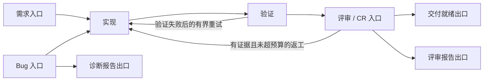

# 四个子能力的版本、解释与 Experience 场景 Graph

2026-10-04。依据用户确认的「互联网产研为场景、任务类型为子场景」及「全部实现」授权。在既有脏工作区实施，保留其他改动；没有提交、发布版本或重启用户正在运行的应用。产品版本保持 0.12.37，本文的版本能力指内容与配置版本。

## 已交付

业务上仍称 Workflow，执行结构是有向 Graph，允许有界循环，因此不局限于 DAG。线性 Workflow 和运行时 Graph 共用现有 Task/Policy、Verified Work Loop、DurableActionLoop、Invocation、Host 与 AcceptanceGate。

| 能力 | 实现及人可检查的结果 |
| --- | --- |
| Knowledge | 历史记录、精确版本、跨候选内容比较；来源/文档/解析状态/导入失败路径和原因/使用回执；恢复旧 Claim 生成新候选，保留文档溯源，当前来源撤销时拒绝恢复。 |
| Memory | 历史及差异、显式用户陈述和 Agent 建议区分、替代关系与反馈；恢复即使在自动治理模式也只生成待审核候选，不直接入 Ledger。 |
| Experience | 场景配置直接存为用户编写的候选，不伪造 Observation；内容修订与记录状态版本分开；修改清除旧门禁；查看门禁、近期运行、实际 Graph 轮次与召回记录；恢复为新的候选。 |
| Codebase | 按 Workspace 查询索引历史、摘要、诊断、使用回执和快照差异；只允许当前 checkpoint 重建，历史索引不能服务新代码；保留 candidate_only 语义。 |
| Workbench | 新入口「版本与依据」支持按范围查看、比较后恢复；已有「上下文使用」「梳理流程」继续可用。长差异独立滚动，先比较才能恢复，失败重试沿用幂等键。 |
| 独立集成 | 四个组件都有独立的 `craft_<member>_asset_inspect/restore`，Experience 另有 `craft_procedure_configuration_save`、`craft_procedure_invocation_transition`；标准 Skill + MCP 可单独使用。 |

早先已完成的 loop-me 式访谈草稿、上下文可见性/停用与配对验收样例，见[前一批交付](context-workflow-implementation-2026-10-04.md)。本次补齐四个子能力各自的版本/解释接口与场景运行图。

## 产研配置和实际路径

[可复用的互联网产研配置](../../capability/craft-experience/procedure-templates.ts)是一份共享定义，包含三个入口、三个出口、四个子场景。Bug 诊断与 Bug 修复共用 bug 入口，选择不同目标和允许路径。每次 Invocation 固定一个子场景及其目标出口；换目标必须显式重新规划。

图只概括共享结构；子场景 allowed_nodes/allowed_edges 决定实际合法路径。只做 CR 不允许越过其权限进入实现；交付就绪不等于部署。

配置中的节点具备输入/输出、验收引用和副作用声明。入口需要明确材料；条件/人工恢复边需要当前快照上的已记录判定，未知或多个匹配停止。max_transitions、max_visits、每边 max_traversals、Invocation 派发预算和累计工作项上限共同限制回路。

运行将每轮节点或版本固定的子 Workflow 展开到已有持久账本，以 root/gN 标识轮次。返工保留原记录，失效目标节点及消费其输出的下游材料。已有派发先核对/收齐回执，旧尝试的成功不能验收新 diff。出口独立验收当前有效产物；普通 resume 不得绕过 Graph 转换或重置返工预算。

标准调用及证据字段见 [Runtime Graph Skill 参考](../../skills/craft-experience/references/runtime-graph.md)。所有运行保持 host_execution_authority=false。

## 验证

- 105 项相关回归全部通过，覆盖上述四条真实调用路径、失败重试、审查返工、出口验收、跨重启恢复、迟到回执、只读并行子 Workflow 的失败回执收齐、作用域/当前 ACL、来源撤销、恢复幂等、CAS 冲突、配置漂移、声明外路径和预算拒绝。
- 新增六个运行模块的行、分支、函数覆盖率均为 100%，以 100% 阈值运行并加入 coverage-gates.json。其余本次新增/修改行通过 Node V8 记录检查；Workbench 入口的两行通过 Chromium V8 检查。没有运行全仓库全量测试。[增量记录](evidence/component-versions-incremental-2026-10-04.json)。
- TypeScript 检查通过；层级审计 378 模块、0 违规；工具表面审计、插件打包与版本目录检查通过。
- 同一个共享构建包以 knowledge/memory/experience/codebase 四种独立产品启动，执行 initialize、tools/list 和 95 次工具调用。包括历史、版本读取、差异、解释、恢复，以及 Graph 配置候选。安装缓存另行冷启动验证。[协议证据](evidence/component-versions-protocol-2026-10-04.json)。
- 无头 Chrome 使用临时数据验证「查询历史 → 比较当前版本 → 恢复候选」，0 页面脚本错误；入口代码覆盖记录位于[浏览器证据](evidence/component-versions-browser-2026-10-04.json)，[页面截图](evidence/component-versions-browser-2026-10-04.png)。
- 首次 Workbench 端口测试被 sandbox EPERM 阻止，取得本机测试权限后验证成功；测试服务和临时资料均已关闭/清理。

## 当前边界

- Graph 子调用支持固定版本的 Workflow，包括只读并行组；嵌套 Graph、任意并行写入、独立执行引擎不在本次实现中。复杂控制图可展平，重复有界步骤由子 Workflow 复用。
- 回退是新一轮返工与验收失效，不自动复原文件，也不撤销已发布、已发送等外部动作。补偿边明确要求交接给有授权的 Host Adapter。
- Codebase 自动恢复内置 TypeScript/heuristic 分析器；其他分析器须用原始 checkpoint-pinned import adapter。所有索引的读取/比较与历史浏览均保持诊断属性。
- 配置存储与图运行测试使用本地夹具和 Host-attested 证据，不证明真实生产发布、真实 Host 完整运行或模型能力提升。配对评测保留缺测为 unknown，不将召回视为遵循，不自动晋级经验。
- 当前 Codex CLI 实测仍为 0.151.0；此前真实模型探针的版本兼容阻塞详见前一批交付。此次没有声称已消除此阻塞或已经取得真实模型收益。
- 运行中的会话不会因文件更新热换工具表面。重新连接 MCP 或开启新会话后才会取得新增工具。

## 安装与回退

仓库产物已重新打包；本机已安装的四个独立组件已同步 dist/plugin 和各自 Skill，连接配置与用户数据未变。`craft-context` 构建包同样更新，但本机未安装时不额外安装。

安装缓存旧产物备份：`/private/tmp/craft-before-versions-graph-20261004`。[安装摘要与校验](evidence/component-installed-versions-2026-10-04.json)。需要回退程序包时恢复备份中的对应 dist/skills，并重新连接 Host；内容版本恢复仍走组件的待审核候选流程，两者不是同一种回滚。
