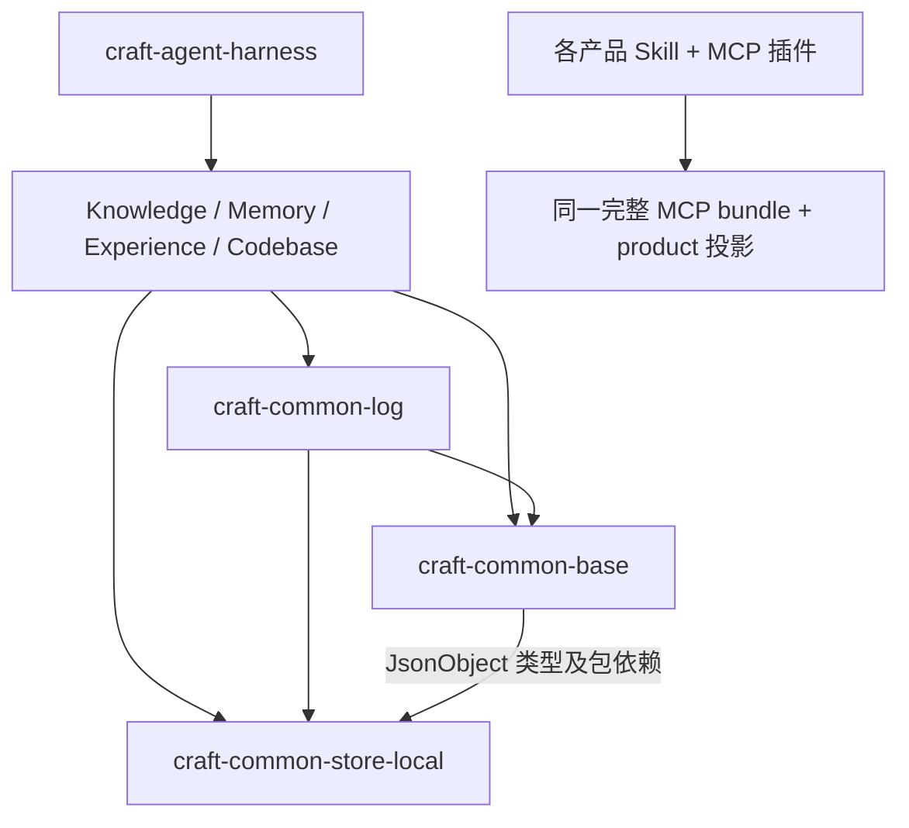

# 核心分层、公共包与可深化 Module：一手来源核查

日期：2026-10-05。范围：当前工作区的 Core、Knowledge、Memory、Experience、Codebase，以及公共包、构建和协议接入；不评审 Workbench、Desktop 或其他 UI。此文是总审查的架构证据底稿，不表示已实施以下建议。

## 结论与适用边界

当前结构已经完成真实公共包拆分：三个 `craft-common-*` 与四个 `@craft/capability-*` 均有自己的 `dist`、声明、`exports` 和依赖声明，四个能力包不再依赖 `craft-agent-harness`。因此不能继续沿用“只有插件投影、没有独立包”的旧结论。但发布包可加载、业务能力可独立使用、宿主产品按需装配，是三个不同验收层级；当前最强证据集中在第一层，完整能力的纵向用例仍大量依赖根 Harness。

下一步的主要价值来自使现有 Module 有更好的 Depth、Locality 与可验证 Interface，而不是增加更多目录、插件名字或空的 coordinator。本文不建议第二个 Runtime、不建议用 MCP 连接进程内 Module、不建议仅为未来数据库假设增加 Repository Adapter。

证据来自当前源码和仓库 ADR，并补充三个直接相关的一手外部规范。本次仅作只读检查和报告写入，没有运行真实 Host、远程发布或模型收益实验；隔离包测试的结论以其代码实际断言范围为准。

## 当前实际依赖关系

| 已证实事实 | 代码证据 | 解释 |
|---|---|---|
| 七个包有独立发布产物和 `exports` | `common/*/package.json`；`capability/craft-{knowledge,memory,experience,codebase}/package.json` | 真正包拆分已存在，不能称为旧式反向 peer dependency |
| 源码仍跨包相对导入，包构建逐文件 bundle | `scripts/release/build-common-packages.ts:14-34`；`capability/craft-memory/capability.ts:32-34` | `--packages=external` 不使相对源码导入自动变成包级依赖；生成声明还由正则重写路径 |
| 隔离验收只执行注册、Store round-trip | `tests/common-packages.test.ts:152-195` | 已有有价值的加载验收；还没有在此验收里执行四能力的完整行为纵切和外部 TypeScript 消费者编译 |
| 插件仍复制同一 MCP bundle，再由 product 参数投影 | `scripts/release/pack-plugin.ts:33-58` | 产品独立安装已存在；不能推断独立最小依赖装配、启动开销或故障域 |
| 主 Harness 固定装配四能力并立即要求其 Kernel | `core/capability-catalog.ts:30-39`；`core/application/service-foundation.ts:481-531` | 注册协议是真实的；在主 Harness 任意去掉某能力仍会触发必需 Kernel 缺失 |
| 通用注册协议的类型依赖落在 Store 包 | `common/craft-common-base/src/capability-protocol.ts:53`；`common/craft-common-base/package.json:58-60` | 类型 import 本身不加载 Store Implementation，但发布依赖与认知耦合仍存在 |
| 发布顺序已配置，远端身份另待配置 | `.github/workflows/publish.yml:31-41` | 配置不是已发布证据；失败后部分包已发布时的重入策略也应单独演练 |

## 应保留的设计决定

- Verified Work Loop 是公共编排入口，Graph 只降低为现有执行计划。`core/application/procedure-invocation.ts:20-25,38-67` 确实将 Procedure 绑定到既有 Work Loop 和 Durable Action Loop；不应为新 Graph 再造执行账本。对应 [ADR 0002](../adr/0002-verified-work-loop-is-the-single-orchestration-facade.md)、[ADR 0022](../adr/0022-graph-lowers-to-verified-work-loop.md)。
- 包归属与产品可见工具不同，不能为了让两张表相等强搬共享控制逻辑。对应 [ADR 0016](../adr/0016-ownership-is-not-projection.md)。但这种差异应该可见、可测试，并明确哪些包用例必须借助 Harness。
- Context 是投影、State 是事实，Hook 不扩权。对应 [ADR 0021](../adr/0021-agent-harness-runtime-context-boundaries.md)。
- Markdown 正文与 SQLite 元数据分工继续成立；加强恢复契约不要求改回单一大数据库。对应 [ADR 0007](../adr/0007-markdown-content-store-source-of-truth.md)。
- Host 已有真实多 Adapter：`CodexHostKernel`、`ClaudeHostKernel`、`InternalHostDriver`、`GenericCliHostKernel` 均实现 `HostDriver`。保留 `core/host-driver.ts:12-22` 的现有 Seam，避免按产品重写执行语义。

## 五个深化候选

### A. 让应用编排 Module 真正拥有完整用例 — Strong

**文件**：`core/application/craft-service.ts:246-280`、`core/application/service-foundation.ts:441-531`、四个 `core/application/coordinators/{work,runtime,evaluation,workspace}-coordinator.ts`、`core/application/use-cases/kernel-delegates.ts:214-230`。

**问题**：四个 coordinator 目前只收集并公开 Kernel 字段。源码全局检索未找到 `.workCoordinator.`、`.runtimeCoordinator.`、`.evaluationCoordinator.`、`.workspaceCoordinator.` 的行为调用；真实编排仍在 `CraftService`。另有原型安装器和类型声明维护同一入口，理解一个动作要跳转多处。

**方向**：选择一个已验证、常改的完整用例，把其校验、权限、事务与调用顺序集中到一个应用 Module；兼容门面只转发。未接管行为的容器不算完成拆分。不在此设计新 Interface 的具体方法。

**Deletion test**：删除纯字段容器只减少概念，不会把隐藏逻辑散落回调用方；这是浅 Module 的证据。反之，删除一个真正封装授权和状态转移的用例，会把同一约束复制到多个入口，应保留。

**Interface = test surface**：测试从 CLI/MCP 使用的同一用例入口检查拒绝、幂等、恢复和副作用事实，不为每层转发再加重复测试。收益是一次修复覆盖多个入口的 Leverage，以及错误与验证位于同一 Module 的 Locality；不是文件变短的收益。

**前后关系**：`协议 → 门面 → 安装器/公开 Kernel → 多处编排`，收敛为 `协议/兼容门面 → 一个用例 Module → 既有 Kernel`。

**ADR**：符合 0002、0021。无需再抽象一个万能 Executor；已有 Host Adapter 差异继续留在现有 Seam。

### B. 把包的 Interface 变成构建与验收的实际 Seam — Strong

**文件**：`scripts/release/build-common-packages.ts:14-34`、`scripts/ci/layer-graph.ts:26-55`、`tests/common-packages.test.ts:152-195`、`tsconfig.build.json`、各包 `package.json` 与 `tsconfig.json`。

**问题**：包外部有 `exports`，包内开发却常绕过它直接跨目录取源码；根编译、逐入口 bundle 和正则声明重写支撑发布，独立包消费者的类型兼容尚未成为同等验收面。分层审计目前也只解析相对 import。

**实测**：纯内存对照调用 `auditLayerGraph`：同一 common-base 文件相对导入 `core/application/craft-service.ts` 会返回 `upward`；把它改为 bare import `craft-agent-harness` 后返回空数组。对应 `layer-graph.ts:49` 的过滤逻辑。这是门禁覆盖缺口，不证明当前源码已通过该路径逆向依赖。

**方向**：让跨包消费走已声明的包入口，构建按实际依赖图进行；隔离环境安装真实待发布包、编译外部消费者，并各跑一个最小完整用例。可以评估 TypeScript project references，但先做一个包的迁移和构建耗时比较，不做全仓一刀切。分层审计需识别工作区包名与 exports 目标，不能只在源码相对路径上成立。

**Deletion test**：当构建工具能从包依赖和声明自然产生正确产物，现有声明正则重写层可以删除，复杂度不会转移给消费者；若删后消费者必须知道工作区路径，则包的 Interface 仍未完成。

**Interface = test surface**：隔离消费者仅从 `exports` 导入，测试用的是用户能安装的产物。收益是包变更与受影响消费者可定位的 Locality、少依赖根仓环境的 Leverage。

**前后关系**：`源码相对路径 → 根编译 → 正则修声明 → 隔离注册`，变为 `包 Interface → 依赖图构建 → 真包消费/类型/行为验收`。

**ADR**：保持 0016；不要求产品投影变成完全无共享依赖的运行时。此候选属于发布与接入正确性，建议先于扩大插件数量。

### C. 使 common-base 与 common-log 的职责名副其实 — Worth exploring

**文件**：`common/craft-common-base/src/index.ts:1-9`、`workflow.ts:1-4,88-174`、`retrieval-port.ts:3-10,45-125`、`common/craft-common-log/src/evaluation-contract.ts:21-75`。

**问题**：base README 描述 runtime-neutral；实际顶层导出带 `spawnSync` 的 Workflow 执行、`fetch` 与 SQLite 缓存的检索 Adapter。log 既提供内容无关观测 SDK，又持有决定 `routeable` 的评测晋级状态机。观测失败可忽略和控制准入失败关闭是两种不同契约，不宜因为都是横切概念而混成一个 Interface。

**方向**：先明确哪些是纯协议/算法、哪些是本地执行 Implementation、哪些是可信评测决定；在现有包内部收窄公开入口或移动归属，必要时才增包。不能把 `verified_stage` 的可信推进弱化成普通日志写入。

**Deletion test**：若删除大 barrel 后，使用注册协议的人无需再加载平台 Implementation，且 import 更精确，这是减少耦合；若只是新增一层原样转发则没有 Depth 收益。

**真实 Adapter**：检索已有 Keyword 与 OpenAI-compatible embeddings 两个实际 Adapter，适合维持一个可评测 Seam；本地 Store 目前没有第二个真实持久化 Adapter，不建议顺手造多数据库框架。Telemetry 有可注入 Sink 和本地 Sink，但 OTLP 导出函数不能未经核对就算完整的第二个 `TelemetrySink` Adapter。

**Interface = test surface**：纯协议消费者可在无 Store、无执行器初始化的情况下使用；检索两个 Adapter 共享拒绝/降级/预算契约测试；评测准入仍经过受控状态机。收益是外部 SDK 用户的 Leverage 和安全策略维护的 Locality。

**前后关系**：`base/log 的混合入口 → 协议+I/O+准入`，收敛为 `协议/算法入口、平台 Adapter 入口、评测决定 Module 各守其职责`。此处不预设新增包名或方法。

**ADR**：符合 0021、0025；目录搬迁须同时修文档中的 runtime-neutral 宣称。

### D. 收敛 Context 的公共调用约定与 Receipt — Strong

**文件**：`core/context-working-set.ts:23-55`、`core/application/use-cases/knowledge-memory.ts:31-35`、`core/application/use-cases/repository-context.ts:53-97`、`core/application/craft-service.ts:3386`、`core/context-resolution.ts:211-252`。

**问题**：[ADR 0025](../adr/0025-context-working-set-is-the-retrieval-seam.md) 规定 Context Working Set 是唯一检索 Seam；实际公开聚合入口和部分 Host 路径直调 Context Resolution，另行创建 Context Pack Receipt。底层检索仍共享，并非发现了两套检索算法；分散的是调用约定、预算组合、Receipt 和可复现引用语义。

**方向**：用一个公共 Context Module 承接成员选择、Scope、总预算、Codebase 补充引用和 Receipt；原有协议入口只作兼容投影。明确 working set、resolution、pack 三种记录各自是否必要，而不是简单让每次调用额外多写一条 Receipt。

**Deletion test**：若删去 Working Set 包装后只是少写一份同义 Receipt、原约束仍都在，则应该合并；若它确实封装 Host 的 history/state 约束，应让真实 Host 调用它，让该 Depth 被利用。

**Interface = test surface**：同一作用域和预算从单能力、聚合入口、内部 Host 进入，得到语义一致的成员约束和来源引用；Codebase 仍是受限引用，不增成第六个累积 Context member。两个真实 Retrieval Adapter 的差异继续保留在同一 Seam 后。

**前后关系**：`Host/聚合/单能力 → 多个预算和 Receipt 包装 → 一个 resolver`，收敛为 `多入口 → 一个 Context Module → 现有 contribution 与 Retrieval Adapter`。收益是总预算和隔离规则的 Locality、跨 Host 回放的 Leverage。

**ADR**：当前调用图与 0025 需要收敛；不建议默默修改 ADR 来接受重复约定。

### E. 版本资产用例与持久化恢复各收进有 Depth 的 Module — Strong

**文件**：`core/application/coordinators/component-assets.ts:8-35,56-98,100-136`、`core/application/craft-service.ts:276-280`、`capability/craft-experience/procedure-configuration.ts:15-41`、`capability/craft-experience/procedure-definition.ts:72-98`、`common/craft-common-store-local/src/store.ts:89-109,117-132,197-205`。

**问题**：资产版本能力已实现，但共享 coordinator 了解四能力的字段、状态、恢复命令和不可恢复限制；新增或修改一类资产会同时改共享读取、解释、恢复以及能力所有者。SQLite 的事务不会回滚已经落盘的版本 JSON/Markdown；Procedure 配置先写文件后存记录，崩溃/失败后的孤儿版本与重试语义需要显式验收。`Store.list` 一旦带 predicate 就移除 SQL LIMIT，先读取/水合全部当前记录再过滤，返回数量有界不等于工作量有界。

**方向**：保留共享版本审计和授权规则，把成员特有的可见字段、适用性解释与恢复条件集中到相应资产 Module。补齐同一版本文件和记录的完整性检查、可恢复写入/重试契约，先用故障注入证明实际失败点，再选最小修复。不承诺跨文件系统与数据库的全局事务。常用 Scope/关联键查询改为在存储查询时限界，先以真实数据规模基准确认优先级。

**Deletion test**：删除共享资产 Module 会让相同 Scope/CAS/审计规则复制到四个调用方，因此共享部分有 Depth；删除散落的成员判断、改由既有四类真实恢复 Implementation 承担，则提高 Locality。无需可动态安装的通用资产插件框架。

**Interface = test surface**：从公开恢复入口覆盖撤销来源、历史 Scope、重复 request、CAS 冲突、文件写入后失败与进程重启重试；从公开查询入口测有界 I/O。收益是恢复行为可解释和一次修复惠及四能力的 Leverage。

**前后关系**：`共享 coordinator 内四类字段/恢复判断 + 分散文件写入`，变为 `共享审计授权 + 各资产 Module 自己的恢复规则 + 经故障验收的持久化写入契约`。

**ADR**：保持 0007、0016。这里已确认事务与文件落盘分离、查询先全读的实现事实；没有在本次额外执行崩溃或并发破坏试验，所以具体丢失窗口和规模拐点仍须验证。

## 直接相关的一手外部来源

1. [Node.js：Package entry points / exports](https://nodejs.org/api/packages.html#package-entry-points)。`exports` 规定包名导入的公开子路径，但不是防止绝对路径访问的强隔离。本项目不能仅因有 exports 就推断工作区源码已遵循包 Interface；源码审计和独立消费者验收仍有必要。此处依据是包语义，不是建议升级 Node 版本。
2. [TypeScript：Project References](https://www.typescriptlang.org/docs/handbook/project-references.html)。引用项目可使用输出声明，`tsc -b` 依据依赖顺序构建并检查是否过期；文档同时说明构建和编辑体验的代价。应用到 Craft 的“替代部分根编译与声明正则重写”是推论，必须通过一个包的迁移验证，不能当作已经证明的提速结论。
3. [MCP 2025-11-25：Tools](https://modelcontextprotocol.io/specification/2025-11-25/server/tools)。`outputSchema` 是可选字段；若声明则服务端结构化结果必须符合它。当前 `core/mcp/tool-schema.ts:3` 的 Tool 类型仅包含输入 Schema 与 annotations，`mcp-server.ts:205` 返回 structuredContent。为关键持久状态命令补输出契约是可考虑的质量增量，不能把缺少可选 outputSchema 报成协议违规。现有 `isError` 和输入验证应继续保留。

以上来源在 2026-10-05 访问，只用于相应具体判断。本文没有将其他平台的架构名称、协议特性清单或流行实践直接变成 Craft 的必做需求。

## 推荐先后

优先补 **B 的包消费与分层门禁验收**，使这轮真包拆分的交付声明可复现；同时在现有问题中优先处理 **E 的恢复和有界查询风险**。随后以 **D 的 Context 纵切** 实践 **A 的应用 Module 深化**，这条路径已有真实调用方和多个 Adapter，能直接验证 Locality 与 Leverage。**C** 跟随这次实际迁移收窄公共入口，避免先做一次没有行为收益的大范围改名搬家。

这五项不是五个新框架；验收是让现有能力在更少调用约定下保持作用域、版本、证据和恢复语义。未来是否拆出独立 Runtime 包、改用其他数据库或独立子能力版本，应等真实消费者和运维需求出现后再决定，目前只列为可能研究方向。
