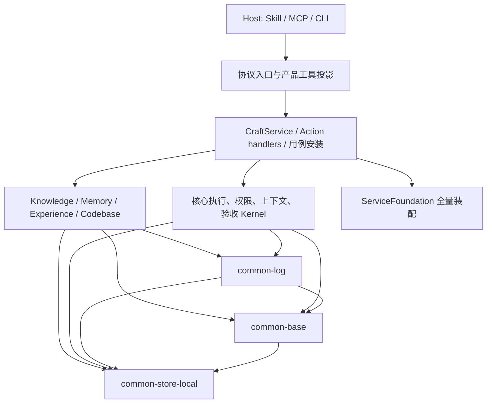
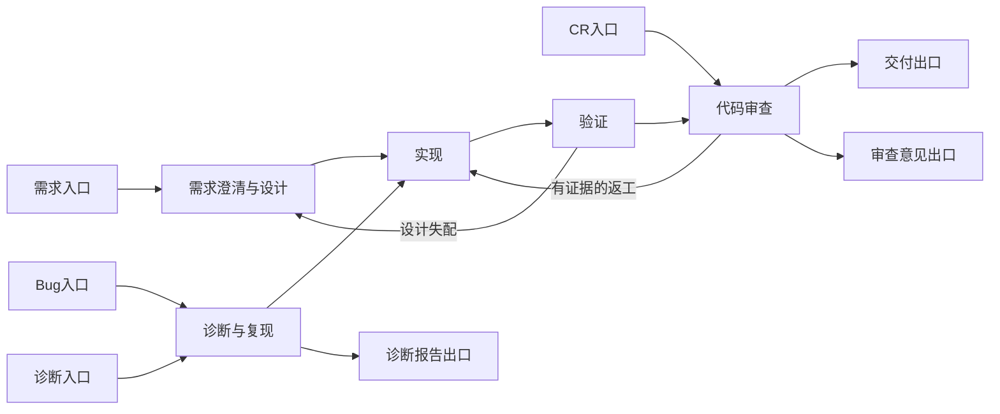

# Craft 核心与四子能力：架构审查及未来工作集合

日期：2026-10-05。审查基点：`9ada1c7a92dfc3847837b063081176696ca9f463`，对象是**当前工作区全貌，加上相对 HEAD 的未提交及未跟踪源码**。第 1～13 节保留原审查快照和工作项；第 14 节记录后续本地实现与剩余验收。未发布、未部署，也未更改用户数据。

> 本文原始检查结果是 2026-10-05 的审查快照。后续实现应另附验收记录，不把审查时发现的缺陷永久描述为当前源码状态。

## 0. 目标产品契约

1. **默认 Context，独立子能力。** `craft-context` 默认聚合 Knowledge、Memory、Experience 和 Codebase；四能力也各自提供可安装、可调用、可完成业务操作的 Skill + MCP 产品。进入一个 Git 仓库时自动建立或复用该仓库的基础索引，无须用户逐项目激活。需要调用关系或影响候选时再请求语义分析。非仓库任务和失败成员明确返回 `skipped`/`partial` 原因。纯 MCP 不会自行得知任务开始；由 Skill 调用公开入口，可信 Hook 只作可选生命周期增强。
2. **真实独立性。** 子能力依赖公共协议、存储和观测包，根包组合它们；子能力不反向依赖 `craft-agent-harness`。独立包加载、Skill+MCP 挂载、完整业务调用及数据隔离分别验收。一条业务纵切包括权限、版本、失败和恢复，而非仅 `register()` 成功。
3. **公共扩展契约。** `craft-common-base` 提供能力与检索协议，`craft-common-store-local` 提供本地持久化，`craft-common-log` 提供无内容 log/trace/metric/usage/cost/evaluation 采集和可替换 Sink。第三方只接观测时不需要初始化 Store 或注册 Craft 能力；贡献 Context 时再实现能力协议。记录评测结果与授予晋升/路由资格分属两个边界，业务成功不受可降级 Sink 失败改写。
4. **Experience 三种使用方式。** 经验可供只读建议，用户可显式选用固定版本 Procedure，自动推荐/路由则需要独立验证和治理批准。互联网产研共享一份粗粒度 Graph：需求、Bug、诊断、Code Review 是有命名入口、出口、允许路径、输入、产物和验收的子场景；子 Workflow 固定版本复用既有 Work Loop。多出口选择在 Invocation 绑定时固定。
5. **五产品四接入。** Context 和四子能力分别有 Codex、Claude、独立 Skill+MCP、DSH 产物。同装聚合与单能力时同一任务复用 Receipt，避免重复召回和重复写入；接入验收依次检查产物、`initialize`、`tools/list`、真实调用和真实 Host 任务。Hook 不构成任何一种产品的必需前置条件。
6. **远程交付边界。** 当前交付可部署配置和验收脚本，暂不上线。真实 IdP、租户隔离、撤权、运维和模型收益只有目标环境取得证据后才可标为通过；它们不阻塞本地独立产品的交付判定。

以上是目标契约。第 2～9 节记录审查时的现状和证据；第 10～12 节按此契约安排改动与验收。

## 1. 集合结论

**Craft 已有相当完整的受控执行、上下文治理、版本与 Graph 机制；下一阶段的主线应是“修复可信性缺口 → 收敛核心 Module → 补齐独立纵切和真实任务证据 → 按数据规模扩展”。** 继续增加工具名、状态记录和门面方法，收益已经低于把现有能力贯通、收窄和证明。

需要同时保留三个判断：

1. **已有能力不能推倒重来。** 四个子能力、三个公共包已形成真实可发布产物；Knowledge/Memory/Experience 的性质区分、Scope Envelope、不可变版本、恢复为 Candidate、Graph 降低到既有执行循环等方向成立。
2. **当前实现尚不能作为全面可信的发布基线。** 本轮复现了同 tenant 内 Knowledge 私有读取旁路、Procedure 文件与数据库失败不一致，以及评测准入漏检/错绑。它们比目录整理更先影响使用结论。
3. **“全实现”需要明确口径。** 源码中存在某个 Kernel、MCP 工具可以调用、隔离包可以加载、真实 Host 完成任务、配对评测证明增益，是不同完成层级。当前跨 Host 的完整业务纵切、模型收益和生产环境运维证据仍不充分。

建议以本文第 10 节的 **34 个工作项**作为后续集合。优先完成 R01–R06；R07–R15 改善结构和可维护性；R16–R27 补齐四子能力及共享使用链；R28–R34 完成验证、分发和运行证据。工作项是可分别验收的批次，不是要求一次完成的大重构。

## 2. 范围、假设与证据口径

### 2.1 纳入与排除

纳入：`core/`、`capability/`、`common/`，以及为核心能力提供实际执行、协议、构建和验收的 `adapters/`、`bin/`、`deploy/components/`、相关脚本、测试、Skill、ADR 和技术契约。Host Adapter、MCP、公共包、无内容可观测性属于核心审查范围。

排除：Workbench 页面、Desktop/Tauri 窗口、视觉设计、交互和浏览器布局。历史文件名含 `workbench`、但实际负责认知写入或领域投影的代码，只审查其核心职责，不审查 UI。

本轮不假定要做云端 SaaS、全语言 IDE、无限自主 Agent 或通用流程引擎。远程共享、Graph 嵌套、PDF 摄取等分别标明已有契约缺口或可选扩展，不能把行业里存在的功能全部算作 Craft 的遗漏。

### 2.2 状态词

| 标记 | 本文含义 |
| --- | --- |
| 已实现 | 当前源码中能沿调用链找到实际行为 |
| 部分实现 | 一条用户使用链只有部分环节可工作，或有明确限制 |
| 已复现缺陷 | 当前源码在隔离探针中产生了与契约冲突的结果 |
| 验证缺口 | 有实现或 fixture，但没有相应真实环境/规模/价值证据 |
| 可选扩展 | 未承诺或暂不需要；须由真实场景决定是否做 |

架构术语沿用指定 Skill：**Module** 是一份行为及其对外契约；**Interface** 包括参数、调用顺序、权限、错误和成本；**Seam** 是替换行为的位置；**Adapter** 是该位置的具体实现；**Depth** 看 Interface 能隐藏多少真实复杂性；**Leverage** 看调用方获得多少能力；**Locality** 看一次变更是否集中。行数只帮助定位，不用于按比例判定 Depth。

### 2.3 本轮检查结果

| 检查 | 当前结果 | 能证明的范围 |
| --- | --- | --- |
| TypeScript `tsc --noEmit` | 通过 | 当前受 tsconfig 管理的源码类型检查；不能证明宽泛 JSON 内部字段正确 |
| `audit:layering` | 400 个 Module，0 条现有规则违规 | 脚本覆盖路径的静态相对导入方向/运行时环；不等于所有包引用都被覆盖 |
| `audit:surfaces` | 1,034 个工具、8 个域规则，检查通过 | 声明的归属投影一致；不等于 1,034 份独立业务能力 |
| 8 个定向测试文件 | 48/48 通过 | Graph、版本、聚合访问、公共包及门禁算法的既有断言 |
| 七个公共/能力包重新构建 | 通过 | 当前源码能生成 JS 与声明产物 |
| 重建后的公共包测试 | 6/6 通过，属于上述测试的重复子集 | 隔离加载/注册、Store、telemetry 与评测状态测试；不重复计成 54 个独立测试 |
| 覆盖率清单 | `incomplete`：366 个生产路径，167 个精确登记，199 个未登记 | 这是清单结果，**不是 199 个文件完全没有测试**；清单自身也有范围与 glob 问题 |
| 隔离故障/访问/资格探针 | 发现本文 S1/S2、Spec 轴准入问题 | 真实本地 Store、文件、MCP/身份 Adapter 行为；无真实 IdP 或生产数据 |

明细见 [本轮验证摘要](evidence/core-review-verification-2026-10-05.json)、[Standards 探针](evidence/standards-probes-2026-10-05.json) 和 [Spec 审查](core-spec-review-2026-10-05.md)。没有运行完整测试套件、完整覆盖率套件、生产压测或真实模型配对评测。文档新增不涉及可执行增量代码，不能据此宣称新增核心代码覆盖率 100%。

## 3. 代码与包依赖分层

### 3.1 当前真实形态

这张图表达实际主要依赖，不把 `core/domains/` 当成已经完成的领域实现目录。该目录的 `index.ts` 目前主要是命名空间再导出。根下 Kernel 仍直接使用具体 `CraftStore` 和通用 JSON 记录。[目录与契约](../architecture/layer-map.md)、[装配入口](../../core/application/service-foundation.ts)、[领域导出](../../core/domains/index.ts)。

包层面已经取得实际进展：

| 包/接入形态 | 已成立的事实 | 还不能推出的结论 |
| --- | --- | --- |
| `craft-common-store-local` | Store、路径、迁移、正文存储有独立产物 | 已有跨数据库/文件的原子提交、完整灾难恢复 |
| `craft-common-base` | 注册协议、校验、摘要、检索等公共实现已抽取 | 已是纯协议/纯算法包；当前还包含 SQLite、网络请求与进程执行 |
| `craft-common-log` | 无内容事件、Sink、OTLP、成本与评测记录可复用 | 全部业务 Kernel 已自动接入；全部信号已由真实接收端验证 |
| 四个能力 npm 包 | 无宿主包也可加载注册，exports 指向自身 dist | 不借宿主编排就能完成每条产品业务纵切 |
| 四个产品插件 | 独立 Skill + MCP 产品入口 | 每个产物只包含自身运行时；当前仍复制同一 MCP bundle |

因此，对“能否独立”的回答应拆成：**包可加载独立、产品接入独立、业务纵切独立、运行数据隔离**。前两项已有较强本地证据，后两项按操作和部署形态继续验证。详见 [公共包契约](../technical/modules/common-packages.md) 和 [架构一手研究](core-architecture-primary-sources-2026-10-05.md)。

### 3.2 当前最显著的结构摩擦

**中心装配与业务门面仍然过宽。** `craft-service.ts` 4,785 行，出现 2,107 次 `JsonObject`；`service-foundation.ts` 有 196 条 import。这些数字本身不构成缺陷，但对应实际认知成本：一个领域操作经常需要同时阅读工具目录、Action handler、prototype 安装、门面和 Kernel。新增能力仍经常需要修改多个中心文件。[门面](../../core/application/craft-service.ts)、[用例安装](../../core/application/use-cases/kernel-delegates.ts)、[动作绑定](../../core/application/actions/action-handlers.ts)。

**部分 Coordinator 只有字段集合。** Work/Runtime/Evaluation/Workspace 四个 Coordinator 目前主要保存 Kernel 引用，真实行为仍在门面。对这些 Module 做 deletion test：删掉仅持有字段且无调用方的对象，不会把业务复杂性重新散落到 N 个调用者，因此它们没有提供预期 Depth。保留真正承担认知写入、工作流设计等规则的 Coordinator，不能因为名称相同一起删。[Work 示例](../../core/application/coordinators/work-coordinator.ts)。

**Interface 仍靠调用方掌握隐含顺序。** 多数用例接收/返回 `JsonObject`，身份、Scope、版本、Evidence、生命周期合法组合由运行时分散检查。类型检查可以通过，但一个层次把 `source_id`、`artifact_id` 或不同版本身份混用时，编译器帮助有限。应从高风险纵切引入领域类型和明确失败分类，不要求一次类型化全部记录。

**包图与源码图未统一。** 源码仍大量跨包相对路径导入；构建用逐入口 bundle 与声明路径替换生成可发布包。可以工作，但源码测试、包消费测试和产物类型解析之间存在三套观察面。需要用真实消费用例验证一致性，而不是仅更换目录名。[构建脚本](../../scripts/release/build-common-packages.ts)。

### 3.3 目标职责分配

| Module 归属 | 应承担的行为 | 收敛原则 |
| --- | --- | --- |
| 协议入口 | 输入解码、可信访问身份注入、Schema/错误映射、投影 | 不自行拼接正文读取、资格评估或领域状态写入 |
| 应用用例 | 一次完整用户操作的授权、幂等、版本前置条件、跨域编排 | Interface 隐藏必须成组的调用；避免新的纯透传链 |
| 核心运行与治理 | Task/Run/Policy/Lease/Receipt/Acceptance/Verification 的事实语义 | 保持 Verified Work Loop 单一公共编排主线 |
| 四子能力 | 自己的内容模型、选择/归纳/解析、领域校验与贡献 | 拥有者必须真实；产品可投影共享核心能力 |
| 公共协议与算法 | 多调用者共同需要的类型、注册、摘要、排序等 | 只有实质复用才共享，不把所有低层名字塞进 base |
| 存储与外部 Adapter | SQLite、内容文件、Embedding、Host、OTLP、外部系统差异 | 具体差异留在实际存在的 Seam；不预造 PostgreSQL 等尚无需求实现 |

不建议按每个 MCP 工具建立一个 Module，也不建议立即拆成微服务。优先把一条已出现缺陷的业务路径深化，随后让其它入口复用它。

## 4. 两轴审查结论

两轴分别保留事实、严重性和计数，不用一个轴的通过抵消另一个轴的问题。下面是导航；具体触发条件、规范原句、行号和证据以独立报告为准。

### Standards

[独立 Standards 报告](core-standards-review-2026-10-05.md)：**3 项明确问题、1 项性能候选**，本轴最严重为 S1 / High。

- **S1：私有 Knowledge Claim 读取旁路。** `knowledgeClaimGet/List` 没有复用现有访问检查；旧工具 Schema 又没有身份字段，远程身份 Adapter 无从注入。已证明同 Store、同 tenant 的另一 principal 可以读取 fixture 私有正文；未证明跨 tenant。[读取位置](../../core/application/craft-service.ts) 第 2815–2816 行；[工具声明](../../core/mcp/tool-catalog.ts) 第 363–364 行。
- **S2：配置文件与数据库失败不一致。** 写出不可变 Procedure JSON 后，数据库失败回滚，版本文件仍留下；相同 id/title 修改内容重试受阻。[配置保存](../../capability/craft-experience/procedure-configuration.ts) 第 27–38 行。
- **S3：Codebase owns 声明不真实。** 版本 inspect/restore 属于共享应用实现，却声明为 Codebase 包拥有，违反 [ADR-0016](../adr/0016-ownership-is-not-projection.md)。产品可见范围不需要因此删除。
- **S4：有界返回未形成有界读取。** Store 的 predicate 路径先装载全集合与正文再过滤；201 条记录、limit=1 的探针发生 201 次正文读取。这是规模风险，未测量生产延迟。[Store](../../common/craft-common-store-local/src/store.ts) 第 197–205 行。

### Spec

[独立 Spec 报告](core-spec-review-2026-10-05.md)：**3 项确定缺陷，均为 P1**，均是本次全貌审查发现的既有问题；以 [ADR-0004](../adr/0004-platform-v1-requires-mechanism-and-value-evidence.md) 和 [Verification Plane 契约](../technical/modules/verification-plane.md)为主要依据。

- **Release Qualification 没有强制预先声明的护栏到齐。** Pilot 保存了 `guardrail_names`，评估却只遍历调用者实际提供的对象。十个 slot 都给 `{}`，仍可 `guardrails_passed=true`、`eligible`。[资格评估](../../core/release-qualification.ts) 第 20、38、48–52 行。
- **Verification 可以引用不属于当前 Candidate/环境的资格。** 当前只读取被引用资格的 conclusion，未充分绑定目标变更与环境。另一个环境/变更的 eligible 资格被复用后仍可形成 eligible assessment。[Verification](../../core/verification-plane.ts) 第 88–98 行。
- **结果来源的强绑定仍需补齐。** 资格 record 检查 Evidence confidence，但同一条无关联 Evidence 可支撑十个 slot；模型、输入、验收和 Trial 身份未全部固定。自报指标不能升级为真实效果证明。此项与以上缺陷的范围及计数按 Spec 报告区分。

没有把明确不支持的嵌套 Graph、外部补偿执行或可选新格式当作伪装实现；也没有仅凭源文件保留旧工具定义，就认定它仍公开暴露。`ACTIVE_TOOLS` 会过滤退役工具，判断必须沿实际 Surface 路径完成。

轴内小结：Standards 为 3 项明确问题加 1 项性能候选，最严重 S1 / High；Spec 为 3 项 P1，分别影响护栏完整性、资格绑定和 Trial 证据，不跨轴选一个总分。

## 5. 核心能力全貌：已有、缺口、下一步

| 核心领域 | 已实现的主要行为 | 当前不足及下一步 |
| --- | --- | --- |
| 目标与任务合同 | Goal/Target/Plan/Accept、Task Contract、预算、effect、交互模式 | 术语已清楚，但调用 Interface 仍碎片化；形成从用户任务到受控启动的最小完整纵切，减少手工传递多组 ID |
| Capability 供给 | Source/Asset/Connector、Kit manifest、依赖与启用、撤销及健康记录 | 区分“登记元数据”“装入进程能力”“Host 执行动作”；新能力零核心修改尚未覆盖所有工具/资产生命周期入口 |
| Policy 与权限 | Scope Envelope、Access Policy、Activation、Action Gate、外部 effect 门禁 | 各公开读取/写入入口一致执行尚有 S1；第三方身份、审批权和自报 Evidence 的可信来源须分别校验 |
| Host / Model | Codex、Claude、Generic CLI、Internal Host、模型路由与 Adapter | 配置、进程启动、MCP 握手、真实任务完成应分开验收；当前模型或进程缓存不能靠发布版本号推断 |
| 可恢复执行 | Task Run、Durable Action、dispatch/report、Lease、Receipt、State Snapshot、重试与对账 | 需跨进程中止、租约竞争、重复/迟到回执和外部副作用不明的长链测试；不能把重复状态记录当成完成闭环 |
| 状态与产物 | Workspace、Checkpoint、Artifact、Evidence、版本固定 | 工作区文件恢复不等于数据库/外部系统整体恢复；文件和 DB 的一致发布协议存在 S2 |
| Context | scoped resolution、Knowledge/Memory/Experience 贡献、Codebase pack、预算与 Receipt | Working Set/Resolution/Pack 入口契约未收敛；字符预算不是精确 token 预算；使用回执不等于模型实际采纳或收益 |
| Verification / Acceptance | 验证计划、必需检查、回执、终态验收、资格/配对比较记录 | 评测与目标身份绑定、缺失护栏处理有实质问题；先修 gate，再把真实证据接入 |
| Evolution | Observation→Pattern/Candidate→Procedure、阶段晋升、canary/reject/rollback | 评测方法与来源证明需要更强；不应把序列化门禁或引用有置信度的记录视作独立观察 |
| Trace / 成本 | 无内容事件、关联 Trace、usage/cost、Sink、OTLP 导出 | 业务接入覆盖、真实接收端、失败积压/补发、同 Trace 串联需验证；unknown 成本不能默认零 |
| 本地存储 | SQLite WAL、追加版本、CAS、迁移备份、Markdown/JSON 内容存储 | predicate 扫描/正文提前加载、启动全索引重建、文件事务恢复和规模数据维护待改善 |
| 远程与分发 | HTTPS/token introspection 配置、服务端 tenant 路由、产品 MCP、各 Host 包装 | 本地 fixture 不等于真实 IdP/运维；同 tenant principal 读取 ACL 要先修，互不信任多人场景还缺完整逐用户写入/管理员授权；npm 发布身份、产物复现与实际 Host 覆盖仍需完成 |

入口依据：[Verified Work Loop](../../core/verified-work-loop.ts)、[Capability Kit](../../core/capability-kit-runtime.ts)、[Durable Action](../../core/durable-action-loop.ts)、[Host 装配](../../core/application/service-foundation.ts)、[Context](../../core/context-resolution.ts)、[Verification](../../core/verification-plane.ts)、[存储](../../common/craft-common-store-local/src/store.ts)、[远程身份](../../deploy/components/server.ts)。这是一张实现盘点表，不表示每个域都已经过等强度审计。

## 6. 四个子能力各自需要补什么

### 6.1 Knowledge：从有来源的内容，做到全路径可控、可重验证

**已有：** Source 注册/信任、目录分页摄取、文档摘要和片段定位、变更/删除失效、Candidate、语义 review packet、Host/provider review、独立支持记录、晋升与撤回、关系、作用域检索、历史/diff/恢复 Candidate。

**优先补齐：**

1. 全部读入口先按当前身份、Source 和 Envelope 授权，再读正文；历史版本必须同时满足当前限制。S1 表明仅保护 Context 和 history 不够。
2. 所有入口对未 review、过期、撤销、Source 已变更的状态采用同一策略；诊断读取和执行 Context 明确区分。回归用例应覆盖 `get/list/search/context/export/history/restore`，不能每个入口各自解释。
3. 摄取失败需要可续跑且不中断已成功部分的清晰语义。当前分页前会读取并摘要整批文件，源大小/坏文件失败、游标过期与真正缺失文档应分开说明。
4. 片段改变以后，Claim、引用它的 Memory/Procedure/评测是否都需要失效或重新验证，要有明确传播规则与 Receipt，避免各域散落一套关联判断。
5. 建立真实查询集，分别测正确引用、无答案时不编造、陈旧内容拒绝、同词跨项目与私有受众隔离；再考虑扩展语义检索。

**可选扩展：** 目录摄取当前主要处理 `.md/.mdx/.txt`，不能由 Linkly 的 PDF 场景推导 Craft 已有完整 PDF/Office/OCR 知识库。项目已有 parser/OCR 相关基础，但是否接入 Source→fragment→review 全链须按真实文档需求决定；网页/云盘连接器同理。先证明两种真实输入差异，再选择 Parser Adapter 的 Seam。

源码：[Source 摄取](../../capability/craft-knowledge/knowledge-source-registry.ts) 第 32、134–229 行；[Review](../../core/knowledge-auto-review.ts)；[知识贡献](../../capability/craft-knowledge/contribution.ts)。

### 6.2 Memory：从能保存召回，做到可更正、可拒答、可迁移

**已有：** 作用域 Ledger、来源与 Evidence、有效期、显式用户陈述捕获、Candidate/冲突治理、撤销、历史/as-of/known-at、维护提案、受控 Bundle、版本恢复为新 Candidate。这里不应再新建一套“聊天记忆库”。

**优先补齐：**

1. 明确 Ledger、Governance、Maintenance、Consolidation、旧兼容记忆之间的唯一写入和状态转换归属。Memory 包可注册不代表目前在 core 的治理/召回已全部独立进入包。
2. 更正、冲突、撤销必须覆盖跨会话/多 Host：旧回执保留历史诊断意义，但不能继续用于当前决策；新版本不得悄悄继承旧版本的批准。
3. 维护动作按稳定任务/版本幂等，过期、重复、合并的建议与实际应用分开；先解决某个具体冲突再召回，不能“总选最新字符串”。
4. 检索评测支持无正确答案/应拒答样本、矛盾条目、噪声条目和用途差异。当前 `runRetrievalEvaluation` 拒绝空 `expected_ids`，已由探针确认；这限制了“该不该召回”的评测。
5. 把迁移、撤回与删除语义讲清楚：revoke 是逻辑撤销，不是从历史/备份物理清除。物理保留期/清除策略是未来数据生命周期能力，不是本轮已存在承诺。

**验证缺口：** 少量 fixture 的召回率不证明记忆减少了重复错误。必须固定 Host/model/任务/预算，比较无 Memory 与有 Memory 的真实任务，并记录错误复发率和不当召回。

源码：[Ledger](../../capability/craft-memory/memory-ledger.ts)、[治理](../../core/memory-governance.ts)、[维护](../../core/memory-maintenance.ts)、[历史与检索](../../core/context-resolution.ts)、[评测限制](../../core/retrieval-evaluation.ts) 第 19–24 行。

### 6.3 Experience：已有 Graph 核心，下一步是可信运行与评测

**已有：** Observation/Pattern/Procedure、用户直接配置 Candidate、Prompt/Workflow/Graph 定义、阶段门、JSON 权威内容、版本固定、子流程、绑定既有 Work Loop、dispatch/report/resume/transition、成对结果评估。不能再把它描述成只有经验列表。

**优先补齐：**

1. 配置与执行证据分开：用户配置不需要伪造两次成功观察，但也不会因此自动 routeable。修 S2 后，配置失败重试、重复提交、升级/回退都应保持可恢复。
2. 同一个互联网产研场景共享节点和资产；需求、Bug、诊断、Code Review 是子场景。为每个子场景提供可回放 Case、允许路径和终态，而不复制四份完整图。
3. 图的版本、选中子场景、入口/出口、子 Procedure 版本和初始状态必须固定到 Invocation；历史执行不得跟随最新配置漂移。
4. 回退是一次新的受控转移，旧产物和验收失效，历史保留。进一步证明并发回执、重启、取消、人工恢复和失败补偿的组合，而不是只测单条转移函数。
5. 经验效果评测应比较相同任务的 baseline/candidate；多种不同入口的任务不能混成一个成功率。能跑完 Graph 与能提升产研效率分别验收。

**明确限制：** 当前 Graph 节点支持 `read_only/local_write`；可以调用固定版本 Workflow 子流程，其中可包含只读并行组；子 Graph 显式拒绝。控制图当前一次推进一个活动节点，不能等同于任意并行多 Token 流程引擎。外部系统补偿需交给有权限的 Host/Adapter，不能由 graph edge 伪装成已经回滚。

源码：[Graph 校验](../../capability/craft-experience/procedure-graph.ts)、[Procedure 组合](../../capability/craft-experience/procedure-composition.ts)、[Graph 转移](../../core/application/procedure-graph-progress.ts)、[Invocation](../../core/application/procedure-invocation.ts)。

### 6.4 Codebase：从有界结构参考，发展为可量化可靠的影响候选

**已有：** 仓库发现、基础自动索引、显式语义索引、Checkpoint 固定、符号/调用方/影响候选、TS checker、Python/外部 AST/LSP 导入、偏移/摘要校验、诊断、查询 Receipt、旧索引与当前工作树漂移判断。

**优先补齐：**

1. 修正 owns 与共享版本 Interface 的真实归属；不要因同属 Codebase 产品就宣称实现在包内。
2. 支持显式模块/路径分片与按需补索引。当前基础自动选择上限为 500 文件、单文件 512 KiB、总计 8 MiB，按路径排序选取。**本次 Craft 自身索引就遗漏 241 个候选文件**，这是真实容量证据，不能只调大一个数字。
3. 将“自动基础索引”与“完整分析”的状态持续展示在返回契约中；Codebase 的静态候选不能证明真实运行影响或测试已覆盖。
4. 建立真实 TS/JS、Python 项目正确/错误控制样本，测符号定位、关系 precision/recall、动态/生成代码诊断、跨包导入与删除后失效。Java/Go 等按使用需求接入有证据的 AST/LSP/SCIP Adapter，不以正则符号名宣布语义支持。
5. 增量能力要区分文件级缓存和关系图增量更新。测冷启动、无变更热启动、一个文件变更和跨文件引用变更，之后决定是否需要持久图增量机制。

源码：[文件预算](../../capability/craft-codebase/repository-files.ts)、[索引与导入](../../capability/craft-codebase/codebase-index.ts)、[TS 分析](../../capability/craft-codebase/typescript-analysis.ts)、[仓库准备](../../core/application/use-cases/repository-context.ts)。

## 7. 版本能力应该继续做，但须分清版本身份

**需要版本能力，且当前已有关键实现。后续重点是正确绑定、恢复协议与兼容性，不是再做一个通用 version 字段。**

| 身份 | 用途 | 必须防止的混淆 |
| --- | --- | --- |
| Product release | npm/插件/宿主分发身份 | 相同版本号并不保证脏工作区产物相同；需内容摘要与可复现来源 |
| Schema/Protocol version | 数据迁移、外部格式兼容 | 不能跟随产品发布号机械递增，也不能不经兼容检查解析旧结构 |
| Record version | 生命周期、审核状态和 CAS | 状态变化不一定表示正文变化 |
| Content revision/digest | 正文和权威 JSON 内容 | 缺少该身份时应返回 unknown/null，不假装等于 record version |
| Source/document revision | 引用来源的新鲜度 | 新 Source 版本不能自动证明旧 Claim 仍然成立 |
| Procedure/scenario definition | 本次流程采用的规则 | 运行中读取最新配置会破坏可回放性 |
| Workspace checkpoint/index | 代码结构与工作状态 | 旧索引不能直接对当前文件生效；恢复资产不等于恢复工作区 |
| Evidence/model/adapter identity | 判断一次通过究竟证明什么 | 仅记录“模型名称”“有证据”不足以比较跨版本效果 |

保留现有 `history/read/diff/explain/restore` 用户心智。Restore 的通用协议固定为：**读历史 → 检查当前权限与 Source → 检查当前 expected_version → 创建新 Candidate/重建当前索引 → 新的验证 → 才可使用**。不得覆盖旧账本、复活已撤销权限或沿用失效 Gate。

新增工作主要为：文件/数据库失败恢复、版本图中上下游失效、运行固定版本的升级策略、旧数据兼容 Case，以及可移植 Bundle 的冲突处理。**资产恢复、流程回退、工作区恢复、外部业务补偿是四种动作**，共享 lineage/Receipt 即可，不要强行合成一种万能 rollback。

公共包和四子能力现阶段可继续按统一产品版本发布，但要固定兼容矩阵与产物摘要。独立发布节奏只有出现真实外部消费者、升级节奏冲突或依赖成本后才值得引入；不因已经拆包就立即维护七条独立版本线。

## 8. 互联网产研场景的 Graph 结论

“Workflow”和“有向 Graph”不冲突：Workflow 描述业务协作过程，Graph 是它的控制流表达。含返工边时通常不是 DAG；把所有回退都塞进 DAG 会丢失真实语义。

此图是业务语义说明，**不是表示当前一份 Invocation 可以在多个出口中任意临时切换**。当前实现选择的是已声明子场景的精确 entry/exit，允许节点和边也随之固定；变化应形成新的明确选择或重新规划。

建议一份场景配置包含：共享节点/边、命名入口/出口、子场景允许路径、输入/产物契约、验收、effect、预算、固定子 Procedure 引用。核心逻辑应让调用者回答“当前任务是什么子场景、从哪里开始、交付到哪里”，而不是先学全部图状态。

| 需求 | 当前判断 | 后续策略 |
| --- | --- | --- |
| 多入口、多出口定义 | 已有 | 补每个入口/出口的回放 Case 与效果分组 |
| 子场景共享节点、不同路径 | 已有 | 配置验证和一致版本发布，不复制整图 |
| 有限条件/失败/重试/人工恢复 | 已有 | 补长链故障、权限及版本漂移验证 |
| 回退使旧产物/验收失效 | 已有 | 扩展消费者链、迟到回执和重启组合测试 |
| 固定版本 Workflow 子流程 | 已有 | 继续复用既有编排账本与验收 |
| 任意并行控制图、Graph 嵌套 | 当前不支持 | 可选；仅在具体场景无法用子 Workflow 表达时重开设计 |
| 外部系统补偿自动执行 | 当前不作为 Graph 自有能力 | 先有真实可授权 Adapter、幂等与对账，再接入；保持 ADR-0022 |
| 正在运行的图热迁移 | 无本轮完成证据 | 默认运行固定旧版本，配置升级作用于新 Invocation；不要隐式迁移 |

未来应优先积累“互联网产研”需求/Bug/诊断/CR 四类真实 Case，而不是继续丰富图节点种类。工作流从 Spec 到真实结果的瓶颈，已经更多在身份、验收、恢复和 Host 证据，而非缺少 Graph 表达。

## 9. Module 深化候选

以下只确定值得探索的职责与收益，不在这份审查中发明完整新 Interface 或承诺重构全部 Kernel。推荐强度与审查问题严重性是不同维度。

| 候选 | 强度 | 当前摩擦与深化方向 | Deletion test / 测试收益 |
| --- | --- | --- | --- |
| D1 受控资产读取与恢复 | Strong | claim/get/list、Context、版本入口权限执行不一致；把当前授权、历史授权、Source 新鲜度与正文读取顺序集中 | 真正删除后授权复杂性会散落多入口，值得成为 deep Module；同一 Interface 跑正/反权限矩阵 |
| D2 验证与资格证据绑定 | Strong | Verification、Qualification、EvaluationContract 各自解释 eligible 与引用关系 | 需要集中资格绑定及缺失证据行为；跨环境、跨 Candidate、重复 Evidence 负例通过同一 Interface 验证 |
| D3 从 CraftService 迁出完整纵切 | Strong | 门面大、prototype delegate 多、部分 Coordinator 无行为 | 删除无行为 Coordinator 可减少概念；保留一个真实业务用例吸收调用顺序，提升 Locality；外部契约测试保留 |
| D4 工具定义与归属登记 | Strong | Schema、handler、owns、surface、delegate 多处登记，S3 已出现真实漂移 | 聚合当前必要元信息并自动做一致性检查；减少一项改动要同步的地点，不再新增另一份登记表 |
| D5 common-base 职责收敛 | Worth exploring | 注册/摘要与 Embedding fetch/cache、Workflow spawnSync 放在同包 | 提取真实 effect 实现归属，维持现有兼容导出；Keyword/Embedding、不同 Host 是真实 Adapter 差异；不新造空存储 Adapter |
| D6 元数据查询与正文发布 | Strong（正确性）/ Worth exploring（性能） | 文件与 DB 回滚不一致；predicate 前读正文、启动重建索引 | 一处隐藏正文发布恢复、授权后水合和分页成本；故障测试走同一读写 Interface，规模优化先量化再改 |

这些建议保持 [ADR-0002](../adr/0002-verified-work-loop-is-the-single-orchestration-facade.md)、[ADR-0007](../adr/0007-markdown-content-store-source-of-truth.md)、[ADR-0016](../adr/0016-ownership-is-not-projection.md)、[ADR-0022](../adr/0022-graph-lowers-to-verified-work-loop.md) 的方向，不建立第二套执行器、权限或正文事实源。Context 多入口收敛需以 [ADR-0025](../adr/0025-context-working-set-is-the-retrieval-seam.md) 为目标：若当前选定目标已变化，应显式修订 ADR，不能让代码与文档各说一套。

## 10. 未来工作集合：34 项

优先级定义：**P0** 为继续共享访问/依赖准入结论前必须修复；**P1** 为下一阶段核心完成条件；**P2** 为有数据和使用需求后扩展。尺寸 S/M/L 表示相对改动面，不是工期承诺。顺序按实现依赖组织，不合并或改写 Standards/Spec 的轴内严重性。

### 10.1 正确性与可信性

| ID | 优先级/尺寸 | 工作项与当前依据 | 可验收结果 | 依赖 |
| --- | --- | --- | --- | --- |
| R01 | P0/M | 全部 Knowledge 公开读入口复用授权查询；修 S1 | owner 可读；同 tenant 非 owner、跨 scope、撤销 Source、受限历史均拒绝；MCP 与远程身份 Adapter 结果一致 | 无 |
| R02 | P0/S | Qualification 必须检查所有预声明护栏 | 缺失/多余/类型错护栏按契约拒绝或 inconclusive；空对象不能 eligible；正常配对 Case 仍通过 | 无 |
| R03 | P0/M | Verification↔Qualification 精确绑定 | Candidate、input、Host/model、环境、预算、验收、版本任何错配都无法借用 eligible；assessment 记录绑定身份 | R02 |
| R04 | P1/M | Evidence 与 Trial/producer/结果强绑定；明确迟到证明追补 | 同条无关联 Evidence 不可充当多独立 Trial；明确 host_attested/runner_verified；报告游标领先验证游标后仍有合法恢复；伪造、重复、迟到、过期负例覆盖 | R03 |
| R05 | P1/M | Procedure/正文与 DB 的可恢复发布协议；修 S2 | 文件写入后、记录创建前、提交失败、进程中止后都可重启对账；无错误复活、无不可修复版本占用 | 无 |
| R06 | P1/S | 修正 owns，补真实实现归属验证；修 S3 | 保持产品工具可见；owns 对应实际注册内核；新增同类错误的负探针会失败 | 无 |

### 10.2 核心结构与公共包

| ID | 优先级/尺寸 | 工作项与当前依据 | 可验收结果 | 依赖 |
| --- | --- | --- | --- | --- |
| R07 | P1/M | 深化受控资产访问 Module（D1） | 一个真实读取/恢复纵切被多个入口复用；调用方无需知道权限/水合顺序；不保留两份业务策略 | R01、R05 |
| R08 | P1/M | 删除无行为 Coordinator，迁出一个完整门面用例（D3） | 旧外部入口契约保持；业务逻辑从门面实质移走；删除新 Module 会重新增加调用方复杂性 | R07 |
| R09 | P1/M | 关键路径领域类型、输出契约与结构化错误 | Scope/版本/Receipt/Invocation 不再用未约束字符串互换；关键 structuredContent 可验证；Host 能区分冲突/权限/可重试；outputSchema 是质量增量而非MCP必需项 | R08，逐路径做 |
| R10 | P1/M | 统一工具 Schema、handler、归属/投影核对（D4） | 新增一个工具的必填信息集中；缺 handler、重复名、伪 owns、过宽 surface 均在门禁失败；不扩大执行权限 | R06 |
| R11 | P1/M | 核心按产品选择装配所需 Module | standalone Knowledge 的完整读写业务链无需装配无关执行/浏览器 Kernel；四能力各有权限、版本、失败及恢复用例；缺依赖报明确错误；冷启动/包体/内存有前后对照 | R08、R10 |
| R12 | P1/M（契约）；P2/M（拆包） | 公共包内纯协议/算法、effect、观测与评测准入分责（D5） | 仓库外第三方分别验证“仅观测”和“贡献 Context”；仅观测无需 Store/能力注册；Sink 失败与业务结果分离，评测记录不能自行授予 routeable；若实测隔离仍失败，再按消费需求拆包 | R11，契约先定 |
| R13 | P1/M | 包消费/源码/声明一致性 | 隔离 npm tarball 中执行业务纵切与 tsc；不依赖仓库相对路径、根 node_modules 或正则未覆盖的声明路径 | R10 |
| R14 | P1/S | 分层门禁识别内部 bare package import | 正向 package exports 通过，逆向包依赖/环/非法深导入失败；已有相对路径探针保持通过 | R13 可并行 |
| R15 | P1/M | Context Working Set/Resolution/Pack 契约收敛 | `craft-context` 默认包含四能力；仓库按当前根目录自动建/复用基础索引、逐项目无需激活；语义结构按需请求；非仓库及部分失败原因可见；同装插件复用任务 Receipt；历史兼容入口与 ADR 一致 | R07、R09 |

### 10.3 子能力与跨能力使用链

| ID | 优先级/尺寸 | 工作项与当前依据 | 可验收结果 | 依赖 |
| --- | --- | --- | --- | --- |
| R16 | P1/M | Knowledge 摄取/重验证完整链 | 变更、删除、坏文件、游标漂移分别有可续跑结果；成功部分和失败范围可追溯；失效 Claim 不进入 Context | R01、R05 |
| R17 | P1/M | Source→Claim→Memory/Procedure 版本失效传播 | 上游撤销/内容变化后，下游解释说明原因并阻止不安全复用；历史仍可诊断；不隐式重批 | R16、R07 |
| R18 | P1/M | Memory 写入/冲突/维护归属收敛 | 显式更正、冲突、到期、维护与兼容记录走同一状态转换；多 Host 重复提交幂等；恢复仍为 Candidate；独立 Memory 产品完成一条授权业务纵切 | R07、R09 |
| R19 | P1/M | Retrieval 支持无答案/应拒答及对抗评测 | 空 expected_ids 合法；定义误召回/abstention 指标；跨 scope、陈旧/冲突/私有受众和成本缺失负例覆盖 | R01、R15 |
| R20 | P1/M | 互联网产研四子场景配置与回放集 | 需求/Bug/诊断/CR 各至少有正常、失败、回退、人工恢复、提前出口/越权反例；共享图，无复制漂移；建议、显式选用与自动路由分别验收，绑定后入口/出口和子版本固定 | R04、R05 |
| R21 | P1/M | Graph/Invocation 长链恢复 | 中止重启、CAS冲突、迟到回执、并行子 Workflow 失败、回退失效、预算耗尽均有终态或明确接管，且无第二执行器 | R20 |
| R22 | P2/L | 外部副作用补偿的具体 Adapter | 只针对一个真实目标系统；授权、幂等、未知结果对账与人工接管可验收；不宣称外部动作被文件回滚撤销 | R21 + 真实需求 |
| R23 | P1/M | Codebase 分片/路径选择与完整度说明 | 以 Craft 自身超500文件仓库验证；任意指定模块可按需覆盖，省略原因明确；无隐式全库完整宣称 | 无，可并行 |
| R24 | P1/M | Codebase 实际项目语义基准 | TS/JS、Python 正负关系集；pin文件摘要/offset/版本；动态与未支持语言明确partial；precision/recall有可重放数据 | R23 |
| R25 | P2/M | 增量索引与检索成本优化 | 冷/热/单文件/跨文件变更基准；不会为了缓存返回旧关系；测扫描行数、正文读取数、P95和内存 | R19、R23、R24 |
| R26 | P1/M | 统一版本 lineage 与兼容回归 | record/content/source/procedure/checkpoint/protocol 不能混用；旧Schema、回退Candidate、Bundle冲突和运行版本固定用例通过 | R05、R17 |
| R27 | P2/M | 数据生命周期与整套恢复演练 | 明确逻辑撤销/保留期/物理清除/备份；同一恢复点的metadata+正文完整校验；损坏/缺失内容可诊断 | R05、R26 |

### 10.4 验证、分发、可观测与价值

| ID | 优先级/尺寸 | 工作项与当前依据 | 可验收结果 | 依赖 |
| --- | --- | --- | --- | --- |
| R28 | P1/S | 修覆盖率清单并作为 CI 门禁 | common纳入、include glob正确展开、生成物与兼容导出明确分类；`--check`失败会阻断；新增未受管生产文件被抓住 | 无 |
| R29 | P1/M | 高风险行为测试补强 | 对 R01–R06 的失败先有稳定回归；状态机/故障注入测试通过正式Interface；增量行/分支/函数100%不靠无断言执行 | R01–R06、R28 |
| R30 | P1/M | 四子能力独立业务纵切矩阵 | 每个隔离包/Skill+MCP完成至少一个有结果的真实使用链，不只有load/register；负权限、版本与失败路径也验证；Context 聚合入口另验收同装 Receipt 复用 | R07、R13、R16、R18、R21、R24 |
| R31 | P1/M | 五产品四方式接入与真实 Host 诊断 | Context/Knowledge/Memory/Experience/Codebase × Codex/Claude/独立 Skill+MCP/DSH 的产物、握手、工具列表和业务调用分别通过；固定产物摘要；真实 Host 阅读 Skill 并无 Hook 完成任务；缺工具能区分版本/缓存/未挂载 | R30 |
| R32 | P1/M | 无内容可观测性实际接入 | 核心和四能力可同Trace定位操作；业务成功不被Sink失败改写；真实OTLP接收、partial拒绝、成本unknown语义验证 | R08、R13 |
| R33 | P1/M（本地）；目标环境另验 | 可复现发布、远程部署配置和验收脚本；收敛活跃文档 | 干净构建/产物摘要/迁移兼容；各 npm 包发布身份配置；可部署模板与 IdP、撤权、同 tenant 多 principal、跨 tenant 隔离的验收脚本齐备；当前不部署，真实环境结果保留 inconclusive；活跃契约消除旧说法 | R01、R03、R13、R31、R32 |
| R34 | P1/L | 固定 Reference Pilot 的价值门 | 同输入/Host/model/环境/预算，baseline与单一候选配对；测终态成功、首次通过、错误恢复、成本延迟及回归；无改善如实不晋级 | R02–R04、R19–R21、R24、R31 |

## 11. 建议分批顺序与完成标准

**第一批：可信基线。** R01–R06，加 R28。拿到可复现失败并修复，再跑受影响用例和增量覆盖率。准入结论和访问控制不可信时，不应把更多 Host/团队用户接入当成下一步成功。

**第二批：一个完整纵切的结构收敛。** 从“有权限地读取/恢复资产”开始做 R07–R11、R13–R15；必要时完成 R18 的 Memory 状态归属。按产品装配先验证一个产品，不要求一次迁完所有 Kernel。用真实调用链评估 Depth 和 Locality，不以移动文件数量验收。

**第三批：产研流程和检索质量。** R16–R21、R23–R26。先把一条需求交付和一条 Bug 诊断跑通，再扩展 CR/诊断子场景；Codebase 和 Retrieval 的正确/负例数据集可并行建立。

**第四批：使用与发布证据。** R29–R34。公共包加载、MCP握手、真实Host完成、业务效果、远程生产运行分别出具证据。任一关键环境不可用就保留验证缺口，不用同一个 fixture 反复包装为多层通过。

**条件批：规模与新 effect。** R12、R22、R25、R27 中的扩展部分按基准/需求触发。没有实际并发写压力不换数据库；没有真实嵌套图需求不做通用图解释器；没有资料输入需求不建立庞大 Connector 矩阵。

阶段验收共用四条：

1. **行为有证据：** 正常、拒绝、故障和重复提交都通过实际 Interface，而非只直接把 Store 状态摆成成功。
2. **数据可恢复：** 固定版本、CAS、文件与元数据关联、未知外部结果的对账都有明确结果。
3. **声明可核实：** `owns`、Surface、Skill、npm exports、Schema、文档和运行时指纹相符。
4. **收益可比较：** 改结构看一项变更需要接触的模块与测试面，改检索看标注集，改流程看真实任务配对；不把所有变化压成一个“Agent 更聪明”的分数。

## 12. 测试与质量应怎样补强

### 12.1 100% 覆盖率仍保留，但分母和断言必须可靠

当前 `coverage-inventory.ts` 只扫描 core/capability/adapters/bin/workbench，不含 `common/`；`include` 用精确字符串集合，不能展开新公共包组中的 `*.ts`；CI 没调用其 `--check`。探针让一个只有 common 源文件、没有覆盖组的输入返回 `complete`。这属于清单门禁缺口，**不能据此说现有 common 测试未执行**。[清单算法](../../scripts/coverage/coverage-inventory.ts)、[检查入口](../../scripts/coverage/check-coverage-inventory.ts)、[CI](../../.github/workflows/test.yml)。

另一个需补的恢复合同是评测证明迟到：当前 `EvaluationContract.record` 先收到 mechanism、fixture 的报告后，再补 mechanism 的有效证明会被 `stages cannot move backwards` 阻断。应明确报告和验证两个游标的推进/追补规则；这是当前合同不足，未强行算成新的 Spec 违规。[复现与说明](core-spec-review-2026-10-05.md)。

应把三类结果分开保存：清单登记完整性、实际 line/branch/function 覆盖、行为断言充分性。核心保护策略宜增加小规模故障注入/状态序列测试：它们能捕获本轮发现的“成功路径测试全绿但错误路径越权/错判”。避免为达到百分比只直接访问私有方法、修改内部状态或无差别调用每个分支。

### 12.2 最小的正式验收矩阵

| 层次 | 正例 | 必须有的反例 | 不可替代的更高层证据 |
| --- | --- | --- | --- |
| Module Interface | 同一输入稳定行为 | 版本冲突、空值、类型错、预算耗尽 | 不能代替跨进程执行 |
| Store/文件 | 提交后可读可解释 | 文件残留、DB回滚、中止重启、损坏引用 | 不能代替外部系统补偿 |
| 包消费 | tarball独立运行/类型解析 | 缺依赖、旧Schema、错误exports | 不能代替Host挂载 |
| MCP | initialize/list/真实call | 错误身份、过期权限、工具未开放 | 不能代替模型使用结果 |
| Host | 读Skill并完成受控任务 | 中断、迟到回执、版本漂移 | 不能代替价值增益 |
| Reference Pilot | 同条件配对完成 | 缺护栏、借用资格、重复Evidence | 不能代替生产可靠性 |
| 远程运维 | 真实认证、隔离、恢复 | 撤权、同tenant越权、重启/迁移失败 | 不能用本地stub IdP代替 |

### 12.3 本轮不建议做的事情

- 不为目录整齐重写全部核心，不把四子能力再复制 Store/Policy/Receipt。
- 不为每个 Kernel 套一层同名 Interface，也不把纯透传 Coordinator 当成架构完成。
- 不把全部 `JsonObject` 一次替换成巨大通用 schema；先类型化实际出错和高频纵切。
- 不引入第二套 Graph executor、独立审批状态机或未经验证的自动经验晋升。
- 不把协议允许的可选特性都变成需求。例如工具分页、进度、MCP Tasks 应依真实 Host 消费场景取舍；实验性协议不能默认作为稳定依赖。
- 不根据行数或工具数制定“删到某个数字”的目标。小 Interface、规则集中、负例可靠和真实效果才是完成条件。

## 13. 证据索引与审查限制

### 当前源码与一手材料

- [架构与外部一手来源研究](core-architecture-primary-sources-2026-10-05.md)：真实包图、Module 候选、官方 TypeScript/Node/MCP 对照。
- [Standards 审查](core-standards-review-2026-10-05.md) 与 [Spec 审查](core-spec-review-2026-10-05.md)：各自保持独立。
- [分层地图](../architecture/layer-map.md)、[领域词汇](../../CONTEXT.md)、[公共包](../technical/modules/common-packages.md)、[Procedure Invocation](../technical/modules/procedure-invocation.md)、[组合流程](../technical/modules/experience-composition.md)。
- [本轮机器可读验证记录](evidence/core-review-verification-2026-10-05.json) 与 [本轮源码快照统计](evidence/core-review-source-snapshot-2026-10-05.json)。快照包含工作区内容摘要，不能只凭 HEAD 重建当前未提交状态。
- [此前组件交付记录](context-components-review-implementation-2026-10-04.md)、[此前版本/Graph 交付记录](component-versions-graph-implementation-2026-10-04.md)、[历史 Host 验收](host-acceptance-2026-09-28.md)只用于追溯；历史通过不自动变成本轮源码或新产物通过。

### 本轮 Craft 使用记录

未发现可复用的当前可信 Hook 回执，手动使用 Knowledge、Memory、Experience。Knowledge/Memory 返回的已有条目仅为 Hook 可达性验证，没有提供本次架构结论依据；Experience 指定场景暂无观察。

- 开始 Knowledge Receipt：`context_resolution_4c5d6f778bdb4acb9f295693f03da855`。
- 开始 Memory Receipt：`context_resolution_c7c6c6b241584f16a42fe3672c48a7d5`。
- 结束 Knowledge/Memory Receipt：`context_resolution_8bfc46c926da44bd8bae71b7dc083b2d`、`context_resolution_42b1c225961946e2b37fef4d2796c07e`；结束 Experience 指定场景仍为空。没有将本次建议自动写成长期 Memory 或已验证 Experience。
- 当前会话工具面未暴露 `craft_codebase_repository_ensure`，因此使用当前源码、独立临时 Store 运行相同仓库准备逻辑；不是当前 MCP 已挂载该新工具的证明。
- 基础索引：`repository_index_dad2991de89977fed1ef3028`；Checkpoint：`workspace_checkpoint_e0e954f1c7b44a76b299b93d4afa3a73`；查询 Receipt：`codebase_receipt_54c8a960686244e7f7d7`。查询找到 `ProcedureInvocationKernel`，500 文件受理、241 文件省略、基础分析 partial，未分析完整关系。本文判断还使用了直接源码/测试/导入图检查，未把这个基础索引当作完整仓库事实。

这是一份覆盖主要核心领域的架构与能力审查，不是逐行安全认证。全量分支覆盖、外部身份系统、真实多机并发、断电/磁盘故障、生产部署以及模型价值增益没有在本轮完成。发现的问题已有当前本地证据；其余规模和结构收益标为待验证，避免把建议写成已证实性能结论。

## 14. 后续本地实施记录（与审查快照分离）

这一节只记录当前工作区已有的实施和本地证据。第 2.3 节的数字是审查时的快照，不能用于断言本节改动的验收状态。

| 工作项 | 当前进展 | 还缺什么才能按第 10 节完整验收 |
| --- | --- | --- |
| R01 | `claimReadable` 统一当前/历史 Claim 的 scope、tenant、principal、sensitivity、Source 状态；MCP 远程身份负例通过 | 所有非 Claim 的受控资产读取入口仍需逐一审计 |
| R02–R03 | Qualification 检查预声明 Guardrail；Verification 对 candidate、环境、预算、input、model、acceptance、Host 与 Pilot 版本逐项绑定 | 真实 Host/runner 的独立证据来源和跨进程生命周期验收 |
| R04 | Trial Evidence 按 Slot、Arm、Pair、Pilot、环境、预算等身份校验并禁止跨 Slot 复用；评测报告领先验证时可补交较早阶段的绑定 Assessment | `host_attested` 与 `runner_verified` 的独立签发/校验、过期策略和真实迟到回执链 |
| R05 | Procedure 文件先写而 DB 回滚时，配置重试能识别无引用的孤儿版本并替换；已引用版本受保护 | 任意进程中止点的启动对账、跨机器故障和完整文件/DB 原子恢复演练 |
| R06 | Codebase 的 `owns` 去掉共用资产工具，产品投影仍暴露工具 | 全工具 owner/handler 自动一致性门禁 |
| R12 | 仓库外独立包测试证明第三方仅实例化 `CraftTelemetry` 与自有 Sink 即可采集，无 Store 初始化或能力注册；Sink 失败不反写业务结果；npm tarball 可在仓库外运行 | 长期第三方 API 兼容性与真实外部使用方 |
| R13 | 七个本地 npm tarball 在临时目录解包后，外部 TypeScript 消费者通过 `tsc` 并运行公共包与四能力注册 | 每个能力仍需以 tarball 完成权限、版本、失败/恢复的业务纵切 |
| R14 | 分层审计按实际 package exports 把 Craft bare import 映射回源码；逆向依赖、运行时环、未导出的深导入有负例 | 新增包时继续由 manifest 自动纳入审计，发布 tarball 仍需独立消费验收 |
| R19 | 检索评测允许空 `expected_ids`，报告 precision、误召回和 abstention；有无答案样例误召回的向量适配器被拒绝 | 跨范围、陈旧、冲突、私有受众等固定对抗集和阈值校准 |
| R20 | Experience Skill 明确只读建议、用户显式配置、自动推荐/路由三种模式；推荐先核 scope、Entry/Exit、输入、前置证据和版本 | 四子场景完整回放集和真实 Host 使用证据 |
| R28–R29 | Coverage inventory 纳入 `common`、展开 include glob；冻结旧缺口，新漏登阻断 CI；本轮定向新增模块的行/函数/分支覆盖门禁通过 | 198 个历史未登记路径仍是基线债务；所有高风险纵切的全流程门禁不能由单文件覆盖代替 |
| R31–R34 | 可部署远程模板、脚本、五产品分发形态和部分本地 handshake/call 检查已在工作区 | 真实 Host 任务、真实 IdP/多租户部署、OTLP 接收端、干净 tarball/发布身份、配对价值 Pilot 均不能由本地 fixture 代替 |

R07–R11、R15–R18、R21–R27、R30 及上述未满足的验收点仍按第 10 节保留为工作项。这里的“部分实施”不等于整项完成，尤其不能把本地可写入的 Evidence 元数据说成独立可信的 Host 证明。
