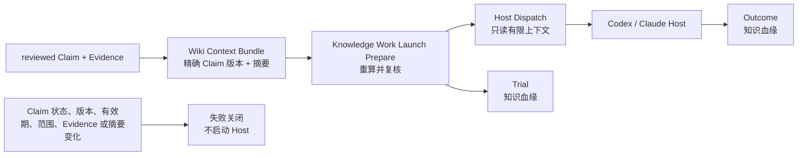

# Knowledge-bound Work Launch：可复现知识进入真实任务

> 状态：v0.11.34 已实现。它把一份已存在的 Wiki Context Bundle 固定到一次 Work Launch；不自动抓取知识、不让模型自行挑选 Claim，也不将知识赋予任何工具或写入权限。

Knowledge Context Bundle 是可审阅的检索收据；Knowledge-bound Work Launch 则是它真正产生运行影响的边界。启动时把 Bundle 的精确版本、Claim 精确版本、Evidence 引用、范围、字符预算和摘要固定到 Launch、Host Dispatch 和 Trial。Host 完成时，同一绑定进入 Outcome。

## 复核规则

`craft_knowledge_context_work_launch_prepare` 接收 `task_id`、`bundle_id` 与原始任务 Prompt。它只允许包含至少一条 Claim 的 Bundle，并在生成 Host Dispatch 前验证：

- Bundle 是指定的精确版本，且摘要可由当前 Claim 正文重算；
- 每个 Claim 仍是当前版本并保持 `reviewed`；
- Claim 仍在 Bundle 的 `global` 或同一 scope 内，且尚未到 `valid_until`；
- 每个 Evidence 引用仍存在；
- 重建的正文未超过编译时字符预算。

Knowledge 文本总被包在 `craft-read-only-evidence-knowledge` 边界中，明确不授予工具、文件、网络或审批权限。普通 `craft_host_run_start`、直接 Host Dispatch execute、普通 Work Launch approval/retry 都拒绝已绑定知识的 Dispatch；这样不能绕过复核。只读 Launch 在 Prepare 后立即启动，写入型 Launch 会在 `craft_knowledge_context_work_launch_decide` 的批准前再次复核。重试也必须经过 `craft_knowledge_context_work_launch_retry`。

这保证的是 Craft 控制面可复现：Host 自己是否忠实遵循只读参考仍需由 Evidence、Acceptance 和 Eval 验证，不能从 Prompt 注入本身推断。

## 血缘与失效

`knowledge_binding` 不保存为独立“当前知识”指针，而是复制精确 Bundle ID/version、Claim refs、scope、字符预算和 context digest 到 Work Launch、Host Dispatch、Trial 环境与 Outcome。因此审计能回答“这次运行实际采用了什么”，而不会因为后续重新编译而重写历史。

如果任一 Claim 被修订、争议、过期、移出范围，Bundle 被改变，或重算摘要不一致，下一次准备、批准或重试会失败关闭。历史 Launch/Trial/Outcome 仍保留原始血缘；要继续工作必须重新编译并明确采用新 Bundle。
