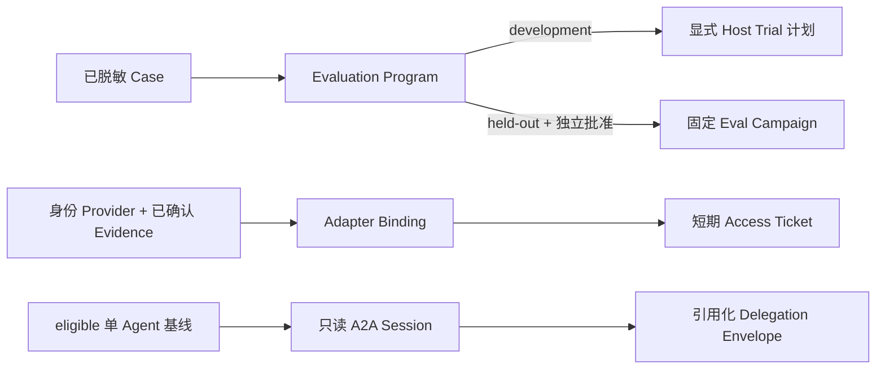

# 可运营评测、企业访问与受控远程协作

> 实现基线：v0.11.58。本文描述已实现的本地控制面；它不是任何企业 IdP、凭据 Broker、远程 Agent 或业务系统已经完成生产接入的声明。

## 目的与边界

Craft 的事实链已经能固定一次 Host 工作的任务、状态、Receipt、再观察与验收。v0.11.58 补上三类容易被“模型已完成”掩盖的运营边界：真实 Case 如何按节奏进入评测、企业外部访问如何只以短期授权契约出现、远程协作如何在单 Agent 已有证据前保持关闭。

三个模块都只保存摘要、版本和 Artifact/Evidence 引用。原始业务正文、密码、Cookie、Authorization、完整远程结果和模型思考不进入 Craft 数据库。

## 1. Evaluation Operations

`EvaluationProgram` 固定 owner、reviewer、脱敏 `development` Case、经独立批准的 `held_out` Case 和 cadence。`due` 只是可审计的排程判断，绝不会在后台启动 Host。

- development 计划生成 `evaluation_program_run`，下一动作明确要求由 Host 准备试验；Craft 不伪造运行结果。
- held-out 计划创建精确 `EvalCampaign`，仍需显式创建 Campaign Runner、领取 Slot 并绑定真实 Host Attempt。
- 计划身份绑定 Program 的**定义摘要**而非会随 `last_planned_at` 变化的记录版本，因此重试保持幂等；定义变化则生成不同计划。
- `report` 返回无正文的计划、Campaign 引用和下次到期状态。它不是质量结论。

可比较结论仍由既有 Trial、终态再观察、同环境/同预算、重复配对、可靠性、Signoff 与 Canary 链路给出。真实业务样本必须先由人脱敏、审核、分区；线上反馈不能直接进入 held-out。

## 2. Enterprise Access

`EnterpriseAccessKernel` 是凭据 Broker 的**控制面契约**，不是凭据实现：

1. 登记 HTTPS 的 `oidc_workload_identity` 或 `short_lived_broker` Provider；静态密钥型 Provider 被拒绝。
2. 只有引用 confirmed Evidence，且观察到短期票据、交换、审计主体和撤销声明后，Provider 才可标记为 verified。
3. `EnterprisePrincipal` 以主体 SHA-256 摘要、Task 范围和到期时间绑定，不保存主体原文或 Token。
4. `EnterpriseAdapterBinding` 必须引用 active Contract Publication 和 verified/healthy Capability Asset，且不能扩大已发布 effect。
5. `EnterpriseAccessTicket` 同时绑定 principal、Task、短期 Credential Lease、Adapter、请求摘要和过期时间。读操作可签发；外部写入还必须有审批与已消费的 autonomy authorization。

Broker 只能根据未过期 Ticket 的 `broker_instruction` 在最后一跳取得秘密。v0.11.58 内置实现不会发放真实秘密、不会联网、不会替企业校验 OIDC；没有部署侧可信 Broker 时，需凭据/外部写入的动作必须失败关闭。

## 3. A2A Collaboration

A2A Card 的发现仍是不可信只读元数据。要建立协作，必须显式通过 `A2AAgentTrust`，它要求：已验证企业 Provider、confirmed Evidence、人工 approval 和 `read_only` effect。写入型远程 delegation 一律拒绝。

`A2ACollaborationSession` 还必须引用状态为 `eligible_for_signoff` 的单 Agent 评测基线与 confirmed justification Evidence；每 Session 最多 5 个 delegation。`A2ADelegation` 只封装目标摘要、Artifact/Evidence 引用、effect、到期时间和收据引用，不能携带原始上下文或凭据。dispatch 需要 confirmed transport Evidence；report 会拒绝包含疑似秘密字段的结果并仅保存结果摘要。

Craft 不实现 A2A HTTP 客户端、远程任务执行或自动多 Agent 调度。Host/Adapter 负责真实传输，Craft 只签发和审计控制面 Receipt；没有基线证据时，不会创建 Session。

## MCP 与使用面

管理动作位于 `craft-mcp-full`：

- `craft_evaluation_program_{save,due,plan,report}`
- `craft_enterprise_identity_provider_*`、`craft_enterprise_principal_bind`、`craft_enterprise_adapter_bind`、`craft_enterprise_access_ticket_*`
- `craft_a2a_agent_trust_approve`、`craft_a2a_collaboration_session_create`、`craft_a2a_delegation_*`

精简 `craft-mcp` 只暴露 `evaluation_program_due/report`、`enterprise_access_ticket_get` 和 `a2a_delegation_get` 等只读状态；它不会借由通用入口绕过审批或 effect Policy。

## 验收与非目标

机制验收覆盖：Case 分区/审批、计划幂等与冲突、Provider/短期 Lease/写入审批、Ticket 过期、A2A 基线与最多五个 delegation、只读限制、传输/结果 Evidence、MCP 核心面裁剪和所有拒绝路径。测试使用脱敏 fixture，只证明控制机制正确。

本版本不证明真实业务质量提升，不提供 Windows 强隔离、真实企业 Broker、组织 SSO、自动 Judge/业务 Grader、远程 Hub 或 A2A transport。它们只能在部署侧 Adapter 和真实脱敏 Case 通过评测后逐项接入。
