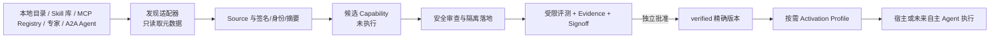

# 可插拔能力源与最小默认能力

> 状态：架构与接入准则。基线 v0.11.35。当前已实现本地 Source Mount、签名 Hub 目录同步、隔离落地、候选认证和 Codex/Claude/DeepSeek Harness/通用 MCP 接入；下述远程 Registry Adapter、A2A Adapter 和 Source 连接器尚未实现。

Craft 的短期定位不是经营又一个 Skill/MCP 商店，而是在不同来源和宿主之间提供**可审计的接入与治理层**。一个来源可以是本地目录、Git/包仓库、MCP Registry、Skill 库、领域专家服务或未来的 A2A Agent；它们不会因为“能发现”就自动进入模型上下文，更不会获得执行权。

## 接入契约

每一种新源都应实现 Adapter，而不是把源的专用语义扩散进核心：

| Adapter 面 | 最小输出 | 绝不承担 |
| --- | --- | --- |
| Discovery | 身份、版本、摘要、许可/来源、声明能力与风险 | 下载并执行任意内容 |
| Materialization | 固定摘要的有限文件或远程端点描述 | 隐式 lifecycle script、凭据或宿主权限 |
| Verification | 来源/签名、内容漂移、安全扫描、兼容性与健康回执 | 把标签、下载量或模型推荐当作信任 |
| Activation | 精确版本、最小上下文、允许 effect、有效期 | 自动启动 Server 或扩大工具权限 |
| Execution | Host/A2A 的任务与回执映射 | 绕过授权、预算、Evidence 或 Signoff |

这使 Craft 能接入热门来源而不锁定某一个市场：本地 `SKILL.md`、组织内部目录和经签名的 Hub 走当前实现路径；MCP 官方 Registry 可作为**待实现的 metadata Discovery Adapter**；Skill/模板市场必须先映射到同一候选模型；专家服务应以能力契约、费用和数据边界登记；A2A Agent 只映射 Agent Card/Task/Artifact/状态，不把其内部推理或工具信任转移给 Craft。

## 为什么默认只内置两项轻量 Skill

模型和宿主会变，复杂的“超强 Prompt”很容易从增益变成上下文污染。当前内置 `craft` 和 `craft-clarify`，因为它们分别提供稳定的治理边界与最小澄清契约；它们不绑定某一家模型、代码流程或行业术语。默认不内置长篇角色 Skill、自动多 Agent 编排、网页抓取器或第三方 MCP。

采用门槛是可证伪的：一个候选要证明在明确任务类、模型与预算下提高质量/恢复率或降低人工返工，且没有增加权限、成本或上下文负担。未达到门槛时保留为可选 Candidate，或直接淘汰。模型更强时，Craft 应减少 Harness，而不是要求模型遵守旧复杂度。

## 路线

1. **现在（Provider）**：维护本地 Source、签名目录、隔离候选和 Activation Profile；用 Host/MCP 接入多个宿主，以同一 Evidence/Policy/Signoff 治理。
2. **下一步**：定义只读的 Registry Discovery Adapter 与可检查的 Source health；为 MCP Registry、Skill 源和组织目录各做一个适配器，不在 Core 中硬编码市场格式。
3. **互操作预留**：将 A2A Agent Card、Task、Artifact、状态和错误映射到现有 Task/Capability/Artifact/Evidence。A2A 只补“Agent 对 Agent 通信”，不替代 MCP 的工具接入，也不替代 Craft 的安全、评测与治理。
4. **长期（自主 Agent）**：新增可替换的 conversation loop、planner 和 Host Driver；继续复用上述 Activation、授权、证据和评测内核。先把 loop 作为一个受评测 Capability，而不是把特定模型的 Harness 写死为平台。

## 业界依据与取舍

- Anthropic 明确指出 Harness 会编码会随模型进步而过时的假设，并把可恢复 session、可变 Harness 与 sandbox 分离；这支持“稳定治理内核 + 可替换策略”的结构。[Scaling Managed Agents](https://www.anthropic.com/engineering/managed-agents)
- Anthropic 的上下文工程建议按需、及时加载引用，而非预先灌入大量材料；因此 Activation Profile 只交付最小内容。[Effective context engineering](https://www.anthropic.com/engineering/effective-context-engineering-for-ai-agents)
- MCP 官方 Registry 是预览中的公共元数据中心，明确预期 Host 消费兼容的下游市场；Craft 可做带认证的下游治理层，不能把 Registry 元数据当作安全认证。[MCP Registry](https://modelcontextprotocol.io/registry/about)
- A2A 1.0 提供跨 Agent 的任务、Artifact 和身份协作语义；应做可选 Adapter，而不是强迫单机插件层现在承担完整分布式系统。[A2A v1.0 announcement](https://github.com/a2aproject/A2A/blob/main/docs/announcing-1.0.md)
- MCP Apps 已提供宿主内联 UI 的扩展方向，但客户端支持需要协商；它适合作为未来审批/证据/Hub demo 的渐进呈现层，不应取代现有本地 Workbench。[MCP Apps overview](https://modelcontextprotocol.io/extensions/apps/overview)
