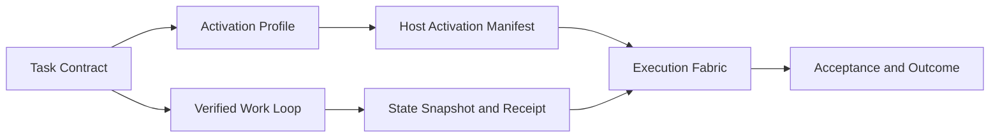

# Verified Execution Fabric

> 状态：v0.11.54 将已有的 `Verified Work Loop`、Activation Profile、Host Dispatch、Workspace State、Acceptance 与 Eval Runner 收敛为一个可审计的运行面，并将本地 Host 启动接到精确 Manifest。它证明机制和边界，不宣称已经提升任意业务任务的效果。

## 目标

Craft 已有可靠的局部能力：Task Contract 固定权限与工作区，Work Loop 记录观察与人工决策，Host Run 保存脱敏回执，Eval Runner 可实际运行确定性 Workflow。`Execution Fabric` 将它们连接为一个不可绕过的事实链，而不新建第二个调度器。

## Host Activation Manifest

Manifest 是给 Host 的无正文清单，固定任务、Profile 版本、Host、Asset 版本、effect、来源摘要，以及 Connector ticket 引用和过期时间。

- 不改 Codex、Claude 或系统 MCP 配置，也不启动 Connector。
- 每个 Asset 必须仍在 Profile 中、可信、健康、effect 未越界且不需要凭据。
- Connector Asset 必须有同一 Profile、同一 Asset 版本、未过期且仍为 `issued` 的 ticket。
- `consume` 只记录 Host 已接受 Manifest 的 receipt；它不等于 Connector 已被调用，也不等于业务结果成功。

所以 Serena、Skill 来源或 MCP 元数据可以进入同一条能力治理链，但真实启停仍由宿主决定。

## Execution Fabric

Fabric 固定同一条 Task、Task Contract、Activation Profile、Work Loop、Task Run 与 Manifest。v0.11.54 的 `Host Bridge` 再将它与一次真实 Host Run 相连：`execute` 先重新验证 Manifest、核对不持久化的 Prompt 摘要并消费一次 Activation Receipt，之后才启动 Host；Host 终态自动触发状态再观察与 Fabric receipt。Profile、Connector ticket、环境、预算或文件状态漂移时，既有失败关闭或 `needs_replan` 路径生效，旧 Receipt 不可当作新事实。

它的生命周期是投影：`prepared`、当前 Work Loop 状态或 `needs_replan`。它不会偷偷重试、分裂子 Agent、扩大权限或执行模型生成的脚本。

## 评测与自适应

本版复用已有 `Evaluation Runner`：它真实执行固定 Case × Workflow Subject × N Trial，输出 Trial/Trace/Outcome，并基于相同 Suite/split 比较基线与候选。通用 Host/Agent 评测必须由显式 Host Run 产生事实，再绑定 `Eval Campaign`；不能把模型自述伪造成 Trial。

`Adaptation Candidate`、可靠性检验、Judge 校准、Signoff 和 Canary 仍是候选唯一晋级路径。默认仍选择最小单 Agent Harness；只有 held-out、等预算、可比较的真实 Outcome 证明收益，才允许推荐增加检索或独立评估器。

## MCP 与非目标

Core 提供 `craft_execution_fabric_prepare / execute / advance / get`、`craft_host_bridge_get` 和 Host Manifest 查询；Full 面仍负责 Connector 注册、发现和审批，避免管理型工具污染默认面。

本版不默认多 Agent、不做通用世界模型/MCTS、不自动同步远端 Hub/A2A，也不自动写入 Prompt、Skill、Workflow 或 Serena Memory。读任务不强制 OS 沙箱；写入和外部 effect 继续受既有审批、Platform Profile、egress 与补偿边界约束。
